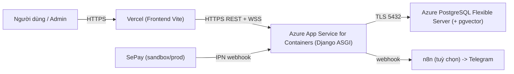

# Hướng dẫn deploy: Frontend → Vercel, Backend + DB → Azure

Tài liệu này hướng dẫn deploy hệ thống PSCD Assistant:

- **Frontend** (Vite + React, thư mục `frontend/`) → **Vercel**
- **Backend** (Django ASGI, thư mục `backend/`) → **Azure App Service for Containers**
- **Database** (PostgreSQL + extension `vector`) → **Azure Database for PostgreSQL Flexible Server**

> Toàn bộ tài nguyên Azure dưới đây đều nằm trong gói **Azure for Students** (tín dụng \$100, không cần thẻ tín dụng). Chọn size nhỏ nhất (Burstable B1ms / App Service B1) để tiết kiệm credit.

---

## 0. Kiến trúc & những điều cần biết trước



Các điểm quan trọng của backend (đã có sẵn trong repo):

- Chạy bằng Docker. `docker-entrypoint.sh` tự động `migrate` + `collectstatic` rồi khởi động `gunicorn` với `uvicorn.workers.UvicornWorker` ở **cổng 8000**.
- WebSocket realtime (`/ws/restaurant-booking/updates/`) dùng **PostgreSQL LISTEN/NOTIFY** — KHÔNG cần Redis.
- Cần extension **`vector`** trên Postgres (file `backend/postgres_init.sql` chạy `CREATE EXTENSION vector;`).
- Static (Django admin/DRF) phục vụ qua **WhiteNoise**, không cần S3 cho việc chạy cơ bản.
- Cấu hình đọc từ biến môi trường (App Settings), không dùng file `.env` khi deploy.

---

## 1. Chuẩn bị

1. Tài khoản **Azure for Students**: https://azure.microsoft.com/free/students/
2. Cài **Azure CLI**: https://learn.microsoft.com/cli/azure/install-azure-cli
3. Tài khoản **Vercel** (đăng nhập bằng GitHub).
4. Repo đã đẩy lên GitHub (Vercel cần GitHub; backend có thể build thẳng trên Azure nên không bắt buộc Docker ở máy bạn).
5. Đăng nhập CLI:

```bash
az login
# Đặt biến dùng lại cho cả hướng dẫn (chỉnh theo ý bạn)
RG=pscd-rg
LOCATION=southeastasia
ACR=pscdacr$RANDOM            # tên ACR phải là chữ thường + số, toàn cục duy nhất
PG_NAME=pscd-pg-$RANDOM       # tên server Postgres, toàn cục duy nhất
PG_ADMIN=pscadmin
PG_PASSWORD='Doi-Mat-Khau-Manh-123!'
APP_PLAN=pscd-plan
APP_NAME=pscd-backend-$RANDOM # sẽ thành https://<APP_NAME>.azurewebsites.net
az group create -n $RG -l $LOCATION
```

---

## 2. Tạo PostgreSQL (Azure Database for PostgreSQL Flexible Server)

```bash
az postgres flexible-server create \
  --resource-group $RG \
  --name $PG_NAME \
  --location $LOCATION \
  --tier Burstable --sku-name Standard_B1ms \
  --storage-size 32 \
  --version 16 \
  --admin-user $PG_ADMIN \
  --admin-password "$PG_PASSWORD" \
  --database-name ai_chat_bot \
  --public-access 0.0.0.0   # tạm cho phép Azure services; sẽ siết lại ở bước sau
```

### 2.1. Bật extension `vector`

Azure chặn extension theo allowlist, phải khai báo trước:

```bash
az postgres flexible-server parameter set \
  --resource-group $RG --server-name $PG_NAME \
  --name azure.extensions --value VECTOR
```

Sau đó tạo extension trong database `ai_chat_bot` (dùng psql hoặc Azure Portal → "Connect"):

```bash
az postgres flexible-server execute \
  --name $PG_NAME --admin-user $PG_ADMIN --admin-password "$PG_PASSWORD" \
  --database-name ai_chat_bot \
  --querytext "CREATE EXTENSION IF NOT EXISTS vector;"
```

> Nếu lệnh `execute` không khả dụng, mở Azure Portal → server Postgres → **Connect** (Cloud Shell psql) rồi chạy `CREATE EXTENSION IF NOT EXISTS vector;`.

### 2.2. Firewall

Để App Service kết nối được, bật "Allow public access from Azure services":

```bash
az postgres flexible-server firewall-rule create \
  --resource-group $RG --name $PG_NAME \
  --rule-name allow-azure --start-ip-address 0.0.0.0 --end-ip-address 0.0.0.0
```

(0.0.0.0–0.0.0.0 là quy ước Azure để cho phép dịch vụ nội bộ Azure. Muốn test bằng máy cá nhân thì thêm rule với IP của bạn.)

---

## 3. Build & push image backend lên Azure Container Registry (ACR)

Dùng `az acr build` để **build ngay trên Azure** (không cần Docker ở máy bạn).

```bash
az acr create -n $ACR -g $RG --sku Basic --admin-enabled true

# Build từ thư mục backend/ (có Dockerfile)
az acr build -r $ACR -t pscd-backend:latest ./backend
```

---

## 4. Tạo App Service for Containers (backend)

```bash
# App Service Plan Linux nhỏ nhất
az appservice plan create -g $RG -n $APP_PLAN --is-linux --sku B1

# Lấy thông tin đăng nhập ACR
ACR_SERVER=$(az acr show -n $ACR --query loginServer -o tsv)
ACR_USER=$(az acr credential show -n $ACR --query username -o tsv)
ACR_PASS=$(az acr credential show -n $ACR --query "passwords[0].value" -o tsv)

# Web App chạy container từ ACR
az webapp create -g $RG -p $APP_PLAN -n $APP_NAME \
  --deployment-container-image-name $ACR_SERVER/pscd-backend:latest

az webapp config container set -g $RG -n $APP_NAME \
  --docker-custom-image-name $ACR_SERVER/pscd-backend:latest \
  --docker-registry-server-url https://$ACR_SERVER \
  --docker-registry-server-user $ACR_USER \
  --docker-registry-server-password $ACR_PASS

# Container lắng nghe cổng 8000 + bật WebSocket cho realtime
az webapp config appsettings set -g $RG -n $APP_NAME --settings WEBSITES_PORT=8000
az webapp config set -g $RG -n $APP_NAME --web-sockets-enabled true
```

### 4.1. Khai báo biến môi trường (App Settings)

Thay `<...>` bằng giá trị thật. `BACKEND_URL` chính là URL App Service; FE là domain Vercel (điền sau khi có ở Phần 6, có thể set lại sau).

```bash
az webapp config appsettings set -g $RG -n $APP_NAME --settings \
  DEBUG=False \
  APPLICATION_SECRET='<chuoi-bi-mat-django-ngau-nhien-dai>' \
  POSTGRES_HOST="$PG_NAME.postgres.database.azure.com" \
  POSTGRES_PORT=5432 \
  POSTGRES_DB=ai_chat_bot \
  POSTGRES_USER="$PG_ADMIN" \
  POSTGRES_PASSWORD="$PG_PASSWORD" \
  BACKEND_URL="https://$APP_NAME.azurewebsites.net" \
  WEBSITE_URL='https://<your-app>.vercel.app' \
  CORS_ALLOWED_ORIGINS='https://<your-app>.vercel.app' \
  CSRF_TRUSTED_ORIGINS="https://<your-app>.vercel.app,https://$APP_NAME.azurewebsites.net" \
  OPENAI_API_KEY='<openai-key>' \
  OPENAI_AGENT_MODEL='gpt-5-mini' \
  OPENAI_ROUTER_MODEL='gpt-5-nano' \
  THROTTLE_RATES_ANON='60/min' \
  THROTTLE_RATES_USER='120/min' \
  THROTTLE_RATES_CHAT='15/min' \
  ACCESS_TOKEN_LIFETIME=8 \
  REFRESH_TOKEN_LIFETIME=168 \
  EMAIL_HOST='smtp.gmail.com' \
  EMAIL_PORT=587 \
  EMAIL_USE_TLS=true \
  EMAIL_HOST_USER='<email-gui>' \
  EMAIL_HOST_PASSWORD='<app-password-gmail>' \
  DEFAULT_FROM_EMAIL='PSCD Japanese Dining <your@gmail.com>' \
  SEPAY_ENVIRONMENT='sandbox' \
  SEPAY_MERCHANT_ID='<merchant-id>' \
  SEPAY_SECRET_KEY='<secret-key>' \
  SEPAY_SUCCESS_URL='https://<your-app>.vercel.app/booking/tra-cuu' \
  SEPAY_ERROR_URL='https://<your-app>.vercel.app/booking/tra-cuu' \
  SEPAY_CANCEL_URL='https://<your-app>.vercel.app/booking/tra-cuu'
```

Tuỳ chọn (Telegram qua n8n — xem Phần 7):

```bash
az webapp config appsettings set -g $RG -n $APP_NAME --settings \
  N8N_ADMIN_NOTIFICATIONS_ENABLED=1 \
  N8N_ADMIN_WEBHOOK_URL='https://<n8n-host>/webhook/booking' \
  N8N_ADMIN_WEBHOOK_SECRET='<secret-trung-voi-n8n>'
```

> Sau khi đổi App Settings, App Service tự restart. Lúc khởi động, `docker-entrypoint.sh` sẽ tự chạy `migrate` (tạo bảng + seed admin/menu) và `collectstatic`. Theo dõi log:
> ```bash
> az webapp log tail -g $RG -n $APP_NAME
> ```

### 4.2. Kiểm tra backend

- Mở `https://<APP_NAME>.azurewebsites.net/api/restaurant-booking/menu/` → phải trả JSON menu.
- Admin login dùng tài khoản seed: `ly.thi.j@example.com` / `password123` (SUPER_ADMIN).

---

## 5. (Tuỳ chọn) Sinh `APPLICATION_SECRET`

```bash
python -c "import secrets; print(secrets.token_urlsafe(64))"
```

Dán kết quả vào App Setting `APPLICATION_SECRET`.

---

## 6. Deploy Frontend lên Vercel

Repo đã có sẵn `frontend/vercel.json` (framework `vite`, output `dist`, rewrite SPA).

1. Vào https://vercel.com → **Add New Project** → import repo GitHub.
2. **Root Directory**: chọn `frontend`.
3. Build command / Output: để mặc định (`npm run build` → `dist`).
4. **Environment Variables** (Production):
   - `VITE_API_BASE_URL` = `https://<APP_NAME>.azurewebsites.net/api`
   - (tuỳ chọn) `VITE_REALTIME_WS_URL` = `wss://<APP_NAME>.azurewebsites.net/ws/restaurant-booking/updates/`
     - Nếu bỏ trống, FE tự suy ra WS từ `VITE_API_BASE_URL` (đổi `https`→`wss`), thường là đủ.
5. **Deploy**. Sau khi xong, bạn có domain dạng `https://<your-app>.vercel.app`.

> Sau khi biết domain Vercel thật, quay lại **Phần 4.1** cập nhật `WEBSITE_URL`, `CORS_ALLOWED_ORIGINS`, `CSRF_TRUSTED_ORIGINS`, `SEPAY_*_URL` cho khớp rồi để App Service restart.

---

## 7. Đấu nối cuối cùng

### 7.1. CORS / CSRF
Đảm bảo App Settings backend chứa đúng domain Vercel (Phần 4.1). Sai domain sẽ bị lỗi CORS khi FE gọi API.

### 7.2. SePay IPN (xác nhận thanh toán)
Booking chỉ chuyển `CONFIRMED` khi **webhook IPN** của SePay gọi tới backend. Trong dashboard SePay, đặt **Webhook/IPN URL**:

```
https://<APP_NAME>.azurewebsites.net/api/restaurant-booking/payments/sepay/ipn/
```

- Đảm bảo SePay gửi header `X-Secret-Key` = `SEPAY_SECRET_KEY`.
- Khi chạy production thì đặt `SEPAY_ENVIRONMENT=production`. Khi đó endpoint `sandbox-confirm` (dùng test local) sẽ tự khoá.

### 7.3. Telegram (tuỳ chọn)
Repo dùng **n8n** làm cầu nối webhook → Telegram. Hai cách:
- Dùng **n8n.cloud** (nhanh nhất): import workflow, lấy webhook URL, điền vào `N8N_ADMIN_WEBHOOK_URL`.
- Hoặc chạy thêm 1 container n8n (xem `backend/docker-compose.prod.yml` dịch vụ `n8n`) trên 1 Azure Container App / VM riêng.

Backend chỉ bắn webhook **sau khi thanh toán cọc thành công** (sự kiện `booking.confirmed`), payload có sẵn `preordered_items` (món khách chốt) + `notes` để hiển thị trong Telegram/lịch.

---

## 8. Kiểm thử sau deploy (checklist)

1. FE mở được, gọi `/api/restaurant-booking/menu/` không lỗi CORS.
2. Chat đặt bàn end-to-end: chọn món → đặt bàn → nhận link cọc SePay.
3. Thanh toán sandbox → SePay gọi IPN → booking thành `CONFIRMED`.
4. Email xác nhận có mục **"Món đặt trước"** (nếu khách chọn món).
5. Telegram (nếu bật) nhận thông báo **sau** khi thanh toán, kèm món.
6. Admin login (`ly.thi.j@example.com` / `password123`) → trang quản trị + realtime cập nhật khi có booking mới.

---

## 9. Cập nhật về sau (redeploy)

```bash
# Build lại image mới rồi cho App Service kéo về
az acr build -r $ACR -t pscd-backend:latest ./backend
az webapp restart -g $RG -n $APP_NAME
```

Frontend: chỉ cần `git push` lên nhánh đã kết nối, Vercel tự build lại.

---

## 10. Lưu ý chi phí (Azure for Students)

| Tài nguyên | Cấu hình gợi ý | Ghi chú |
|---|---|---|
| PostgreSQL Flexible | Burstable **B1ms**, 32GB | Rẻ nhất; dừng server khi không dùng để tiết kiệm |
| App Service Plan | Linux **B1** | Có thể dùng **F1 Free** để test, nhưng F1 KHÔNG hỗ trợ "Always On" và có thể hạn chế WebSocket → khuyến nghị B1 |
| Container Registry | **Basic** | Nhỏ, đủ cho 1 image |

Mẹo tiết kiệm credit: `az postgres flexible-server stop` và `az webapp stop` khi không demo; `start` lại khi cần.

---

## 11. Troubleshooting

- **Backend không kết nối được DB / SSL**: Azure Postgres bắt buộc TLS. `libpq` mặc định `sslmode=prefer` nên thường tự dùng SSL. Nếu vẫn lỗi, vào server Postgres → Server parameters, kiểm tra `require_secure_transport` (mặc định ON là đúng). Đảm bảo firewall "allow azure services" đã bật (Phần 2.2).
- **`CREATE EXTENSION vector` báo lỗi không cho phép**: chưa set `azure.extensions=VECTOR` (Phần 2.1) hoặc chưa restart server sau khi set.
- **WebSocket admin không nhận realtime**: kiểm tra đã bật `--web-sockets-enabled true` và FE dùng `wss://` đúng host.
- **CORS bị chặn**: `CORS_ALLOWED_ORIGINS` phải khớp **chính xác** domain Vercel (kể cả `https://`).
- **Thanh toán thành công nhưng booking vẫn "Chờ thanh toán"**: SePay chưa gọi được IPN. Kiểm tra IPN URL trong dashboard SePay trỏ đúng `https://<APP_NAME>.azurewebsites.net/.../sepay/ipn/` và `SEPAY_SECRET_KEY` khớp.
- **Container không start / log lỗi migrate**: xem `az webapp log tail`. Thường do thiếu App Setting bắt buộc (`APPLICATION_SECRET`, `POSTGRES_*`).
