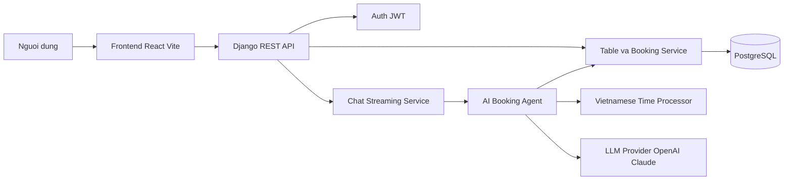
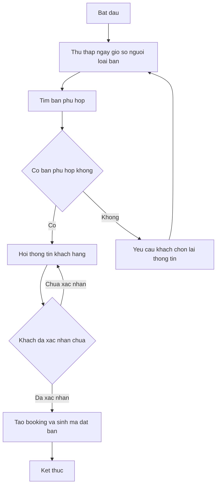

# SO DO M1

Tai lieu nay gom:

- Giai thich so do khoi la gi.
- So do khoi tong the cua he thong.
- So do quy trinh dat ban 4 buoc.
- Cach trinh bay 2 so do khi bao ve.

## 1. So do khoi la gi

So do khoi la hinh mo ta he thong o muc tong quan. Moi khoi dai dien cho mot thanh phan chuc nang, vi du giao dien, backend, database, agent AI. Mui ten giua cac khoi the hien huong trao doi du lieu hoac luong xu ly.

So do khoi khac voi cac loai so do khac nhu sau:

- Khong di sau vao chi tiet code.
- Khong mo ta tuan tu tung dong xu ly nhu sequence diagram.
- Khong mo ta nghiep vu tung buoc chi tiet nhu activity diagram.

Muc dich cua so do khoi trong M1:

- Chung minh sinh vien hieu cau truc he thong.
- The hien cach chia he thong thanh cac thanh phan hop ly.
- Lam co so de giai thich kien truc khi bao ve.

## 2. So do khoi tong the

### Cach giai thich

- Nguoi dung thao tac tren website frontend.
- Frontend gui request den backend bang cac API.
- Backend tach thanh 3 nhom nghiep vu chinh:
  - Auth JWT.
  - Quan ly ban va booking.
  - Chat streaming.
- Chat streaming goi AI Booking Agent.
- AI agent co the su dung bo xu ly thoi gian tieng Viet, tool tim ban va mo hinh LLM.
- Du lieu cuoi cung duoc doc/ghi tren PostgreSQL.

## 3. So do quy trinh dat ban 4 buoc

### Cach giai thich

- Buoc 1: chatbot hoi lan luot ngay, gio, so nguoi va khu vuc ban.
- Buoc 2: he thong tim cac ban phu hop voi dieu kien do.
- Neu khong co ban, chatbot yeu cau khach doi lai tieu chi.
- Buoc 3: khi da chon ban, chatbot thu thap ten va so dien thoai.
- Buoc 4: chatbot tom tat thong tin, cho khach xac nhan va tao booking.

## 4. Noi khi bi hoi "vi sao can so do khoi"

Co the tra loi ngan gon:

"So do khoi giup mo ta cau truc he thong mot cach tong quan, cho thay he thong gom nhung thanh phan nao, moi quan he giua cac thanh phan ra sao, va du lieu di theo huong nao. Trong M1, day la co so de chung minh de tai da co thiet ke ky thuat ro rang."

## 5. Luu y khi dua vao Word hoac PowerPoint

- Neu truong khong uu tien Mermaid, co the ve lai bang PowerPoint, draw.io hoac Lucidchart.
- Giu lai dung 3 lop chinh:
  - Frontend.
  - Backend.
  - Data/AI.
- Khong nen ve qua nhieu hop nho gay roi.
- Khi thuyet trinh, tap trung giai thich vai tro tung khoi, khong di vao code.
