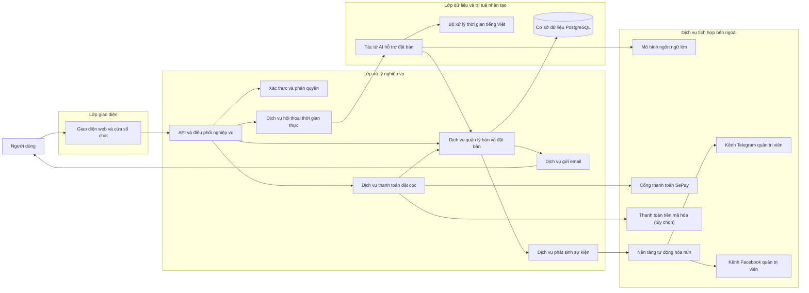
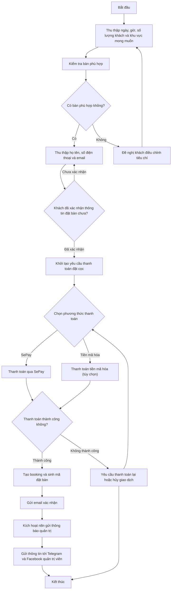

# BÁO CÁO ĐỒ ÁN TỐT NGHIỆP

## Đề tài

**Xây dựng hệ thống chatbot AI hỗ trợ đặt bàn nhà hàng**

## Thông tin trình bày

- Sinh viên thực hiện: `[Điền họ và tên]`
- Mã sinh viên: `[Điền MSSV]`
- Lớp: `[Điền lớp]`
- Giảng viên hướng dẫn: `[Điền tên GVHD]`
- Học phần: Đồ án tốt nghiệp
- Giai đoạn tài liệu: `Phần khởi đầu của báo cáo`
- Học kỳ/Năm học: `[Điền thông tin]`

---

## Lời nói đầu

Trong bối cảnh chuyển đổi số diễn ra mạnh mẽ trên hầu hết các lĩnh vực dịch vụ, ngành nhà hàng cũng đang dần thay đổi cách tiếp cận khách hàng thông qua các nền tảng trực tuyến. Nếu trước đây việc đặt bàn chủ yếu được thực hiện bằng gọi điện thoại, nhắn tin hoặc trao đổi trực tiếp với nhân viên, thì hiện nay khách hàng ngày càng kỳ vọng vào những hệ thống có khả năng phản hồi nhanh, rõ ràng và thuận tiện hơn. Không chỉ mong muốn biết còn bàn hay không, khách hàng còn muốn được hỗ trợ trong quá trình lựa chọn thời gian, khu vực ngồi, số lượng người và các yêu cầu đặc biệt một cách tự nhiên, ít thao tác và ít nhầm lẫn.

Từ thực tế đó, đề tài “Xây dựng hệ thống chatbot AI hỗ trợ đặt bàn nhà hàng” được lựa chọn với mong muốn giải quyết đồng thời hai bài toán: bài toán số hóa quy trình đặt bàn và bài toán nâng cao trải nghiệm tương tác của người dùng trên nền tảng web. Thay vì chỉ dừng lại ở việc xây dựng một biểu mẫu đặt bàn thông thường, đề tài hướng tới việc kết hợp chatbot AI với hệ thống dữ liệu nghiệp vụ để hỗ trợ khách hàng theo cách gần với giao tiếp tự nhiên. Điều này không chỉ có ý nghĩa về mặt ứng dụng thực tế mà còn tạo điều kiện để tích hợp nhiều mảng kiến thức quan trọng trong một đồ án tốt nghiệp, bao gồm phát triển giao diện, xử lý nghiệp vụ, quản lý dữ liệu, mô hình hóa hệ thống và ứng dụng trí tuệ nhân tạo.

Ở giai đoạn hiện tại, nhiệm vụ trọng tâm không phải là chứng minh toàn bộ sản phẩm đã hoàn thiện, mà là làm rõ tính cấp thiết của đề tài, hướng thiết kế sơ bộ, kết quả kỳ vọng, cách đánh giá và kế hoạch triển khai. Nói cách khác, phần khởi đầu của báo cáo cần trả lời được các câu hỏi cốt lõi: tại sao đề tài này cần thiết, đề tài sẽ giải quyết bài toán theo hướng nào, sản phẩm cuối cùng dự kiến đạt được điều gì, việc đánh giá sản phẩm sẽ dựa trên những tiêu chí nào và lộ trình thực hiện có đủ khả thi hay không.

Với tinh thần đó, báo cáo này được xây dựng theo đúng năm nhóm nội dung nền tảng của đề tài. Nội dung báo cáo không đi sâu vào mô tả chi tiết mã nguồn hay liệt kê kỹ thuật triển khai ở mức thấp, mà tập trung vào việc phân tích bài toán, trình bày tư duy thiết kế hệ thống và làm rõ cơ sở học thuật cũng như cơ sở thực tiễn của đề tài. Hai sơ đồ quan trọng nhất là sơ đồ khối tổng thể hệ thống và sơ đồ quy trình nghiệp vụ đặt bàn có chatbot hỗ trợ được giữ lại trong báo cáo như các minh chứng trực quan cho phần đề xuất giải pháp sơ bộ.

Hy vọng rằng bản báo cáo này sẽ là nền tảng đủ chặt chẽ để tiếp tục triển khai các giai đoạn tiếp theo của đồ án, đồng thời giúp người đọc, giảng viên hướng dẫn và hội đồng đánh giá có cái nhìn rõ ràng hơn về mục tiêu, hướng đi và tính khả thi của đề tài.

---

## Tóm tắt nội dung

Trong giai đoạn đầu của đề tài, báo cáo tập trung vào năm nội dung chính theo yêu cầu đánh giá của đồ án tốt nghiệp. Trước hết, báo cáo phân tích bối cảnh thực tế của bài toán đặt bàn nhà hàng, chỉ ra các hạn chế của cách làm truyền thống và khảo sát ba nhóm giải pháp phổ biến hiện nay gồm biểu mẫu đặt bàn trực tuyến, chatbot chăm sóc khách hàng và nền tảng quản lý nhà hàng tích hợp đặt chỗ. Từ đó, báo cáo làm rõ khoảng trống mà đề tài hướng tới là xây dựng một hệ thống vừa có khả năng tương tác tự nhiên với khách hàng, vừa gắn trực tiếp với nghiệp vụ đặt bàn.

Tiếp theo, báo cáo trình bày giải pháp sơ bộ theo hướng kiến trúc ba lớp, trong đó phần lõi của hệ thống được tổ chức thành lớp giao diện, lớp xử lý nghiệp vụ và lớp dữ liệu kết hợp trí tuệ nhân tạo; bên cạnh đó, hệ thống được thiết kế theo hướng sẵn sàng tích hợp thanh toán đặt cọc, gửi email xác nhận và tự động hóa thông báo quản trị qua n8n. Trên cơ sở đó, hai sơ đồ trung tâm của đề tài được giới thiệu và phân tích, bao gồm sơ đồ khối tổng thể hệ thống và sơ đồ quy trình nghiệp vụ đặt bàn có chatbot hỗ trợ theo tám bước. Phần này nhằm chứng minh rằng đề tài đã được hình dung rõ về mặt cấu trúc kỹ thuật và logic nghiệp vụ.

Sau phần giải pháp sơ bộ, báo cáo nêu ra các kết quả dự kiến đạt được trên các phương diện sản phẩm, kỹ thuật, học thuật và giá trị ứng dụng. Từ đó, báo cáo tiếp tục xác định phương pháp đánh giá và bộ tiêu chí kiểm thử theo hướng bám sát bài toán thực tế, chú trọng cả chức năng, dữ liệu, trải nghiệm và chất lượng hội thoại của chatbot. Cuối cùng, báo cáo trình bày kế hoạch thực hiện và phân công công việc theo từng giai đoạn, qua đó làm rõ tính khả thi của đề tài trong khuôn khổ đồ án tốt nghiệp.

Nhìn chung, báo cáo ở giai đoạn hiện tại không chỉ là tài liệu giới thiệu ý tưởng, mà là cơ sở để khẳng định rằng đề tài có nhu cầu thực tiễn, có hướng thiết kế phù hợp, có thể đánh giá được và có kế hoạch triển khai tương đối rõ ràng trong các giai đoạn tiếp theo.

---

## Mục lục gợi ý

1. Lời nói đầu
2. Tóm tắt nội dung
3. 1.1. Điều tra tổng quan và tính cấp thiết của đề tài
4. 1.2. Đề xuất giải pháp sơ bộ
5. 1.3. Dự kiến kết quả đạt được
6. 1.4. Phương pháp đánh giá và tiêu chí kiểm thử
7. 1.5. Kế hoạch thực hiện và phân công công việc

---

## 1.1. Điều tra tổng quan và tính cấp thiết của đề tài

### 1.1.1. Bối cảnh chuyển đổi số trong lĩnh vực nhà hàng

Ngành nhà hàng là một trong những lĩnh vực dịch vụ có tần suất tương tác trực tiếp với khách hàng rất cao. Trong mô hình kinh doanh truyền thống, nhiều khâu vẫn phụ thuộc vào thao tác thủ công như tiếp nhận đặt bàn, xác nhận lịch, ghi chú nhu cầu của khách hoặc tra cứu lại thông tin khi có thay đổi. Cách làm này từng phù hợp trong giai đoạn quy mô nhỏ và lượng khách chưa lớn, nhưng đang dần bộc lộ nhiều hạn chế trong bối cảnh người dùng hiện đại đòi hỏi trải nghiệm nhanh hơn, thuận tiện hơn và ít phụ thuộc hơn vào nhân viên trực.

Chuyển đổi số trong lĩnh vực nhà hàng không chỉ là đưa một vài biểu mẫu lên website, mà là quá trình tái tổ chức lại cách tiếp nhận, xử lý và phản hồi nhu cầu của khách hàng dựa trên nền tảng công nghệ. Một hệ thống đặt bàn hiệu quả cần giúp khách hàng biết được khả năng phục vụ của nhà hàng trong một khoảng thời gian cụ thể, đồng thời hỗ trợ nhà hàng quản lý thông tin có cấu trúc, tránh chồng chéo và giảm sai sót trong quá trình vận hành.

Song song với đó, hành vi người dùng trên môi trường số cũng đang thay đổi đáng kể. Người dùng hiện nay quen với việc trò chuyện với hệ thống, tìm kiếm thông tin nhanh, nhận phản hồi gần thời gian thực và mong muốn thao tác được rút gọn. Vì vậy, việc đưa chatbot AI vào một hệ thống đặt bàn là một hướng phát triển có tính thời sự, vừa phản ánh đúng xu thế công nghệ, vừa phù hợp với nhu cầu thực tiễn của bài toán.

### 1.1.2. Mô tả bài toán đặt bàn trong thực tế

Bài toán đặt bàn nhà hàng nhìn bề ngoài có vẻ đơn giản, nhưng khi phân tích ở mức nghiệp vụ sẽ thấy đây là một quy trình chứa nhiều thông tin và nhiều tình huống phát sinh. Để hoàn thành một yêu cầu đặt bàn, hệ thống hoặc nhân viên cần xác định được ít nhất các yếu tố sau:

- ngày khách muốn sử dụng dịch vụ;
- khung giờ khách đến;
- số lượng người tham dự;
- loại bàn hoặc khu vực mong muốn;
- họ tên, số điện thoại và email của khách;
- trạng thái xác nhận và trạng thái thanh toán đặt cọc, nếu nhà hàng áp dụng;
- các ghi chú phát sinh nếu có.

Nếu một trong các thông tin trên bị thiếu hoặc sai lệch, quá trình phục vụ có thể bị ảnh hưởng. Ví dụ, khách hàng đi nhóm đông nhưng bàn được chuẩn bị không đủ sức chứa, hoặc khách muốn ngồi khu vực riêng tư nhưng hệ thống không ghi nhận đúng yêu cầu. Từ đó có thể thấy rằng bài toán đặt bàn không chỉ là nhận thông tin, mà là một bài toán tổ chức thông tin, xác minh thông tin và phản hồi thông tin một cách thống nhất.

Ngoài ra, một yêu cầu đặt bàn thường không diễn ra theo cấu trúc cứng. Khách hàng có thể nói “tối mai mình đi 4 người”, “cuối tuần còn bàn gần cửa sổ không”, hoặc “đặt giúp mình một bàn ngoài trời khoảng 7 giờ”. Điều này cho thấy nếu hệ thống chỉ dựa trên biểu mẫu tĩnh thì chưa chắc đã phù hợp với hành vi thực tế của người dùng.

### 1.1.3. Thực trạng tiếp nhận đặt bàn theo cách truyền thống

Hiện nay, nhiều nhà hàng vẫn tiếp nhận yêu cầu đặt bàn qua các phương thức quen thuộc như gọi điện thoại, nhắn tin qua mạng xã hội, ứng dụng nhắn tin hoặc điền biểu mẫu cơ bản trên website. Đây là những cách tiếp cận dễ thực hiện, không đòi hỏi đầu tư quá lớn trong giai đoạn đầu và phù hợp với mô hình vận hành thủ công.

Tuy nhiên, ở góc độ hệ thống hóa, những cách làm này còn nhiều điểm chưa tối ưu. Khi tiếp nhận qua điện thoại hoặc tin nhắn, phần lớn thông tin vẫn phải được nhân viên đọc, hiểu, ghi nhận rồi xác nhận lại bằng thao tác thủ công. Trong điều kiện lượng khách tăng hoặc nhiều nhân viên cùng trực, nguy cơ trùng lặp thông tin, bỏ sót thông tin hoặc xác nhận sai là hoàn toàn có thể xảy ra.

Biểu mẫu trên website tuy giúp chuẩn hóa dữ liệu hơn, nhưng vẫn có hạn chế về khả năng tương tác. Người dùng phải tự hiểu mình cần điền gì, không được hỗ trợ nếu dữ liệu chưa rõ ràng và khó xử lý tốt các trường hợp muốn mô tả theo ngôn ngữ tự nhiên.

### 1.1.4. Những hạn chế nổi bật của phương pháp đặt bàn truyền thống

Qua quan sát thực tế, có thể tổng hợp các hạn chế nổi bật của cách đặt bàn truyền thống như sau.

Thứ nhất, **phụ thuộc nhiều vào con người**. Trong các khung giờ cao điểm, nếu không có nhân viên tiếp nhận kịp thời thì khách hàng có thể phải chờ hoặc bỏ qua nhu cầu đặt bàn.

Thứ hai, **dễ phát sinh sai sót khi ghi nhận thông tin**. Việc ghi nhầm ngày, giờ, số lượng người hoặc bỏ sót yêu cầu đặc biệt có thể dẫn đến trải nghiệm không tốt khi khách đến nhà hàng.

Thứ ba, **khó chuẩn hóa quy trình**. Mỗi nhân viên có thể có cách tiếp nhận và xác nhận khác nhau, dẫn đến sự thiếu đồng nhất trong chất lượng phục vụ.

Thứ tư, **khó tra cứu và tổng hợp dữ liệu**. Nếu thông tin booking không được lưu trữ có cấu trúc, nhà hàng sẽ khó thống kê được lượng khách, mức độ sử dụng bàn hoặc lịch sử đặt bàn.

Thứ năm, **trải nghiệm người dùng chưa thực sự linh hoạt**. Khách hàng ngày càng quen với việc thao tác nhanh trên môi trường số. Một hệ thống đặt bàn chỉ dừng ở mức biểu mẫu hoặc trao đổi thủ công khó tạo được cảm giác hiện đại và chủ động.

### 1.1.5. Khảo sát các nhóm giải pháp hiện có

Để định vị rõ đề tài, cần khảo sát các nhóm giải pháp đang phổ biến hiện nay. Có thể chia thành ba nhóm chính.

#### 1.1.5.1. Biểu mẫu đặt bàn trực tuyến

Đây là nhóm giải pháp cơ bản nhất, trong đó website cung cấp cho người dùng một biểu mẫu gồm các trường ngày, giờ, số lượng người, họ tên, số điện thoại và một số thông tin bổ sung. Ưu điểm của nhóm này là đơn giản, dễ triển khai, dễ chuẩn hóa dữ liệu đầu vào và phù hợp với quy mô nhỏ.

Tuy nhiên, nhược điểm lớn là thiếu khả năng tương tác. Nếu khách chưa biết nên chọn giờ nào, muốn hỏi còn bàn khu vực nào hoặc cần làm rõ điều kiện đặt chỗ, biểu mẫu không thể phản hồi linh hoạt. Như vậy, giải pháp này tốt ở tính cấu trúc, nhưng yếu ở khả năng hỗ trợ người dùng.

#### 1.1.5.2. Chatbot chăm sóc khách hàng

Nhóm này tập trung vào khả năng trò chuyện với khách hàng. Chatbot có thể đóng vai trò tiếp nhận câu hỏi, hướng dẫn, giải đáp thông tin cơ bản hoặc hỗ trợ tư vấn ban đầu. Ưu điểm lớn nhất là tạo ra cảm giác tương tác tự nhiên hơn, giúp người dùng dễ tiếp cận hơn so với biểu mẫu cứng.

Tuy nhiên, nhiều chatbot hiện nay chỉ dừng ở mức tư vấn hoặc trả lời câu hỏi, chưa gắn trực tiếp với dữ liệu bàn và booking của hệ thống. Khi thiếu kết nối với dữ liệu nghiệp vụ, chatbot có thể trả lời tốt về mặt ngôn ngữ nhưng không đảm bảo tính chính xác khi xử lý đặt bàn thực tế.

#### 1.1.5.3. Nền tảng quản lý nhà hàng tích hợp đặt bàn

Đây là nhóm giải pháp toàn diện hơn, thường bao gồm quản lý bàn, quản lý booking, phân quyền nhân viên, báo cáo thống kê và đôi khi cả thanh toán, marketing hoặc chăm sóc khách hàng. Ưu điểm là dữ liệu tập trung và có thể hỗ trợ vận hành ở quy mô lớn hơn.

Tuy nhiên, đối với phạm vi một đồ án tốt nghiệp, nhóm giải pháp này có thể quá rộng và dễ dẫn tới dàn trải. Mục tiêu của đồ án là giải quyết sâu một bài toán rõ ràng, chứ không phải xây dựng một nền tảng quản trị toàn bộ hoạt động nhà hàng.

### 1.1.6. Khoảng trống mà đề tài hướng tới

Từ ba nhóm giải pháp nêu trên, có thể nhận thấy khoảng trống chính nằm ở sự thiếu kết hợp giữa hai yếu tố: **tương tác tự nhiên** và **xử lý nghiệp vụ thực tế**. Một hệ thống chỉ có biểu mẫu sẽ mạnh ở dữ liệu có cấu trúc nhưng yếu ở hỗ trợ người dùng; ngược lại, một chatbot tư vấn thuần túy có thể mạnh ở tương tác nhưng lại chưa đủ năng lực xử lý nghiệp vụ đặt bàn.

Đề tài này hướng đến việc kết hợp hai yếu tố đó trong một hệ thống thống nhất. Cụ thể, hệ thống cần:

- hiểu được yêu cầu của khách theo ngôn ngữ tự nhiên;
- thu thập thông tin còn thiếu theo đúng trình tự;
- đối chiếu với dữ liệu bàn thực tế;
- hỗ trợ khách đưa ra lựa chọn phù hợp;
- xác nhận lại nội dung đặt bàn trước khi ghi nhận chính thức;
- hỗ trợ khởi tạo thanh toán đặt cọc, gửi email xác nhận cho khách hàng và gửi thông báo quản trị qua n8n sau khi đặt bàn thành công.

Khoảng trống này chính là điểm nhấn và cũng là lý do khiến đề tài có giá trị riêng so với các hướng tiếp cận thông thường.

### 1.1.7. Tính cấp thiết về mặt thực tiễn

Về thực tiễn, đề tài có tính cấp thiết vì giải quyết một nhu cầu rõ ràng của mô hình kinh doanh nhà hàng: tiếp nhận đặt bàn nhanh hơn, chính xác hơn và ít phụ thuộc hơn vào thao tác thủ công. Khi được tổ chức tốt, hệ thống không chỉ giúp nhà hàng giảm tải cho nhân viên mà còn hỗ trợ nâng cao hình ảnh chuyên nghiệp trong mắt khách hàng.

Trong điều kiện cạnh tranh giữa các nhà hàng ngày càng lớn, trải nghiệm số cũng trở thành một yếu tố ảnh hưởng đến quyết định sử dụng dịch vụ. Một hệ thống cho phép khách hàng đặt bàn dễ dàng, được hướng dẫn rõ ràng và nhận phản hồi hợp lý sẽ tạo ra lợi thế nhất định về chất lượng phục vụ.

### 1.1.8. Tính cấp thiết về mặt học thuật

Về học thuật, đề tài là một môi trường phù hợp để tích hợp nhiều mảng kiến thức đã học trong chương trình đào tạo. Người thực hiện cần phải:

- phân tích bài toán và nhu cầu người dùng;
- mô hình hóa hệ thống và quy trình;
- thiết kế giao diện và trải nghiệm người dùng;
- xử lý dữ liệu có cấu trúc;
- xây dựng logic nghiệp vụ;
- áp dụng AI vào một bối cảnh nghiệp vụ cụ thể.

Điểm đáng chú ý là AI trong đề tài này không đứng riêng lẻ, mà được đặt trong quan hệ với toàn bộ hệ thống. Điều đó làm cho đề tài có giá trị cao hơn một bài thực hành kỹ thuật đơn lẻ.

### 1.1.9. Kết luận mục 1.1

Qua việc phân tích bối cảnh, mô tả thực trạng và khảo sát các nhóm giải pháp hiện có, có thể khẳng định rằng đề tài “Xây dựng hệ thống chatbot AI hỗ trợ đặt bàn nhà hàng” có tính cấp thiết rõ ràng. Đề tài không chỉ xuất phát từ một ý tưởng công nghệ, mà xuất phát từ nhu cầu thực tế của bài toán đặt bàn và xu hướng số hóa dịch vụ trong lĩnh vực nhà hàng.

---

## 1.2. Đề xuất giải pháp sơ bộ

### 1.2.1. Mục tiêu của giải pháp sơ bộ

Giải pháp sơ bộ của đề tài được xây dựng nhằm trả lời ba câu hỏi cốt lõi:

- hệ thống sẽ được tổ chức theo cấu trúc nào;
- chatbot sẽ tham gia vào quy trình đặt bàn ra sao;
- vì sao hướng thiết kế này là phù hợp với bài toán.

Ở giai đoạn hiện tại, mục tiêu của phần này không phải là trình bày toàn bộ chi tiết kỹ thuật triển khai, mà là đưa ra một mô hình giải pháp có tính logic, có thể giải thích được và có tính khả thi.

### 1.2.2. Định hướng giải pháp tổng thể

Định hướng chung của đề tài là xây dựng một hệ thống web hỗ trợ đặt bàn nhà hàng có tích hợp chatbot AI. Trong hệ thống này, chatbot không chỉ đóng vai trò giao tiếp mà còn tham gia điều phối quy trình đặt bàn theo từng bước. Toàn bộ luồng nghiệp vụ, từ tiếp nhận nhu cầu, kiểm tra bàn phù hợp, xác nhận thông tin, khởi tạo thanh toán đặt cọc cho đến gửi email xác nhận và kích hoạt luồng thông báo quản trị qua n8n, đều phải được kiểm soát thống nhất tại tầng xử lý trung tâm.

Giải pháp này có thể được hiểu là sự kết hợp giữa:

- một giao diện web thân thiện để người dùng dễ tiếp cận;
- một tầng xử lý nghiệp vụ để đảm bảo tính nhất quán của dữ liệu và điều phối luồng đặt bàn;
- một thành phần AI giúp tăng khả năng tương tác tự nhiên;
- các dịch vụ tích hợp hỗ trợ thanh toán đặt cọc, gửi email thông báo và tự động hóa thông báo cho quản trị viên.

Sự kết hợp này giúp hệ thống vừa đảm bảo tính cấu trúc, vừa cải thiện trải nghiệm người dùng.

### 1.2.3. Kiến trúc ba lớp của hệ thống

Về mặt tổng quát, giải pháp được tổ chức theo mô hình ba lớp.

**Lớp giao diện** là nơi người dùng trực tiếp thao tác. Ở lớp này, người dùng có thể xem thông tin, lựa chọn ngày giờ, gửi yêu cầu đặt bàn hoặc trò chuyện với chatbot.

**Lớp xử lý nghiệp vụ** là phần trung gian có vai trò rất quan trọng. Đây là nơi kiểm soát logic đặt bàn, điều phối luồng hội thoại, kiểm tra tính hợp lệ của thông tin, quản lý trạng thái đặt bàn, khởi tạo thanh toán đặt cọc, kích hoạt gửi email xác nhận và phát sinh sự kiện phục vụ luồng thông báo quản trị.

**Lớp dữ liệu và trí tuệ nhân tạo** là nơi lưu trữ dữ liệu có cấu trúc về bàn, booking và trạng thái giao dịch, đồng thời hỗ trợ khả năng suy luận hội thoại thông qua mô hình ngôn ngữ lớn và tác tử AI. Bên cạnh ba lớp lõi, hệ thống còn được thiết kế theo hướng sẵn sàng kết nối với các dịch vụ tích hợp bên ngoài như cổng thanh toán, hạ tầng gửi email và nền tảng tự động hóa quy trình.

Việc chia hệ thống thành ba lớp như vậy giúp đề tài có cấu trúc rõ ràng, dễ mô tả trong báo cáo và thuận tiện cho việc mở rộng ở các giai đoạn sau.

### 1.2.4. Sơ đồ khối tổng thể của hệ thống

**Hình 1. Sơ đồ khối tổng thể của hệ thống chatbot AI hỗ trợ đặt bàn nhà hàng**

### 1.2.5. Chú thích và phân tích sơ đồ khối

Sơ đồ khối trên là hình mô tả hệ thống ở mức tổng quan. Sơ đồ cho thấy hệ thống không chỉ bao gồm giao diện trò chuyện, mà là một tập hợp các thành phần phối hợp với nhau để xử lý trọn vẹn bài toán đặt bàn, thanh toán đặt cọc, thông báo xác nhận cho khách hàng và thông báo quản trị nội bộ.

**Người dùng** là trung tâm của toàn bộ hệ thống. Mọi thiết kế giao diện, logic xử lý và luồng dữ liệu đều nhằm phục vụ nhu cầu của khách hàng trong suốt quá trình đặt bàn.

**Giao diện web và cửa sổ chat** đóng vai trò là lớp trình bày. Đây là nơi hiển thị thông tin bàn, tiếp nhận thao tác đặt bàn và duy trì tương tác hội thoại với chatbot.

**API và điều phối nghiệp vụ** được xem là trung tâm xử lý của hệ thống. Dù người dùng thao tác trực tiếp trên giao diện hay trò chuyện với chatbot, toàn bộ yêu cầu cuối cùng đều được đưa về một tầng nghiệp vụ có khả năng xử lý thống nhất.

**Xác thực và phân quyền** là thành phần nền tảng giúp kiểm soát truy cập và tạo điều kiện mở rộng các chức năng quản trị trong các giai đoạn sau.

**Dịch vụ quản lý bàn và đặt bàn** là cụm chức năng gắn trực tiếp với nghiệp vụ cốt lõi. Thành phần này chịu trách nhiệm kiểm tra bàn khả dụng, ghi nhận booking, quản lý trạng thái đặt bàn và phối hợp với các dịch vụ thanh toán, thông báo.

**Dịch vụ hội thoại thời gian thực** cho thấy hệ thống không coi chatbot như một hộp đen, mà tổ chức riêng phần phản hồi hội thoại để tạo ra trải nghiệm liên tục và gần thời gian thực hơn.

**Tác tử AI hỗ trợ đặt bàn** là thành phần thể hiện rõ bản sắc của đề tài. Thành phần này không chỉ sinh phản hồi ngôn ngữ mà còn tham gia thu thập thông tin, suy luận theo ngữ cảnh và hỗ trợ người dùng đi đúng trình tự nghiệp vụ.

**Bộ xử lý thời gian tiếng Việt** thể hiện đặc thù ngôn ngữ của bài toán. Trong thực tế, khách hàng thường không cung cấp ngày giờ theo định dạng cứng, nên thành phần này giúp tăng tính phù hợp của hệ thống với ngữ cảnh sử dụng tiếng Việt.

**Dịch vụ thanh toán đặt cọc** là đầu mối kết nối với **cổng thanh toán SePay** như phương thức chính. Ngoài ra, sơ đồ cũng thể hiện **thanh toán tiền mã hóa** như một phương án mở rộng tùy chọn, nhằm phản ánh định hướng phát triển tiếp theo của hệ thống.

**Dịch vụ gửi email** có nhiệm vụ gửi thông báo xác nhận sau khi booking được ghi nhận thành công. Thành phần này giúp người dùng nhận được thông tin về bàn đã đặt, thời gian sử dụng và mã xác nhận.

**Dịch vụ phát sinh sự kiện** có nhiệm vụ tạo và chuyển tiếp các sự kiện nghiệp vụ sau khi booking được xác nhận thành công. Đây là điểm kết nối để hệ thống kích hoạt các luồng tích hợp mà không làm tăng độ phụ thuộc trực tiếp giữa phần lõi và các kênh thông báo bên ngoài.

**Cơ sở dữ liệu PostgreSQL** đóng vai trò là kho lưu trữ dữ liệu có cấu trúc. Đây là nền tảng để đảm bảo tính nhất quán của thông tin bàn, booking và trạng thái giao dịch.

**Mô hình ngôn ngữ lớn** là nguồn lực xử lý ngôn ngữ tự nhiên cho tác tử AI. Việc tách riêng thành phần này trong sơ đồ giúp người đọc hiểu rằng AI chỉ là một phần của kiến trúc, không thay thế cho logic nghiệp vụ và dữ liệu hệ thống.

**Nền tảng tự động hóa n8n** tiếp nhận sự kiện booking thành công để thực hiện các quy trình thông báo cho quản trị viên. Từ n8n, thông tin được đẩy sang **Telegram** và **Facebook** của quản trị viên, giúp bộ phận vận hành nắm được tình trạng đặt bàn theo thời gian gần thực.

### 1.2.6. Ý nghĩa học thuật của sơ đồ khối

Sơ đồ khối không chỉ có giá trị minh họa, mà còn có giá trị học thuật trong việc chứng minh rằng đề tài đã được phân tích theo hướng hệ thống. Khi trình bày trước hội đồng, người thực hiện có thể dựa vào sơ đồ này để giải thích:

- hệ thống gồm những thành phần nào;
- các thành phần liên hệ với nhau ra sao;
- vì sao chatbot, thanh toán, email và các luồng thông báo n8n phải được gắn với dữ liệu và nghiệp vụ thay vì hoạt động độc lập.

Đây là điểm rất quan trọng vì nhiều đề tài về chatbot dễ bị nhìn nhận như chỉ là một lớp giao tiếp ngôn ngữ. Trong khi đó, sơ đồ khối của đề tài này cho thấy chatbot là một phần của kiến trúc ứng dụng đầy đủ.

### 1.2.7. Quy trình nghiệp vụ đặt bàn có chatbot hỗ trợ

Để bảo đảm chatbot phục vụ đúng bài toán, cần xây dựng một quy trình hội thoại bám chặt quy trình nghiệp vụ. Quy trình được đề xuất trong đề tài gồm tám bước:

1. Thu thập yêu cầu đặt bàn.
2. Kiểm tra bàn phù hợp.
3. Thu thập thông tin khách hàng.
4. Xác nhận nội dung đặt bàn.
5. Khởi tạo thanh toán đặt cọc.
6. Ghi nhận booking sau khi thanh toán thành công.
7. Gửi email xác nhận cho khách hàng.
8. Kích hoạt n8n gửi thông báo cho quản trị viên qua Telegram và Facebook.

Cấu trúc tám bước này giúp chatbot tránh việc hỏi lan man hoặc bỏ qua các thông tin cần thiết. Đồng thời, quy trình cũng bảo đảm hệ thống chỉ tạo booking khi dữ liệu đã được xác nhận, giao dịch đặt cọc đã được kiểm tra hợp lệ và thông tin vận hành được chuyển tới đúng đối tượng.

### 1.2.8. Sơ đồ quy trình nghiệp vụ đặt bàn có chatbot hỗ trợ

**Hình 2. Sơ đồ quy trình nghiệp vụ đặt bàn có chatbot hỗ trợ**

### 1.2.9. Chú thích và phân tích sơ đồ quy trình

Sơ đồ quy trình trên làm rõ cách chatbot tham gia vào nghiệp vụ đặt bàn theo hướng đầu cuối.

Ở **bước 1** và **bước 2**, chatbot tập trung vào việc thu thập các thông tin đầu vào tối thiểu và phối hợp với hệ thống để kiểm tra tính khả dụng của bàn. Đây là giai đoạn nền tảng vì nếu thiếu dữ liệu hoặc không còn bàn phù hợp, hệ thống chưa thể chuyển sang xử lý các bước tiếp theo.

Ở **bước 3** và **bước 4**, chatbot thu thập thông tin liên hệ và yêu cầu khách hàng xác nhận lại toàn bộ nội dung đặt bàn. Việc xác nhận trước khi xử lý giao dịch giúp giảm rủi ro sai lệch dữ liệu và tăng tính minh bạch trong tương tác.

Ở **bước 5**, hệ thống khởi tạo yêu cầu thanh toán đặt cọc. Trong phạm vi định hướng hiện tại, SePay được xác định là phương thức chính; thanh toán bằng tiền mã hóa được xem là lựa chọn mở rộng tùy chọn cho các giai đoạn tiếp theo.

Ở **bước 6**, booking chỉ được tạo sau khi hệ thống nhận được kết quả thanh toán hợp lệ. Nếu giao dịch không thành công, quy trình sẽ quay lại bước chọn phương thức thanh toán hoặc cho phép hủy giao dịch, nhờ đó tránh phát sinh các booking chưa đủ điều kiện xác nhận.

Ở **bước 7**, sau khi booking được ghi nhận thành công, hệ thống gửi email xác nhận cho khách hàng. Email này giúp người dùng kiểm tra lại thông tin đặt bàn và đóng vai trò là minh chứng thông báo của hệ thống.

Ở **bước 8**, hệ thống kích hoạt luồng n8n để gửi thông tin booking sang Telegram và Facebook của quản trị viên. Bước này giúp phía nhà hàng nhận thông tin kịp thời để chủ động xác nhận vận hành, chuẩn bị bàn và theo dõi các booking mới phát sinh.

### 1.2.10. So sánh vai trò của sơ đồ khối và sơ đồ quy trình

Trong giai đoạn hiện tại của báo cáo, hai sơ đồ được giữ lại vì chúng hỗ trợ cho nhau nhưng không thay thế cho nhau.

- **Sơ đồ khối** cho biết hệ thống gồm những thành phần nào.
- **Sơ đồ quy trình** cho biết hệ thống vận hành theo trình tự nào.

Sự kết hợp giữa hai sơ đồ giúp báo cáo vừa thể hiện được chiều ngang của kiến trúc hệ thống, vừa làm rõ chiều sâu của quy trình nghiệp vụ. Đây là cách trình bày phù hợp với yêu cầu của một báo cáo nền tảng, có thể tiếp tục phát triển ở các giai đoạn sau.

### 1.2.11. Công cụ, nền tảng và nguồn lực triển khai

Để triển khai giải pháp sơ bộ này, đề tài cần kết hợp các công cụ và nền tảng phù hợp với từng lớp của hệ thống.

Về mặt công nghệ, hệ thống có thể được triển khai theo các nhóm cụ thể sau:

- **Lớp giao diện**: sử dụng **React** kết hợp **Vite** để xây dựng giao diện web theo hướng đơn trang, hỗ trợ tốc độ phản hồi nhanh và thuận lợi cho quá trình phát triển giao diện đặt bàn lẫn giao diện chatbot. Phần trình bày giao diện có thể kết hợp **Tailwind CSS** và **Flowbite React** để chuẩn hóa thành phần hiển thị. Việc điều hướng trang có thể tổ chức bằng **React Router**, còn giao tiếp với backend có thể thực hiện thông qua **Axios**.
- **Lớp xử lý nghiệp vụ**: sử dụng **Django** và **Django REST Framework** làm nền tảng xây dựng API nghiệp vụ. Lớp này đảm nhiệm các chức năng quản lý bàn, booking, tra cứu đặt bàn, xử lý chat streaming, điều phối trạng thái thanh toán đặt cọc, gửi email xác nhận và phát sinh sự kiện tích hợp. Đối với xác thực, hệ thống có thể sử dụng **JWT** thông qua thư viện **Simple JWT** để phục vụ các vai trò quản trị và người dùng trong các giai đoạn mở rộng.
- **Lớp dữ liệu và trí tuệ nhân tạo**: sử dụng **PostgreSQL** để lưu trữ dữ liệu bàn, booking, trạng thái giao dịch và thông tin liên hệ. Phần AI có thể được tổ chức bằng **LangChain**, kết hợp với mô hình ngôn ngữ lớn từ **OpenAI** hoặc **Claude** nhằm hỗ trợ suy luận hội thoại, tách thực thể và điều phối tiến trình đặt bàn. Ngoài ra, hệ thống cần một bộ xử lý biểu thức thời gian tiếng Việt để chuẩn hóa các cách diễn đạt tự nhiên như “tối mai”, “cuối tuần” hoặc “7 giờ tối”.
- **Lớp tích hợp và tự động hóa**: sử dụng **SePay** cho nghiệp vụ thanh toán đặt cọc trước, đồng thời chuẩn bị nhánh mở rộng cho thanh toán bằng tiền mã hóa ở mức tùy chọn. Đối với thông báo quản trị, có thể sử dụng **n8n** làm nền tảng workflow để tiếp nhận sự kiện booking thành công từ hệ thống, sau đó chuyển tiếp dữ liệu tới **Telegram** và **Facebook** của quản trị viên. Cách tổ chức này giúp phần lõi nghiệp vụ tách biệt với các kênh thông báo bên ngoài.
- **Môi trường chạy và triển khai**: backend có thể vận hành trên nền **ASGI/Uvicorn** để hỗ trợ các luồng realtime như chat streaming hoặc cập nhật trạng thái, trong khi frontend được build bằng Vite để phục vụ triển khai web. Việc cấu hình môi trường cần được tổ chức thông qua biến môi trường để quản lý khóa truy cập tới cơ sở dữ liệu, mô hình AI, dịch vụ email, SePay và n8n.

Ngoài các nền tảng kỹ thuật nêu trên, việc triển khai còn đòi hỏi một số nguồn lực bổ sung:

- **Dữ liệu mẫu và kịch bản nghiệp vụ**: cần chuẩn bị danh sách bàn, các trường hợp đặt bàn điển hình, các khung giờ cao điểm, các tình huống trùng lịch và dữ liệu mô phỏng thanh toán để kiểm thử luồng đầu cuối.
- **Tài khoản và khóa tích hợp**: cần có tài khoản dịch vụ cho email, SePay, n8n, Telegram, Facebook và nhà cung cấp mô hình AI; đồng thời cần cơ chế lưu trữ khóa truy cập an toàn.
- **Nguồn lực kiểm thử**: cần thời gian để kiểm thử chức năng, kiểm thử hội thoại, kiểm thử dữ liệu và kiểm thử tích hợp giữa booking, thanh toán, email và thông báo quản trị.
- **Công cụ tài liệu hóa**: cần công cụ vẽ sơ đồ, công cụ soạn báo cáo và bộ tài liệu chuẩn hóa nội dung để bảo đảm phần mô tả kiến trúc, quy trình và minh chứng kiểm thử luôn đồng nhất với hệ thống thực tế.

### 1.2.12. Tính khả thi của giải pháp

Giải pháp đề xuất được đánh giá là có tính khả thi cao trong phạm vi triển khai của đề tài. Lý do là vì:

- bài toán đủ rõ ràng và có phạm vi xác định;
- hệ thống có thể chia thành các thành phần tương đối độc lập;
- hướng tiếp cận có nền tảng kỹ thuật tương thích với hiện trạng dự án;
- sản phẩm có thể phát triển theo từng giai đoạn mà không cần hoàn thiện tất cả ngay từ đầu.

Điểm quan trọng là giải pháp vẫn giữ được sự cân bằng giữa tham vọng công nghệ và tính khả thi triển khai. Phạm vi thanh toán được giới hạn ở nghiệp vụ đặt cọc trước qua SePay; thanh toán tiền mã hóa chỉ được xác định là hướng mở rộng tùy chọn. Tương tự, n8n hiện được giới hạn cho bài toán thông báo quản trị sau khi booking thành công, thay vì mở rộng sớm sang các quy trình tự động hóa phức tạp khác. Cách giới hạn này giúp đề tài bổ sung được các khâu kiểm soát cam kết đặt chỗ và vận hành mà không làm phạm vi triển khai trở nên quá rộng.

### 1.2.13. Kết luận mục 1.2

Phần đề xuất giải pháp sơ bộ cho thấy đề tài đã có hình dung rõ ràng về kiến trúc, về quy trình nghiệp vụ và về vai trò của chatbot trong hệ thống. Hai sơ đồ được trình bày trong phần này là bằng chứng trực quan cho thấy đề tài không chỉ có ý tưởng, mà đã có khung thiết kế đủ rõ để tiếp tục triển khai, bao gồm cả các điểm mở rộng quan trọng như thanh toán đặt cọc, gửi email xác nhận và thông báo quản trị qua n8n.

---

## 1.3. Dự kiến kết quả đạt được

### 1.3.1. Quan điểm xác định kết quả đầu ra

Trong một đồ án tốt nghiệp, kết quả đầu ra không nên chỉ hiểu là “có một sản phẩm chạy được”. Nếu nhìn như vậy, giá trị học thuật của đồ án sẽ bị thu hẹp. Đối với đề tài này, kết quả dự kiến cần được nhìn nhận trên nhiều phương diện, bao gồm:

- kết quả về sản phẩm phần mềm;
- kết quả về mặt học thuật;
- kết quả về trải nghiệm người dùng;
- giá trị ứng dụng đối với bối cảnh nhà hàng;
- giá trị học tập đối với người thực hiện.

Việc chia kết quả theo nhiều phương diện giúp báo cáo có chiều sâu hơn và phản ánh đúng tinh thần của một đồ án ứng dụng.

### 1.3.2. Kết quả dự kiến về mặt sản phẩm

Kết quả cốt lõi của đề tài là xây dựng được một hệ thống đặt bàn nhà hàng có tích hợp chatbot AI. Hệ thống này cần đạt đến mức nguyên mẫu đủ rõ để có thể minh họa được toàn bộ luồng đặt bàn từ khi khách hàng bắt đầu tương tác cho đến khi booking được ghi nhận, thanh toán đặt cọc được xác thực, email thông báo được gửi thành công và thông tin booking được chuyển tới các kênh quản trị.

Ở góc độ sản phẩm, các chức năng dự kiến cần đạt được gồm:

- cho phép người dùng tiếp cận hệ thống qua giao diện web;
- hỗ trợ xem thông tin bàn và tình trạng sẵn sàng;
- hỗ trợ tìm bàn phù hợp với điều kiện đầu vào;
- hỗ trợ đặt bàn bằng thao tác trực tiếp;
- hỗ trợ đặt bàn thông qua chatbot AI;
- hỗ trợ xác nhận thông tin đặt bàn trước khi ghi nhận chính thức;
- hỗ trợ thanh toán đặt cọc trước qua SePay;
- hỗ trợ gửi email xác nhận sau khi đặt bàn thành công;
- hỗ trợ kích hoạt n8n để gửi thông tin booking tới Telegram và Facebook của quản trị viên;
- hỗ trợ tra cứu lại thông tin đặt bàn.

Những đầu ra này thể hiện rõ rằng sản phẩm của đề tài không chỉ là một chatbot, mà là một hệ thống đặt bàn có chatbot là một thành phần nổi bật, đồng thời có khả năng mở rộng theo hướng tích hợp dịch vụ thanh toán và thông báo tự động.

### 1.3.3. Kết quả dự kiến về mặt kỹ thuật

Về mặt kỹ thuật, đề tài hướng tới một hệ thống có cấu trúc rõ ràng, trong đó các thành phần không chồng chéo vai trò với nhau. Nếu được triển khai đúng định hướng, hệ thống sẽ đạt được các giá trị kỹ thuật sau:

- tổ chức giao diện và xử lý nghiệp vụ theo hướng phân lớp;
- quản lý dữ liệu bàn và booking theo cấu trúc rõ ràng;
- quản lý trạng thái booking và trạng thái thanh toán theo cách nhất quán;
- thiết kế được một luồng hội thoại có kiểm soát cho chatbot;
- tạo được sự liên kết giữa phần AI và phần dữ liệu nghiệp vụ;
- tổ chức được cơ chế tích hợp với cổng thanh toán, dịch vụ email và nền tảng n8n;
- xây dựng được nền tảng kỹ thuật có thể mở rộng về sau.

Giá trị kỹ thuật của đề tài không chỉ nằm ở việc sử dụng công nghệ mới, mà nằm ở khả năng kết hợp công nghệ để giải quyết một bài toán cụ thể một cách logic và nhất quán.

### 1.3.4. Kết quả dự kiến về mặt học thuật

Ngoài sản phẩm phần mềm, đồ án cần tạo ra các đầu ra học thuật rõ ràng. Các kết quả này bao gồm:

- báo cáo mô tả đầy đủ bài toán, giải pháp và định hướng triển khai;
- các sơ đồ dùng để giải thích kiến trúc và quy trình của hệ thống;
- phần phân tích tiêu chí đánh giá và cách kiểm thử sản phẩm;
- tài liệu phục vụ thuyết trình và bảo vệ các mốc của đồ án.

Những đầu ra học thuật này rất quan trọng vì giúp đề tài không chỉ được nhìn nhận như một sản phẩm kỹ thuật, mà như một quá trình nghiên cứu và phát triển có hệ thống.

### 1.3.5. Kết quả dự kiến về mặt trải nghiệm người dùng

Một hệ thống đặt bàn chỉ thực sự có giá trị khi người dùng cảm thấy dễ sử dụng. Vì vậy, bên cạnh các chức năng kỹ thuật, đề tài cũng kỳ vọng mang lại kết quả tích cực ở góc độ trải nghiệm.

Cụ thể, người dùng cần có cảm giác rằng:

- việc đặt bàn trở nên đơn giản hơn;
- hệ thống hỗ trợ họ rõ ràng hơn khi chưa biết phải nhập gì;
- chatbot có thể trò chuyện theo cách gần với tương tác thực tế;
- họ nhận được hướng dẫn thanh toán đặt cọc rõ ràng khi cần xác nhận booking;
- họ nhận được email thông báo sau khi hoàn tất quy trình;
- họ có thể kiểm tra lại thông tin đặt bàn một cách thuận tiện.

Nếu đạt được những điều trên, sản phẩm sẽ có tính thuyết phục cao hơn cả về mặt công nghệ lẫn mặt ứng dụng.

### 1.3.6. Giá trị dự kiến đối với nhà hàng

Đối với phía nhà hàng, hệ thống dự kiến mang lại nhiều lợi ích thực tế. Trước hết là giảm khối lượng thao tác lặp lại ở khâu tiếp nhận đặt bàn. Việc hỗ trợ khách hàng ngay trên website sẽ giúp giảm áp lực cho nhân viên, hạn chế rủi ro sai sót trong quá trình ghi nhận thông tin và nâng cao tính nhất quán của dữ liệu đầu vào.

Tiếp theo, khi dữ liệu được tổ chức tốt hơn và quy trình đặt cọc được số hóa, nhà hàng sẽ thuận lợi hơn trong việc kiểm tra lịch đặt, đối chiếu thông tin, giảm rủi ro giữ chỗ không cam kết và chủ động gửi thông báo xác nhận tới khách hàng. Việc tích hợp n8n còn giúp quản trị viên nhận thông tin booking mới ngay trên Telegram và Facebook, từ đó rút ngắn thời gian nắm bắt tình hình vận hành. Về lâu dài, một hệ thống như vậy có thể trở thành nền tảng để mở rộng sang các chức năng quản lý khác nếu có nhu cầu.

### 1.3.7. Giá trị dự kiến đối với sinh viên thực hiện

Với người học, đề tài mang lại cơ hội làm việc trên một hệ thống có tính tích hợp cao. Trong quá trình triển khai, sinh viên không chỉ tiếp cận một công nghệ đơn lẻ mà phải vận dụng tư duy tổng hợp để giải quyết một bài toán từ đầu đến cuối.

Giá trị lớn nhất đối với người thực hiện là khả năng:

- phân tích đúng vấn đề cần giải quyết;
- mô hình hóa hệ thống bằng ngôn ngữ kỹ thuật;
- liên kết giữa lý thuyết học được và tình huống thực tế;
- học cách đánh giá sản phẩm bằng tiêu chí cụ thể;
- nâng cao tư duy thiết kế hệ thống và tư duy triển khai theo giai đoạn.

### 1.3.8. Các đầu ra cụ thể có thể trình bày khi bảo vệ

Khi đồ án bước sang các giai đoạn tiếp theo, các đầu ra sau có thể được sử dụng trong quá trình bảo vệ:

- một nguyên mẫu hệ thống có thể thao tác trực tiếp;
- bộ sơ đồ dùng để minh họa kiến trúc và logic vận hành của hệ thống;
- báo cáo mô tả bài toán, giải pháp và kết quả thực hiện;
- các kịch bản demo cho luồng đặt bàn, thanh toán đặt cọc, gửi email xác nhận và gửi thông báo quản trị qua n8n;
- các minh chứng đánh giá và kiểm thử.

Việc xác định sớm các đầu ra này giúp quá trình chuẩn bị tài liệu, tổ chức demo và hoàn thiện sản phẩm được thực hiện chủ động và đúng định hướng bảo vệ.

### 1.3.9. Giới hạn của kết quả ở giai đoạn hiện tại

Cần nhấn mạnh rằng đây mới là giai đoạn khởi đầu. Vì vậy, ở thời điểm hiện tại, phần “dự kiến kết quả đạt được” chủ yếu mang tính định hướng và xác lập mục tiêu, chưa phải là phần chứng minh rằng toàn bộ hệ thống đã được hoàn thiện.

Do đó, khi trình bày, cần phân biệt rõ:

- những thành phần đã có nền tảng hoặc đã được xây dựng bước đầu;
- những nội dung sẽ tiếp tục được hoàn thiện ở các giai đoạn sau.

Cách trình bày như vậy giúp báo cáo giữ được tính trung thực, đồng thời vẫn thể hiện rõ định hướng phát triển của hệ thống trong toàn bộ quá trình thực hiện.

### 1.3.10. Kết luận mục 1.3

Phần dự kiến kết quả đạt được cho thấy đề tài hướng tới một sản phẩm có giá trị trên nhiều phương diện, không chỉ ở mặt công nghệ mà còn ở mặt trải nghiệm, ứng dụng và học thuật. Đây là cơ sở để xác định cách đánh giá sản phẩm trong phần tiếp theo.

---

## 1.4. Phương pháp đánh giá và tiêu chí kiểm thử

### 1.4.1. Mục đích của việc đánh giá trong đồ án

Đánh giá là bước bắt buộc để chứng minh rằng một sản phẩm không chỉ tồn tại về mặt mô tả, mà có thể được kiểm chứng theo các tiêu chí cụ thể. Đối với đề tài chatbot AI hỗ trợ đặt bàn nhà hàng, phần đánh giá càng có ý nghĩa quan trọng vì sản phẩm vừa bao gồm các chức năng thông thường, vừa bao gồm thành phần AI vốn dễ bị cảm tính hóa nếu không có tiêu chí rõ ràng.

Mục đích của việc đánh giá là:

- xác định mức độ đáp ứng của hệ thống so với mục tiêu đề tài;
- kiểm tra tính đúng đắn của quy trình đặt bàn;
- kiểm tra sự phù hợp của chatbot với nghiệp vụ;
- tạo cơ sở cho việc cải tiến và hoàn thiện ở các giai đoạn sau.

### 1.4.2. Nguyên tắc xây dựng tiêu chí đánh giá

Các tiêu chí đánh giá của đề tài cần tuân theo một số nguyên tắc:

- phải bám sát bài toán đặt bàn thực tế;
- phải có khả năng kiểm chứng thông qua tình huống cụ thể;
- phải bao phủ cả chức năng, dữ liệu và trải nghiệm;
- phải phù hợp với phạm vi của đồ án tốt nghiệp.

Nhờ các nguyên tắc này, việc đánh giá sẽ tránh được tình trạng chung chung hoặc chỉ dựa vào cảm nhận cá nhân.

### 1.4.3. Đánh giá theo nhóm chức năng

Nhóm đánh giá đầu tiên là đánh giá các chức năng cốt lõi. Đây là mức đánh giá cơ bản nhất, nhằm kiểm tra xem hệ thống có thực hiện được các nhiệm vụ mà đề tài đặt ra hay không.

Các chức năng cần được đánh giá gồm:

- khả năng hiển thị thông tin bàn;
- khả năng tìm bàn phù hợp;
- khả năng hỗ trợ đặt bàn;
- khả năng ghi nhận booking;
- khả năng xử lý thanh toán đặt cọc theo đúng trạng thái;
- khả năng gửi email xác nhận sau khi đặt bàn thành công;
- khả năng kích hoạt n8n và gửi thông báo sang Telegram, Facebook của quản trị viên;
- khả năng tra cứu thông tin đã đặt;
- khả năng chatbot hướng dẫn người dùng theo đúng quy trình.

Nếu một trong các chức năng cốt lõi này không đảm bảo, hệ thống khó có thể được xem là đáp ứng đúng mục tiêu của đề tài.

### 1.4.4. Đánh giá theo tính đúng đắn của dữ liệu

Trong bài toán đặt bàn, tính đúng đắn của dữ liệu là tiêu chí cực kỳ quan trọng. Một hệ thống có giao diện đẹp hoặc chatbot phản hồi tự nhiên nhưng dữ liệu sai lệch thì vẫn không có giá trị thực tế.

Vì vậy, cần đánh giá các khía cạnh sau:

- bàn được gợi ý có đúng với điều kiện đầu vào không;
- thông tin lưu cho booking có đầy đủ và chính xác không;
- trạng thái thanh toán có đồng bộ với trạng thái booking không;
- hệ thống có tránh được các tình huống xung đột như trùng bàn, trùng giờ không;
- trạng thái bàn hiển thị cho người dùng có phản ánh đúng thực tế không;
- thông tin gửi trong email xác nhận có khớp với dữ liệu đã lưu không;
- thông tin gửi qua n8n tới Telegram và Facebook quản trị viên có đầy đủ và chính xác không.

Đây là nhóm tiêu chí có vai trò bảo đảm chất lượng lõi của sản phẩm.

### 1.4.5. Đánh giá theo chất lượng trải nghiệm

Trải nghiệm người dùng là phần không nên bỏ qua trong một hệ thống dịch vụ. Ở đề tài này, chất lượng trải nghiệm cần được nhìn ở hai góc độ: trải nghiệm giao diện và trải nghiệm hội thoại.

Đối với giao diện, cần xem người dùng có dễ hiểu cách thao tác hay không, có biết phải điền thông tin gì và theo trình tự nào hay không. Đối với chatbot, cần xem phản hồi có dễ hiểu, lịch sự, phù hợp ngữ cảnh và có khả năng hướng dẫn người dùng đi đúng mục tiêu hay không.

Việc đánh giá trải nghiệm không chỉ để làm đẹp sản phẩm, mà để đảm bảo hệ thống có thể thực sự được chấp nhận nếu áp dụng trong thực tế.

### 1.4.6. Đánh giá riêng đối với chatbot AI

Chatbot là điểm nhấn của đề tài nên cần được đánh giá như một nhóm riêng. Có thể chia việc đánh giá chatbot thành ba hướng.

**Thứ nhất, đánh giá khả năng thu thập thông tin.** Chatbot cần lấy được các dữ liệu cần thiết như ngày, giờ, số lượng người, khu vực và thông tin liên hệ.

**Thứ hai, đánh giá khả năng bám quy trình.** Chatbot phải đi đúng theo logic nghiệp vụ đã đề ra, không tạo booking khi chưa xác nhận thông tin, chưa hoàn tất bước thanh toán đặt cọc, đồng thời chỉ kích hoạt các thông báo sau đặt bàn khi dữ liệu đã hợp lệ và biết hỏi lại khi dữ liệu còn thiếu.

**Thứ ba, đánh giá chất lượng phản hồi.** Phản hồi cần rõ ràng, ngắn gọn, lịch sự và đủ định hướng để người dùng hiểu mình cần làm gì tiếp theo.

Nhóm đánh giá này giúp phân biệt chatbot nghiệp vụ với chatbot giao tiếp thông thường.

### 1.4.7. Các tình huống kiểm thử minh họa

Để phần đánh giá không bị trừu tượng, có thể xây dựng các tình huống kiểm thử minh họa.

#### 1.4.7.1. Tình huống đặt bàn trực tiếp

Người dùng chọn ngày, giờ, số lượng người và bàn còn trống, sau đó nhập thông tin liên hệ, xác nhận yêu cầu và thực hiện thanh toán đặt cọc. Hệ thống được xem là đạt yêu cầu nếu quá trình thao tác mạch lạc, thông tin hiển thị đúng, giao dịch được ghi nhận chính xác và booking được tạo thành công.

#### 1.4.7.2. Tình huống đặt bàn qua chatbot

Người dùng bắt đầu bằng một yêu cầu chưa đầy đủ. Chatbot cần lần lượt hỏi thêm thông tin, làm rõ nhu cầu, hỗ trợ gợi ý, chuyển sang bước xác nhận khi đã có đủ dữ liệu cần thiết và điều phối người dùng đến bước thanh toán đúng thời điểm.

#### 1.4.7.3. Tình huống không có bàn phù hợp

Khi không còn phương án phù hợp, chatbot hoặc hệ thống phải phản hồi theo hướng hỗ trợ người dùng điều chỉnh tiêu chí, thay vì chỉ kết thúc bằng thông báo thiếu hỗ trợ.

#### 1.4.7.4. Tình huống thanh toán không thành công

Khi giao dịch đặt cọc không thành công, hệ thống phải giữ đúng trạng thái booking, cho phép người dùng thanh toán lại hoặc hủy giao dịch, đồng thời tránh sinh ra dữ liệu xác nhận sai.

#### 1.4.7.5. Tình huống gửi email xác nhận

Sau khi booking được ghi nhận thành công, hệ thống phải gửi email với đúng thông tin về thời gian, số lượng khách, bàn đã đặt và mã xác nhận. Tình huống này được xem là đạt yêu cầu khi nội dung thông báo phản ánh chính xác dữ liệu trong hệ thống.

#### 1.4.7.6. Tình huống gửi thông báo quản trị qua n8n

Sau khi booking được ghi nhận thành công, hệ thống phải kích hoạt n8n để chuyển thông tin tới Telegram và Facebook của quản trị viên. Tình huống này được xem là đạt yêu cầu khi quản trị viên nhận đúng thông tin booking trong thời gian phù hợp và không phát sinh bản tin trùng lặp ngoài mong muốn.

#### 1.4.7.7. Tình huống tra cứu booking

Người dùng muốn kiểm tra lại thông tin đã đặt. Hệ thống phải hỗ trợ thao tác này thuận tiện và phản hồi rõ ràng.

### 1.4.8. Bộ tiêu chí đánh giá tổng hợp

Từ các phân tích trên, có thể tổng hợp bộ tiêu chí đánh giá như sau:

| Nhóm tiêu chí | Nội dung đánh giá |
| --- | --- |
| Chức năng | Hệ thống có hỗ trợ đủ các thao tác chính của bài toán hay không |
| Dữ liệu | Thông tin bàn và booking có chính xác và nhất quán hay không |
| Hội thoại | Chatbot có hỏi đúng, đủ và đúng thứ tự hay không |
| Thanh toán và thông báo | Giao dịch đặt cọc, email xác nhận và thông báo quản trị qua n8n có được xử lý đúng, đủ và đúng thời điểm hay không |
| Trải nghiệm | Giao diện và cách tương tác có rõ ràng, thuận tiện hay không |
| Hiệu quả | Giải pháp có giúp quá trình đặt bàn tốt hơn cách truyền thống hay không |
| Khả thi | Mức độ phù hợp của giải pháp với phạm vi đồ án và bối cảnh ứng dụng |

### 1.4.9. Ý nghĩa của việc xác lập tiêu chí từ giai đoạn đầu

Ở giai đoạn hiện tại, chưa cần có đầy đủ số liệu đo lường như báo cáo cuối kỳ. Tuy nhiên, việc xác lập sớm phương pháp đánh giá có ý nghĩa rất lớn vì nó giúp toàn bộ các giai đoạn sau đi đúng hướng. Khi đã biết sẽ đánh giá điều gì và đánh giá như thế nào, việc thiết kế hệ thống và tổ chức kiểm thử sẽ mạch lạc hơn rất nhiều.

Phần này cũng giúp hội đồng thấy rằng đề tài không dừng ở mức “có ý tưởng hay”, mà đã có tư duy đánh giá sản phẩm một cách có hệ thống.

### 1.4.10. Kết luận mục 1.4

Phương pháp đánh giá và tiêu chí kiểm thử của đề tài được xây dựng theo hướng bám sát bài toán nghiệp vụ, nhấn mạnh cả chức năng, dữ liệu, trải nghiệm và phần AI. Nhờ đó, sản phẩm của đề tài sau này có thể được đánh giá một cách rõ ràng, khách quan và có cơ sở.

---

## 1.5. Kế hoạch thực hiện và phân công công việc

### 1.5.1. Vai trò của kế hoạch thực hiện trong đồ án

Một đề tài dù có ý tưởng tốt nhưng thiếu kế hoạch triển khai rõ ràng thì vẫn khó đạt được kết quả như mong muốn. Đối với đề tài này, kế hoạch thực hiện càng quan trọng hơn vì hệ thống có nhiều thành phần liên quan với nhau: giao diện, xử lý nghiệp vụ, dữ liệu, chatbot AI, thanh toán, gửi email và các luồng thông báo quản trị qua n8n. Nếu không chia giai đoạn hợp lý, rất dễ xảy ra tình trạng một phần được làm quá sâu trong khi phần còn lại chưa đủ nền tảng.

Do đó, kế hoạch của đề tài được xây dựng theo hướng từng bước, lấy phần lõi của bài toán làm trung tâm và mở rộng dần theo mức độ hoàn thiện.

### 1.5.2. Nguyên tắc xây dựng kế hoạch

Các nguyên tắc chính khi xây dựng kế hoạch gồm:

- ưu tiên giải quyết phần cốt lõi của bài toán đặt bàn;
- chia tiến độ theo giai đoạn có đầu ra cụ thể;
- cập nhật tài liệu song song với quá trình thực hiện;
- kiểm thử và đánh giá đi kèm với phát triển;
- tránh mở rộng phạm vi quá sớm sang các phần không thuộc trọng tâm.

Những nguyên tắc này giúp đảm bảo rằng đề tài phát triển theo hướng bền vững và có kiểm soát.

### 1.5.3. Giai đoạn khởi tạo: Hoàn thiện nền tảng báo cáo và định hướng đề tài

Đây là giai đoạn nền tảng của toàn bộ đồ án. Ở giai đoạn này, các công việc tập trung vào việc làm rõ bài toán, xác định hướng giải pháp, chuẩn hóa tài liệu, xây dựng sơ đồ và chuẩn bị nội dung thuyết trình.

Các đầu việc chính bao gồm:

- khảo sát và phân tích bài toán;
- xây dựng sơ đồ khối và sơ đồ quy trình;
- hoàn thiện phần nền tảng của báo cáo;
- chuẩn bị slide và nội dung bảo vệ.

Đầu ra của giai đoạn này là một bộ tài liệu nền tảng đủ chắc để làm cơ sở cho các giai đoạn triển khai sau.

### 1.5.4. Giai đoạn 2: Hoàn thiện luồng nghiệp vụ đặt bàn và xác nhận thông tin

Sau giai đoạn khởi tạo, trọng tâm cần chuyển sang việc rà soát và củng cố luồng đặt bàn. Đây là giai đoạn biến phần mô tả trong báo cáo thành quy trình thao tác rõ ràng hơn trong hệ thống.

Các công việc ở giai đoạn này tập trung vào:

- làm rõ cách người dùng tương tác để đặt bàn;
- bảo đảm việc ghi nhận và xử lý thông tin đặt bàn nhất quán;
- chuẩn hóa bước xác nhận thông tin trước khi ghi nhận booking;
- xử lý các tình huống sai sót phổ biến;
- chuẩn hóa cách hệ thống phản hồi trong các trường hợp đặc biệt.

Đầu ra mong đợi là luồng đặt bàn đầu cuối trở nên rõ ràng, ổn định và đủ cơ sở để demo.

### 1.5.5. Giai đoạn 3: Tích hợp thanh toán đặt cọc, email và n8n

Sau khi luồng nghiệp vụ cơ bản đã ổn định, hệ thống cần được mở rộng sang các bước xác nhận sau đặt bàn. Đây là giai đoạn tập trung vào việc bổ sung khâu xử lý giao dịch và thông báo cho người dùng.

Các công việc ở giai đoạn này tập trung vào:

- tích hợp thanh toán đặt cọc qua SePay;
- thiết kế cơ chế ghi nhận và đối chiếu trạng thái thanh toán;
- bổ sung phương án mở rộng thanh toán bằng tiền mã hóa ở mức tùy chọn;
- xây dựng luồng gửi email xác nhận sau khi booking thành công;
- xây dựng workflow n8n để gửi thông báo tới Telegram và Facebook của quản trị viên.

Đầu ra mong đợi là hệ thống có thể hoàn tất chu trình đặt bàn từ tiếp nhận nhu cầu đến xác nhận kết quả cho khách hàng và chuyển thông tin kịp thời tới quản trị viên.

### 1.5.6. Giai đoạn 4: Hoàn thiện chatbot AI

Sau khi luồng nghiệp vụ đã tương đối ổn định, cần tập trung nâng cao phần chatbot. Đây là giai đoạn giúp chatbot không chỉ có khả năng phản hồi, mà còn bám sát hơn với bài toán đặt bàn và hành vi người dùng thực tế.

Các trọng tâm của giai đoạn này bao gồm:

- cải thiện cách chatbot hỏi và hướng dẫn;
- nâng cao khả năng xử lý các biểu thức thời gian tự nhiên;
- kiểm soát chặt chẽ hơn trình tự hội thoại;
- tăng khả năng đề xuất phương án thay thế khi không có bàn phù hợp.

Đầu ra mong đợi là chatbot có chất lượng tốt hơn cả về logic lẫn trải nghiệm.

### 1.5.7. Giai đoạn 5: Kiểm thử, đánh giá và hoàn thiện

Khi các phần cốt lõi đã được hình thành, hệ thống cần bước vào giai đoạn kiểm thử và tinh chỉnh. Đây là giai đoạn quyết định mức độ trưởng thành của sản phẩm.

Các đầu việc chính gồm:

- xây dựng và thực hiện các tình huống kiểm thử;
- quan sát lỗi hoặc điểm chưa phù hợp trong giao diện và chatbot;
- kiểm tra tính đồng bộ giữa booking, thanh toán, email xác nhận và thông báo n8n;
- điều chỉnh nội dung phản hồi và quy trình khi cần;
- tổng hợp minh chứng phục vụ báo cáo.

Giai đoạn này giúp chuyển hệ thống từ mức “có thể chạy” sang mức “có thể chứng minh được chất lượng”.

### 1.5.8. Giai đoạn 6: Hoàn thiện báo cáo cuối và chuẩn bị bảo vệ

Sau khi hệ thống và minh chứng đã tương đối đầy đủ, đề tài cần bước sang giai đoạn tổng hợp học thuật. Công việc lúc này bao gồm:

- cập nhật báo cáo theo kết quả thực tế;
- chuẩn bị slide theo hướng ngắn gọn nhưng thuyết phục;
- lựa chọn nội dung demo phù hợp;
- luyện tập phần trình bày và trả lời câu hỏi.

Đây là giai đoạn chuyển toàn bộ kết quả thực hiện thành một sản phẩm học thuật hoàn chỉnh.

### 1.5.9. Tiến độ tổng quát đề xuất

Nếu trình bày ở mức khái quát, có thể chia tiến độ như sau:

| Giai đoạn | Nội dung chính | Đầu ra |
| --- | --- | --- |
| Giai đoạn khởi tạo | Phân tích đề tài và hoàn thiện phần nền tảng báo cáo | Báo cáo, sơ đồ, slide giai đoạn đầu |
| Giai đoạn 2 | Hoàn thiện luồng đặt bàn và xác nhận thông tin | Quy trình nghiệp vụ rõ ràng hơn |
| Giai đoạn 3 | Tích hợp thanh toán đặt cọc, email và n8n | Luồng đặt bàn đầu cuối hoàn chỉnh hơn |
| Giai đoạn 4 | Tối ưu chatbot | Chatbot bám sát nghiệp vụ hơn |
| Giai đoạn 5 | Kiểm thử và đánh giá | Minh chứng và kết quả đánh giá |
| Giai đoạn 6 | Hoàn thiện báo cáo cuối | Bộ tài liệu và nội dung bảo vệ |

### 1.5.10. Phân công công việc theo vai trò

Nếu thực hiện theo nhóm, có thể chia vai trò theo các hướng chính:

- **phụ trách giao diện**: tập trung vào trải nghiệm người dùng và phần trình bày thông tin;
- **phụ trách xử lý nghiệp vụ**: tập trung vào logic đặt bàn và tổ chức dữ liệu;
- **phụ trách chatbot/AI**: tập trung vào luồng hội thoại và chất lượng phản hồi;
- **phụ trách tích hợp dịch vụ**: tập trung vào thanh toán đặt cọc, gửi email và workflow n8n;
- **phụ trách tài liệu**: tập trung vào báo cáo, sơ đồ, slide và tổng hợp minh chứng.

Nếu đề tài do một người thực hiện, cách chia vai trò này vẫn hữu ích vì có thể dùng để phân chia thứ tự ưu tiên công việc.

### 1.5.11. Các rủi ro có thể phát sinh

Trong quá trình thực hiện, đề tài có thể gặp một số rủi ro đáng chú ý như:

- chatbot xử lý chưa tốt các yêu cầu mơ hồ;
- đồng bộ trạng thái giữa đặt bàn, thanh toán, email và thông báo n8n còn thiếu chặt chẽ;
- tích hợp với dịch vụ bên ngoài có thể phát sinh lỗi khó kiểm soát;
- phạm vi đề tài dễ bị mở rộng sang quá nhiều chức năng ngoài lõi;
- minh chứng kiểm thử không được chuẩn bị đủ sớm;
- tài liệu học thuật bị làm sau cùng nên thiếu tính nhất quán.

Nhận diện trước các rủi ro này giúp người thực hiện chủ động hơn trong việc phân bổ thời gian và ưu tiên đầu việc.

### 1.5.12. Định hướng kiểm soát tiến độ

Để giảm rủi ro chậm tiến độ, cần có cách kiểm soát phù hợp:

- sau mỗi giai đoạn phải có đầu ra cụ thể;
- các nội dung tài liệu cần cập nhật song song, không dồn cuối kỳ;
- phần cốt lõi phải được ưu tiên trước phần mở rộng;
- các tích hợp bên ngoài phải được kiểm thử theo từng mốc, không ghép muộn vào cuối kỳ;
- mọi quyết định thiết kế đều cần đối chiếu lại với tiêu chí đánh giá đã đặt ra.

Những nguyên tắc này giúp quá trình làm đồ án có tính kỷ luật hơn và giảm nguy cơ lệch hướng.

### 1.5.13. Kết luận mục 1.5

Kế hoạch thực hiện và phân công công việc cho thấy đề tài có lộ trình triển khai tương đối rõ ràng, có tính khả thi và có khả năng kiểm soát tiến độ. Việc chia giai đoạn hợp lý sẽ giúp đồ án vừa đảm bảo chiều sâu kỹ thuật, vừa bảo đảm chất lượng tài liệu và khả năng bảo vệ ở các mốc tiếp theo.
