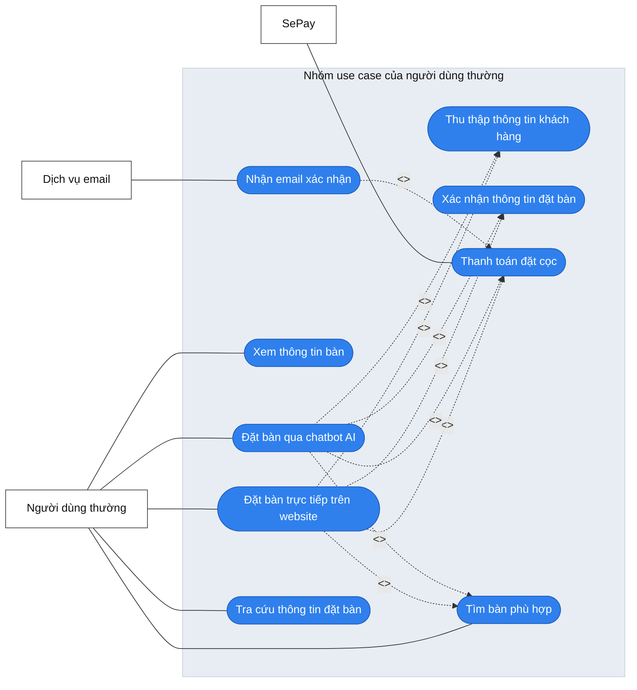
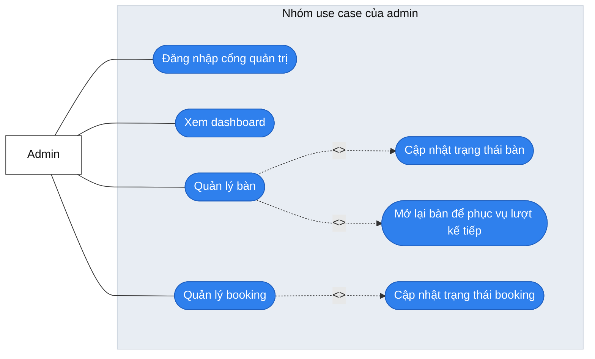
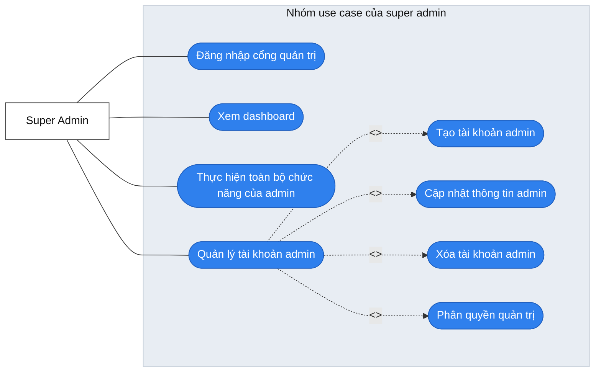
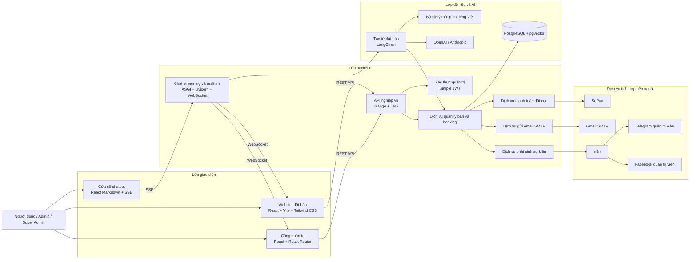
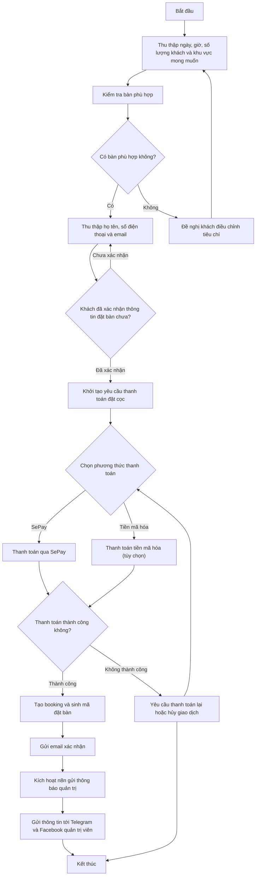

# BÁO CÁO ĐỒ ÁN TỐT NGHIỆP

## Đề tài

**Xây dựng hệ thống chatbot AI hỗ trợ đặt bàn nhà hàng**

## Thông tin trình bày

- Sinh viên thực hiện: `[Điền họ và tên]`
- Mã sinh viên: `[Điền MSSV]`
- Lớp: `[Điền lớp]`
- Giảng viên hướng dẫn: `[Điền tên GVHD]`
- Học phần: Đồ án tốt nghiệp
- Giai đoạn tài liệu: `Phần khởi đầu của báo cáo`
- Học kỳ/Năm học: `[Điền thông tin]`

---

## Lời nói đầu

Trong bối cảnh chuyển đổi số diễn ra mạnh mẽ trên hầu hết các lĩnh vực dịch vụ, ngành nhà hàng cũng đang dần thay đổi cách tiếp cận khách hàng thông qua các nền tảng trực tuyến. Nếu trước đây việc đặt bàn chủ yếu được thực hiện bằng gọi điện thoại, nhắn tin hoặc trao đổi trực tiếp với nhân viên, thì hiện nay khách hàng ngày càng kỳ vọng vào những hệ thống có khả năng phản hồi nhanh, rõ ràng và thuận tiện hơn. Không chỉ mong muốn biết còn bàn hay không, khách hàng còn muốn được hỗ trợ trong quá trình lựa chọn thời gian, khu vực ngồi, số lượng người và các yêu cầu đặc biệt một cách tự nhiên, ít thao tác và ít nhầm lẫn.

Từ thực tế đó, đề tài “Xây dựng hệ thống chatbot AI hỗ trợ đặt bàn nhà hàng” được lựa chọn với mong muốn giải quyết đồng thời hai bài toán: bài toán số hóa quy trình đặt bàn và bài toán nâng cao trải nghiệm tương tác của người dùng trên nền tảng web. Thay vì chỉ dừng lại ở việc xây dựng một biểu mẫu đặt bàn thông thường, đề tài hướng tới việc kết hợp chatbot AI với hệ thống dữ liệu nghiệp vụ để hỗ trợ khách hàng theo cách gần với giao tiếp tự nhiên. Điều này không chỉ có ý nghĩa về mặt ứng dụng thực tế mà còn tạo điều kiện để tích hợp nhiều mảng kiến thức quan trọng trong một đồ án tốt nghiệp, bao gồm phát triển giao diện, xử lý nghiệp vụ, quản lý dữ liệu, mô hình hóa hệ thống và ứng dụng trí tuệ nhân tạo.

Ở giai đoạn hiện tại, nhiệm vụ trọng tâm không phải là chứng minh toàn bộ sản phẩm đã hoàn thiện, mà là làm rõ tính cấp thiết của đề tài, hướng thiết kế sơ bộ, kết quả kỳ vọng, cách đánh giá và kế hoạch triển khai. Nói cách khác, phần khởi đầu của báo cáo cần trả lời được các câu hỏi cốt lõi: tại sao đề tài này cần thiết, đề tài sẽ giải quyết bài toán theo hướng nào, sản phẩm cuối cùng dự kiến đạt được điều gì, việc đánh giá sản phẩm sẽ dựa trên những tiêu chí nào và lộ trình thực hiện có đủ khả thi hay không.

Với tinh thần đó, báo cáo này được xây dựng theo đúng năm nhóm nội dung nền tảng của đề tài. Nội dung báo cáo không đi sâu vào mô tả chi tiết mã nguồn hay liệt kê kỹ thuật triển khai ở mức thấp, mà tập trung vào việc phân tích bài toán, trình bày tư duy thiết kế hệ thống và làm rõ cơ sở học thuật cũng như cơ sở thực tiễn của đề tài. Các sơ đồ quan trọng được giữ lại trong báo cáo gồm cụm sơ đồ use case theo tác nhân, sơ đồ thiết kế hệ thống và sơ đồ quy trình nghiệp vụ đặt bàn có chatbot hỗ trợ. Đây là các minh chứng trực quan cho phần đề xuất giải pháp sơ bộ.

Hy vọng rằng bản báo cáo này sẽ là nền tảng đủ chặt chẽ để tiếp tục triển khai các giai đoạn tiếp theo của đồ án, đồng thời giúp người đọc, giảng viên hướng dẫn và hội đồng đánh giá có cái nhìn rõ ràng hơn về mục tiêu, hướng đi và tính khả thi của đề tài.

---

## Tóm tắt nội dung

Trong giai đoạn đầu của đề tài, báo cáo tập trung vào năm nội dung chính theo yêu cầu đánh giá của đồ án tốt nghiệp. Trước hết, báo cáo phân tích bối cảnh thực tế của bài toán đặt bàn nhà hàng, chỉ ra các hạn chế của cách làm truyền thống và khảo sát ba nhóm giải pháp phổ biến hiện nay gồm biểu mẫu đặt bàn trực tuyến, chatbot chăm sóc khách hàng và nền tảng quản lý nhà hàng tích hợp đặt chỗ. Từ đó, báo cáo làm rõ khoảng trống mà đề tài hướng tới là xây dựng một hệ thống vừa có khả năng tương tác tự nhiên với khách hàng, vừa gắn trực tiếp với nghiệp vụ đặt bàn.

Tiếp theo, báo cáo trình bày giải pháp sơ bộ theo hướng kiến trúc ba lớp, trong đó phần lõi của hệ thống được tổ chức thành lớp giao diện, lớp xử lý nghiệp vụ và lớp dữ liệu kết hợp trí tuệ nhân tạo; bên cạnh đó, hệ thống được thiết kế theo hướng sẵn sàng tích hợp thanh toán đặt cọc, gửi email xác nhận và tự động hóa thông báo quản trị qua n8n. Trên cơ sở đó, cụm sơ đồ use case theo tác nhân, sơ đồ thiết kế hệ thống và sơ đồ quy trình nghiệp vụ đặt bàn có chatbot hỗ trợ theo tám bước được giới thiệu và phân tích. Phần này nhằm chứng minh rằng đề tài đã được hình dung rõ về mặt chức năng, cấu trúc kỹ thuật và logic nghiệp vụ.

Sau phần giải pháp sơ bộ, báo cáo nêu ra các kết quả dự kiến đạt được trên các phương diện sản phẩm, kỹ thuật, học thuật và giá trị ứng dụng. Từ đó, báo cáo tiếp tục xác định phương pháp đánh giá và bộ tiêu chí kiểm thử theo hướng bám sát bài toán thực tế, chú trọng cả chức năng, dữ liệu, trải nghiệm và chất lượng hội thoại của chatbot. Cuối cùng, báo cáo trình bày kế hoạch thực hiện và phân công công việc theo từng giai đoạn, qua đó làm rõ tính khả thi của đề tài trong khuôn khổ đồ án tốt nghiệp.

Nhìn chung, báo cáo ở giai đoạn hiện tại không chỉ là tài liệu giới thiệu ý tưởng, mà là cơ sở để khẳng định rằng đề tài có nhu cầu thực tiễn, có hướng thiết kế phù hợp, có thể đánh giá được và có kế hoạch triển khai tương đối rõ ràng trong các giai đoạn tiếp theo.

---

## Mục lục gợi ý

1. Lời nói đầu
2. Tóm tắt nội dung
3. 1.1. Điều tra tổng quan và tính cấp thiết của đề tài
4. 1.2. Đề xuất giải pháp sơ bộ
5. 1.3. Dự kiến kết quả đạt được
6. 1.4. Phương pháp đánh giá và tiêu chí kiểm thử
7. 1.5. Kế hoạch thực hiện và phân công công việc

---

## 1.1. Điều tra tổng quan và tính cấp thiết của đề tài

### 1.1.1. Bối cảnh chuyển đổi số trong lĩnh vực nhà hàng

Ngành nhà hàng là một trong những lĩnh vực dịch vụ có tần suất tương tác trực tiếp với khách hàng rất cao. Trong mô hình kinh doanh truyền thống, nhiều khâu vẫn phụ thuộc vào thao tác thủ công như tiếp nhận đặt bàn, xác nhận lịch, ghi chú nhu cầu của khách hoặc tra cứu lại thông tin khi có thay đổi. Cách làm này từng phù hợp trong giai đoạn quy mô nhỏ và lượng khách chưa lớn, nhưng đang dần bộc lộ nhiều hạn chế trong bối cảnh người dùng hiện đại đòi hỏi trải nghiệm nhanh hơn, thuận tiện hơn và ít phụ thuộc hơn vào nhân viên trực.

Chuyển đổi số trong lĩnh vực nhà hàng không chỉ là đưa một vài biểu mẫu lên website, mà là quá trình tái tổ chức lại cách tiếp nhận, xử lý và phản hồi nhu cầu của khách hàng dựa trên nền tảng công nghệ. Một hệ thống đặt bàn hiệu quả cần giúp khách hàng biết được khả năng phục vụ của nhà hàng trong một khoảng thời gian cụ thể, đồng thời hỗ trợ nhà hàng quản lý thông tin có cấu trúc, tránh chồng chéo và giảm sai sót trong quá trình vận hành.

Song song với đó, hành vi người dùng trên môi trường số cũng đang thay đổi đáng kể. Người dùng hiện nay quen với việc trò chuyện với hệ thống, tìm kiếm thông tin nhanh, nhận phản hồi gần thời gian thực và mong muốn thao tác được rút gọn. Vì vậy, việc đưa chatbot AI vào một hệ thống đặt bàn là một hướng phát triển có tính thời sự, vừa phản ánh đúng xu thế công nghệ, vừa phù hợp với nhu cầu thực tiễn của bài toán.

### 1.1.2. Mô tả bài toán đặt bàn trong thực tế

Bài toán đặt bàn nhà hàng nhìn bề ngoài có vẻ đơn giản, nhưng khi phân tích ở mức nghiệp vụ sẽ thấy đây là một quy trình chứa nhiều thông tin và nhiều tình huống phát sinh. Để hoàn thành một yêu cầu đặt bàn, hệ thống hoặc nhân viên cần xác định được ít nhất các yếu tố sau:

- ngày khách muốn sử dụng dịch vụ;
- khung giờ khách đến;
- số lượng người tham dự;
- loại bàn hoặc khu vực mong muốn;
- họ tên, số điện thoại và email của khách;
- trạng thái xác nhận và trạng thái thanh toán đặt cọc, nếu nhà hàng áp dụng;
- các ghi chú phát sinh nếu có.

Nếu một trong các thông tin trên bị thiếu hoặc sai lệch, quá trình phục vụ có thể bị ảnh hưởng. Ví dụ, khách hàng đi nhóm đông nhưng bàn được chuẩn bị không đủ sức chứa, hoặc khách muốn ngồi khu vực riêng tư nhưng hệ thống không ghi nhận đúng yêu cầu. Từ đó có thể thấy rằng bài toán đặt bàn không chỉ là nhận thông tin, mà là một bài toán tổ chức thông tin, xác minh thông tin và phản hồi thông tin một cách thống nhất.

Ngoài ra, một yêu cầu đặt bàn thường không diễn ra theo cấu trúc cứng. Khách hàng có thể nói “tối mai mình đi 4 người”, “cuối tuần còn bàn gần cửa sổ không”, hoặc “đặt giúp mình một bàn ngoài trời khoảng 7 giờ”. Điều này cho thấy nếu hệ thống chỉ dựa trên biểu mẫu tĩnh thì chưa chắc đã phù hợp với hành vi thực tế của người dùng.

### 1.1.3. Thực trạng tiếp nhận đặt bàn theo cách truyền thống

Hiện nay, nhiều nhà hàng vẫn tiếp nhận yêu cầu đặt bàn qua các phương thức quen thuộc như gọi điện thoại, nhắn tin qua mạng xã hội, ứng dụng nhắn tin hoặc điền biểu mẫu cơ bản trên website. Đây là những cách tiếp cận dễ thực hiện, không đòi hỏi đầu tư quá lớn trong giai đoạn đầu và phù hợp với mô hình vận hành thủ công.

Tuy nhiên, ở góc độ hệ thống hóa, những cách làm này còn nhiều điểm chưa tối ưu. Khi tiếp nhận qua điện thoại hoặc tin nhắn, phần lớn thông tin vẫn phải được nhân viên đọc, hiểu, ghi nhận rồi xác nhận lại bằng thao tác thủ công. Trong điều kiện lượng khách tăng hoặc nhiều nhân viên cùng trực, nguy cơ trùng lặp thông tin, bỏ sót thông tin hoặc xác nhận sai là hoàn toàn có thể xảy ra.

Biểu mẫu trên website tuy giúp chuẩn hóa dữ liệu hơn, nhưng vẫn có hạn chế về khả năng tương tác. Người dùng phải tự hiểu mình cần điền gì, không được hỗ trợ nếu dữ liệu chưa rõ ràng và khó xử lý tốt các trường hợp muốn mô tả theo ngôn ngữ tự nhiên.

### 1.1.4. Những hạn chế nổi bật của phương pháp đặt bàn truyền thống

Qua quan sát thực tế, có thể tổng hợp các hạn chế nổi bật của cách đặt bàn truyền thống như sau.

Thứ nhất, **phụ thuộc nhiều vào con người**. Trong các khung giờ cao điểm, nếu không có nhân viên tiếp nhận kịp thời thì khách hàng có thể phải chờ hoặc bỏ qua nhu cầu đặt bàn.

Thứ hai, **dễ phát sinh sai sót khi ghi nhận thông tin**. Việc ghi nhầm ngày, giờ, số lượng người hoặc bỏ sót yêu cầu đặc biệt có thể dẫn đến trải nghiệm không tốt khi khách đến nhà hàng.

Thứ ba, **khó chuẩn hóa quy trình**. Mỗi nhân viên có thể có cách tiếp nhận và xác nhận khác nhau, dẫn đến sự thiếu đồng nhất trong chất lượng phục vụ.

Thứ tư, **khó tra cứu và tổng hợp dữ liệu**. Nếu thông tin booking không được lưu trữ có cấu trúc, nhà hàng sẽ khó thống kê được lượng khách, mức độ sử dụng bàn hoặc lịch sử đặt bàn.

Thứ năm, **trải nghiệm người dùng chưa thực sự linh hoạt**. Khách hàng ngày càng quen với việc thao tác nhanh trên môi trường số. Một hệ thống đặt bàn chỉ dừng ở mức biểu mẫu hoặc trao đổi thủ công khó tạo được cảm giác hiện đại và chủ động.

### 1.1.5. Khảo sát các nhóm giải pháp hiện có

Để định vị rõ đề tài, cần khảo sát các nhóm giải pháp đang phổ biến hiện nay. Có thể chia thành ba nhóm chính.

#### 1.1.5.1. Biểu mẫu đặt bàn trực tuyến

Đây là nhóm giải pháp cơ bản nhất, trong đó website cung cấp cho người dùng một biểu mẫu gồm các trường ngày, giờ, số lượng người, họ tên, số điện thoại và một số thông tin bổ sung. Ưu điểm của nhóm này là đơn giản, dễ triển khai, dễ chuẩn hóa dữ liệu đầu vào và phù hợp với quy mô nhỏ.

Tuy nhiên, nhược điểm lớn là thiếu khả năng tương tác. Nếu khách chưa biết nên chọn giờ nào, muốn hỏi còn bàn khu vực nào hoặc cần làm rõ điều kiện đặt chỗ, biểu mẫu không thể phản hồi linh hoạt. Như vậy, giải pháp này tốt ở tính cấu trúc, nhưng yếu ở khả năng hỗ trợ người dùng.

#### 1.1.5.2. Chatbot chăm sóc khách hàng

Nhóm này tập trung vào khả năng trò chuyện với khách hàng. Chatbot có thể đóng vai trò tiếp nhận câu hỏi, hướng dẫn, giải đáp thông tin cơ bản hoặc hỗ trợ tư vấn ban đầu. Ưu điểm lớn nhất là tạo ra cảm giác tương tác tự nhiên hơn, giúp người dùng dễ tiếp cận hơn so với biểu mẫu cứng.

Tuy nhiên, nhiều chatbot hiện nay chỉ dừng ở mức tư vấn hoặc trả lời câu hỏi, chưa gắn trực tiếp với dữ liệu bàn và booking của hệ thống. Khi thiếu kết nối với dữ liệu nghiệp vụ, chatbot có thể trả lời tốt về mặt ngôn ngữ nhưng không đảm bảo tính chính xác khi xử lý đặt bàn thực tế.

#### 1.1.5.3. Nền tảng quản lý nhà hàng tích hợp đặt bàn

Đây là nhóm giải pháp toàn diện hơn, thường bao gồm quản lý bàn, quản lý booking, phân quyền nhân viên, báo cáo thống kê và đôi khi cả thanh toán, marketing hoặc chăm sóc khách hàng. Ưu điểm là dữ liệu tập trung và có thể hỗ trợ vận hành ở quy mô lớn hơn.

Tuy nhiên, đối với phạm vi một đồ án tốt nghiệp, nhóm giải pháp này có thể quá rộng và dễ dẫn tới dàn trải. Mục tiêu của đồ án là giải quyết sâu một bài toán rõ ràng, chứ không phải xây dựng một nền tảng quản trị toàn bộ hoạt động nhà hàng.

### 1.1.6. Khoảng trống mà đề tài hướng tới

Từ ba nhóm giải pháp nêu trên, có thể nhận thấy khoảng trống chính nằm ở sự thiếu kết hợp giữa hai yếu tố: **tương tác tự nhiên** và **xử lý nghiệp vụ thực tế**. Một hệ thống chỉ có biểu mẫu sẽ mạnh ở dữ liệu có cấu trúc nhưng yếu ở hỗ trợ người dùng; ngược lại, một chatbot tư vấn thuần túy có thể mạnh ở tương tác nhưng lại chưa đủ năng lực xử lý nghiệp vụ đặt bàn.

Đề tài này hướng đến việc kết hợp hai yếu tố đó trong một hệ thống thống nhất. Cụ thể, hệ thống cần:

- hiểu được yêu cầu của khách theo ngôn ngữ tự nhiên;
- thu thập thông tin còn thiếu theo đúng trình tự;
- đối chiếu với dữ liệu bàn thực tế;
- hỗ trợ khách đưa ra lựa chọn phù hợp;
- xác nhận lại nội dung đặt bàn trước khi ghi nhận chính thức;
- hỗ trợ khởi tạo thanh toán đặt cọc, gửi email xác nhận cho khách hàng và gửi thông báo quản trị qua n8n sau khi đặt bàn thành công.

Khoảng trống này chính là điểm nhấn và cũng là lý do khiến đề tài có giá trị riêng so với các hướng tiếp cận thông thường.

### 1.1.7. Tính cấp thiết về mặt thực tiễn

Về thực tiễn, đề tài có tính cấp thiết vì giải quyết một nhu cầu rõ ràng của mô hình kinh doanh nhà hàng: tiếp nhận đặt bàn nhanh hơn, chính xác hơn và ít phụ thuộc hơn vào thao tác thủ công. Khi được tổ chức tốt, hệ thống không chỉ giúp nhà hàng giảm tải cho nhân viên mà còn hỗ trợ nâng cao hình ảnh chuyên nghiệp trong mắt khách hàng.

Trong điều kiện cạnh tranh giữa các nhà hàng ngày càng lớn, trải nghiệm số cũng trở thành một yếu tố ảnh hưởng đến quyết định sử dụng dịch vụ. Một hệ thống cho phép khách hàng đặt bàn dễ dàng, được hướng dẫn rõ ràng và nhận phản hồi hợp lý sẽ tạo ra lợi thế nhất định về chất lượng phục vụ.

### 1.1.8. Tính cấp thiết về mặt học thuật

Về học thuật, đề tài là một môi trường phù hợp để tích hợp nhiều mảng kiến thức đã học trong chương trình đào tạo. Người thực hiện cần phải:

- phân tích bài toán và nhu cầu người dùng;
- mô hình hóa hệ thống và quy trình;
- thiết kế giao diện và trải nghiệm người dùng;
- xử lý dữ liệu có cấu trúc;
- xây dựng logic nghiệp vụ;
- áp dụng AI vào một bối cảnh nghiệp vụ cụ thể.

Điểm đáng chú ý là AI trong đề tài này không đứng riêng lẻ, mà được đặt trong quan hệ với toàn bộ hệ thống. Điều đó làm cho đề tài có giá trị cao hơn một bài thực hành kỹ thuật đơn lẻ.

### 1.1.9. Kết luận mục 1.1

Qua việc phân tích bối cảnh, mô tả thực trạng và khảo sát các nhóm giải pháp hiện có, có thể khẳng định rằng đề tài “Xây dựng hệ thống chatbot AI hỗ trợ đặt bàn nhà hàng” có tính cấp thiết rõ ràng. Đề tài không chỉ xuất phát từ một ý tưởng công nghệ, mà xuất phát từ nhu cầu thực tế của bài toán đặt bàn và xu hướng số hóa dịch vụ trong lĩnh vực nhà hàng.

---

## 1.2. Đề xuất giải pháp sơ bộ

### 1.2.1. Mục tiêu của giải pháp sơ bộ

Giải pháp sơ bộ của đề tài được xây dựng nhằm trả lời ba câu hỏi cốt lõi:

- hệ thống sẽ được tổ chức theo cấu trúc nào;
- chatbot sẽ tham gia vào quy trình đặt bàn ra sao;
- vì sao hướng thiết kế này là phù hợp với bài toán.

Ở giai đoạn hiện tại, mục tiêu của phần này không phải là trình bày toàn bộ chi tiết kỹ thuật triển khai, mà là đưa ra một mô hình giải pháp có tính logic, có thể giải thích được và có tính khả thi.

### 1.2.2. Định hướng giải pháp tổng thể

Định hướng chung của đề tài là xây dựng một hệ thống web hỗ trợ đặt bàn nhà hàng có tích hợp chatbot AI. Trong hệ thống này, chatbot không chỉ đóng vai trò giao tiếp mà còn tham gia điều phối quy trình đặt bàn theo từng bước. Toàn bộ luồng nghiệp vụ, từ tiếp nhận nhu cầu, kiểm tra bàn phù hợp, xác nhận thông tin, khởi tạo thanh toán đặt cọc cho đến gửi email xác nhận và kích hoạt luồng thông báo quản trị qua n8n, đều phải được kiểm soát thống nhất tại tầng xử lý trung tâm.

Giải pháp này có thể được hiểu là sự kết hợp giữa:

- một giao diện web thân thiện để người dùng dễ tiếp cận;
- một tầng xử lý nghiệp vụ để đảm bảo tính nhất quán của dữ liệu và điều phối luồng đặt bàn;
- một thành phần AI giúp tăng khả năng tương tác tự nhiên;
- các dịch vụ tích hợp hỗ trợ thanh toán đặt cọc, gửi email thông báo và tự động hóa thông báo cho quản trị viên.

Sự kết hợp này giúp hệ thống vừa đảm bảo tính cấu trúc, vừa cải thiện trải nghiệm người dùng.

### 1.2.3. Cụm sơ đồ use case theo tác nhân

Phần use case của đề tài được trình bày trực tiếp theo từng nhóm tác nhân chính thay vì giữ thêm một sơ đồ tổng thể riêng.

Ba nhóm tác nhân chính của hệ thống gồm:

- người dùng thường;
- admin;
- super admin.

### 1.2.4. Use case của người dùng thường

Người dùng thường là nhóm tác nhân trực tiếp sử dụng hệ thống để tìm bàn, đặt bàn và tra cứu thông tin booking. Đây là nhóm use case gắn với phần giao diện khách hàng và chatbot hỗ trợ đặt bàn.

**Hình 1. Sơ đồ use case của người dùng thường**

Sơ đồ trên cho thấy người dùng thường là tác nhân gắn trực tiếp với phần nghiệp vụ đặt bàn của hệ thống. Các use case chính của nhóm này gồm xem thông tin bàn, tìm bàn phù hợp, đặt bàn trực tiếp trên website, đặt bàn qua chatbot AI và tra cứu thông tin đặt bàn.

Trong đó, hai use case trung tâm là `Đặt bàn trực tiếp trên website` và `Đặt bàn qua chatbot AI`. Cả hai đều có quan hệ `<<include>>` với các bước tìm bàn phù hợp, thu thập thông tin khách hàng, xác nhận thông tin đặt bàn và thanh toán đặt cọc. Điều này thể hiện rằng dù người dùng thao tác qua form hay qua hội thoại, hệ thống vẫn dùng cùng một logic nghiệp vụ cốt lõi.

Use case `Nhận email xác nhận` được đặt ở quan hệ `<<extend>>` từ thanh toán đặt cọc để nhấn mạnh rằng email chỉ được gửi sau khi giao dịch đã được hệ thống ghi nhận hợp lệ.

#### Mô tả các use case tiêu biểu của người dùng thường

##### UC-01. Tìm bàn phù hợp

| Thuộc tính       | Nội dung                                                                                                                                                                                                                                                           |
| ---------------- | ------------------------------------------------------------------------------------------------------------------------------------------------------------------------------------------------------------------------------------------------------------------ |
| Mã use case      | UC-01                                                                                                                                                                                                                                                              |
| Mô tả ngắn       | Khách hàng nhập các điều kiện cơ bản để hệ thống xác định những bàn còn phù hợp trong một khung giờ cụ thể.                                                                                                                                                        |
| Tác nhân chính   | Người dùng thường                                                                                                                                                                                                                                                  |
| Tiền điều kiện   | Hệ thống đã có dữ liệu bàn và dữ liệu booking hiện tại.                                                                                                                                                                                                            |
| Luồng chính      | 1. Khách hàng nhập ngày, giờ, số lượng khách và tiêu chí mong muốn. 2. Hệ thống kiểm tra dữ liệu bàn và các booking đã tồn tại. 3. Hệ thống trả về danh sách các bàn đáp ứng điều kiện. 4. Khách hàng lựa chọn một phương án phù hợp để tiếp tục đặt bàn. |
| Luồng thay thế   | 1. Nếu không có bàn phù hợp, hệ thống thông báo và yêu cầu khách hàng điều chỉnh tiêu chí tìm kiếm.                                                                                                                                                                |
| Kết quả sau cùng | Khách hàng nhận được danh sách bàn phù hợp hoặc thông báo không còn bàn trong khung giờ đã chọn.                                                                                                                                                                   |

##### UC-02. Đặt bàn trực tiếp trên website

| Thuộc tính       | Nội dung                                                                                                                                                                                                                                                                                                                                                                                                                |
| ---------------- | ----------------------------------------------------------------------------------------------------------------------------------------------------------------------------------------------------------------------------------------------------------------------------------------------------------------------------------------------------------------------------------------------------------------------- |
| Mã use case      | UC-02                                                                                                                                                                                                                                                                                                                                                                                                                   |
| Mô tả ngắn       | Khách hàng hoàn tất biểu mẫu đặt bàn trực tiếp trên giao diện web mà không cần tương tác bằng hội thoại.                                                                                                                                                                                                                                                                                                                |
| Tác nhân chính   | Người dùng thường                                                                                                                                                                                                                                                                                                                                                                                                       |
| Tiền điều kiện   | Khách hàng đã chọn được bàn phù hợp từ danh sách bàn khả dụng.                                                                                                                                                                                                                                                                                                                                                          |
| Luồng chính      | 1. Khách hàng chọn bàn, ngày, giờ và số lượng khách. 2. Khách hàng nhập họ tên, số điện thoại, email và các ghi chú bổ sung. 3. Hệ thống kiểm tra tính hợp lệ của dữ liệu đầu vào. 4. Hệ thống khởi tạo yêu cầu thanh toán đặt cọc. 5. Khách hàng thực hiện thanh toán qua SePay. 6. Hệ thống ghi nhận booking sau khi giao dịch hợp lệ. 7. Hệ thống gửi email xác nhận và lưu mã đặt bàn để tra cứu. |
| Luồng thay thế   | 1. Nếu bàn vừa bị khách khác giữ chỗ, hệ thống yêu cầu khách hàng chọn lại bàn khác. 2. Nếu thanh toán không thành công, hệ thống giữ yêu cầu ở trạng thái chờ hoặc cho phép khách hàng thử lại.                                                                                                                                                                                                                     |
| Kết quả sau cùng | Một booking hợp lệ được ghi nhận và gắn với mã đặt bàn tương ứng.                                                                                                                                                                                                                                                                                                                                                       |

##### UC-03. Đặt bàn qua chatbot AI

| Thuộc tính       | Nội dung                                                                                                                                                                                                                                                                                                                                                                                                                                                                                                                           |
| ---------------- | ---------------------------------------------------------------------------------------------------------------------------------------------------------------------------------------------------------------------------------------------------------------------------------------------------------------------------------------------------------------------------------------------------------------------------------------------------------------------------------------------------------------------------------- |
| Mã use case      | UC-03                                                                                                                                                                                                                                                                                                                                                                                                                                                                                                                              |
| Mô tả ngắn       | Khách hàng sử dụng chatbot để trao đổi tự nhiên với hệ thống trong quá trình tìm bàn và đặt chỗ.                                                                                                                                                                                                                                                                                                                                                                                                                                   |
| Tác nhân chính   | Người dùng thường                                                                                                                                                                                                                                                                                                                                                                                                                                                                                                                  |
| Tác nhân phụ     | Tác tử AI hỗ trợ đặt bàn                                                                                                                                                                                                                                                                                                                                                                                                                                                                                                           |
| Tiền điều kiện   | Dịch vụ hội thoại và dữ liệu bàn đang hoạt động bình thường.                                                                                                                                                                                                                                                                                                                                                                                                                                                                       |
| Luồng chính      | 1. Khách hàng gửi yêu cầu đặt bàn bằng ngôn ngữ tự nhiên. 2. Chatbot thu thập dần các thông tin còn thiếu như ngày, giờ, số lượng khách và khu vực mong muốn. 3. Hệ thống kiểm tra bàn phù hợp và trả về gợi ý. 4. Chatbot tiếp tục thu thập thông tin liên hệ của khách hàng. 5. Chatbot tóm tắt lại toàn bộ thông tin để khách hàng xác nhận. 6. Hệ thống khởi tạo thanh toán đặt cọc. 7. Sau khi thanh toán thành công, hệ thống ghi nhận booking, gửi email xác nhận và phản hồi lại kết quả cho khách hàng. |
| Luồng thay thế   | 1. Nếu khách hàng cung cấp thiếu thông tin, chatbot tiếp tục đặt câu hỏi cho đến khi đủ dữ liệu. 2. Nếu không còn bàn phù hợp, chatbot đề nghị khách hàng thay đổi thời gian, khu vực hoặc số lượng khách.                                                                                                                                                                                                                                                                                                                      |
| Kết quả sau cùng | Khách hàng có thể hoàn thành quy trình đặt bàn thông qua hội thoại, đồng thời hệ thống vẫn đảm bảo đúng trình tự nghiệp vụ.                                                                                                                                                                                                                                                                                                                                                                                                        |

##### UC-04. Thanh toán đặt cọc qua SePay

| Thuộc tính       | Nội dung                                                                                                                                                                                                                                                                                                                                     |
| ---------------- | -------------------------------------------------------------------------------------------------------------------------------------------------------------------------------------------------------------------------------------------------------------------------------------------------------------------------------------------- |
| Mã use case      | UC-04                                                                                                                                                                                                                                                                                                                                        |
| Mô tả ngắn       | Hệ thống tiếp nhận giao dịch đặt cọc trước khi xác nhận booking chính thức.                                                                                                                                                                                                                                                                  |
| Tác nhân chính   | Người dùng thường                                                                                                                                                                                                                                                                                                                            |
| Tác nhân phụ     | SePay                                                                                                                                                                                                                                                                                                                                        |
| Tiền điều kiện   | Booking đã có đủ thông tin cần thiết và hệ thống đã tạo yêu cầu thanh toán.                                                                                                                                                                                                                                                                  |
| Luồng chính      | 1. Hệ thống sinh yêu cầu thanh toán đặt cọc với số tiền tương ứng. 2. Khách hàng thực hiện thanh toán thông qua SePay. 3. SePay trả kết quả giao dịch về cho hệ thống. 4. Hệ thống đối chiếu trạng thái giao dịch với booking tương ứng. 5. Nếu giao dịch hợp lệ, hệ thống chuyển booking sang trạng thái đủ điều kiện xác nhận. |
| Luồng thay thế   | 1. Nếu giao dịch hết hạn hoặc thất bại, hệ thống giữ booking ở trạng thái chờ hoặc hủy theo chính sách vận hành.                                                                                                                                                                                                                             |
| Kết quả sau cùng | Trạng thái giao dịch được cập nhật nhất quán với trạng thái booking.                                                                                                                                                                                                                                                                         |

##### UC-05. Tra cứu thông tin đặt bàn

| Thuộc tính       | Nội dung                                                                                                                                                                                        |
| ---------------- | ----------------------------------------------------------------------------------------------------------------------------------------------------------------------------------------------- |
| Mã use case      | UC-05                                                                                                                                                                                           |
| Mô tả ngắn       | Khách hàng tra cứu lại thông tin booking bằng mã đặt bàn đã được hệ thống cấp.                                                                                                                  |
| Tác nhân chính   | Người dùng thường                                                                                                                                                                               |
| Tiền điều kiện   | Booking đã tồn tại và có mã đặt bàn.                                                                                                                                                            |
| Luồng chính      | 1. Khách hàng nhập mã đặt bàn tại trang tra cứu. 2. Hệ thống tìm kiếm booking tương ứng trong cơ sở dữ liệu. 3. Hệ thống hiển thị tình trạng booking, thời gian sử dụng và thông tin bàn. |
| Luồng thay thế   | 1. Nếu mã không tồn tại hoặc sai định dạng, hệ thống thông báo không tìm thấy booking.                                                                                                          |
| Kết quả sau cùng | Khách hàng có thể kiểm tra lại tình trạng đặt bàn mà không cần liên hệ trực tiếp với nhà hàng.                                                                                                  |

### 1.2.5. Nhóm use case của admin

Admin là nhóm tác nhân tham gia vận hành hệ thống ở mức quản lý booking và quản lý bàn

**Hình 2. Sơ đồ use case của admin**

Sơ đồ use case của admin phản ánh đúng phạm vi vận hành hiện tại của cổng quản trị. Admin trước hết phải đăng nhập vào cổng quản trị, sau đó mới có thể truy cập dashboard và thực hiện các thao tác quản lý bàn, quản lý booking.

Use case `Quản lý bàn` bao gồm việc cập nhật trạng thái bàn và, khi cần thiết, mở lại bàn để phục vụ lượt khách tiếp theo. Use case `Quản lý booking` bao gồm việc cập nhật trạng thái booking trong quá trình vận hành. Cách tổ chức này cho thấy quyền của admin được giới hạn ở lớp vận hành, không bao gồm quản trị tài khoản quản trị viên khác.

#### Mô tả các use case tiêu biểu của admin

##### UC-06. Đăng nhập cổng quản trị

| Thuộc tính       | Nội dung                                                                                                                                                                                                                                    |
| ---------------- | ------------------------------------------------------------------------------------------------------------------------------------------------------------------------------------------------------------------------------------------- |
| Mã use case      | UC-06                                                                                                                                                                                                                                       |
| Mô tả ngắn       | Admin đăng nhập vào cổng quản trị để truy cập các chức năng vận hành của hệ thống.                                                                                                                                                          |
| Tác nhân chính   | Admin                                                                                                                                                                                                                                       |
| Tiền điều kiện   | Tài khoản đã tồn tại và có quyền truy cập cổng quản trị.                                                                                                                                                                                    |
| Luồng chính      | 1. Admin truy cập giao diện đăng nhập quản trị. 2. Admin nhập email và mật khẩu. 3. Hệ thống kiểm tra thông tin xác thực và nhóm quyền của tài khoản. 4. Nếu hợp lệ, hệ thống tạo phiên làm việc và chuyển tới dashboard quản trị. |
| Luồng thay thế   | 1. Nếu thông tin đăng nhập sai hoặc tài khoản không có quyền quản trị, hệ thống từ chối truy cập và trả thông báo lỗi.                                                                                                                      |
| Kết quả sau cùng | Admin truy cập được vào cổng quản trị với đúng phạm vi quyền được cấp.                                                                                                                                                                      |

##### UC-07. Quản lý bàn

| Thuộc tính       | Nội dung                                                                                                                                                                                                                                                       |
| ---------------- | -------------------------------------------------------------------------------------------------------------------------------------------------------------------------------------------------------------------------------------------------------------- |
| Mã use case      | UC-07                                                                                                                                                                                                                                                          |
| Mô tả ngắn       | Admin theo dõi danh sách bàn và cập nhật trạng thái vận hành của từng bàn.                                                                                                                                                                                     |
| Tác nhân chính   | Admin                                                                                                                                                                                                                                                          |
| Tiền điều kiện   | Admin đã đăng nhập và có quyền quản lý bàn.                                                                                                                                                                                                                    |
| Luồng chính      | 1. Admin truy cập danh sách bàn trong cổng quản trị. 2. Hệ thống hiển thị thông tin bàn theo tầng, loại bàn và trạng thái hiện tại. 3. Admin thêm mới, chỉnh sửa hoặc cập nhật trạng thái bàn. 4. Hệ thống lưu thay đổi và cập nhật dữ liệu vận hành. |
| Luồng thay thế   | 1. Nếu tài khoản không được cấp quyền quản lý bàn, hệ thống từ chối thao tác.                                                                                                                                                                                  |
| Kết quả sau cùng | Tình trạng bàn trong hệ thống phản ánh đúng trạng thái vận hành thực tế.                                                                                                                                                                                       |

##### UC-08. Quản lý booking

| Thuộc tính       | Nội dung                                                                                                                                                                                                                                              |
| ---------------- | ----------------------------------------------------------------------------------------------------------------------------------------------------------------------------------------------------------------------------------------------------- |
| Mã use case      | UC-08                                                                                                                                                                                                                                                 |
| Mô tả ngắn       | Admin theo dõi danh sách booking và cập nhật trạng thái booking trong quá trình vận hành.                                                                                                                                                             |
| Tác nhân chính   | Admin                                                                                                                                                                                                                                                 |
| Tiền điều kiện   | Admin đã đăng nhập và có quyền quản lý booking.                                                                                                                                                                                                       |
| Luồng chính      | 1. Admin truy cập danh sách booking. 2. Hệ thống hiển thị booking theo mã, khách hàng, bàn, thời gian và trạng thái. 3. Admin thực hiện xác nhận, hủy, hoàn thành hoặc đánh dấu không đến. 4. Hệ thống ghi nhận thay đổi trạng thái booking. |
| Luồng thay thế   | 1. Nếu tài khoản không được cấp quyền quản lý booking, hệ thống từ chối thao tác.                                                                                                                                                                     |
| Kết quả sau cùng | Danh sách booking được cập nhật đồng bộ với tình trạng xử lý thực tế.                                                                                                                                                                                 |

### 1.2.6. Nhóm use case của super admin

Super admin là nhóm tác nhân có phạm vi quyền cao nhất trong hệ thống. Ngoài các quyền tương đương admin, super admin còn có khả năng tạo tài khoản admin, cập nhật thông tin admin, xóa tài khoản admin và gán quyền thao tác cho từng admin thường.

**Hình 3. Sơ đồ use case của super admin**

Sơ đồ use case của super admin thể hiện nhóm quyền cao nhất trong khu vực quản trị. Ngoài việc có thể thực hiện toàn bộ các chức năng mà admin thường có, super admin còn chịu trách nhiệm quản lý tài khoản admin.

Use case `Quản lý tài khoản admin` bao gồm các thao tác tạo mới, cập nhật, xóa và phân quyền cho tài khoản admin thường. Đây là điểm khác biệt rõ nhất giữa admin và super admin trong hệ thống hiện tại, đồng thời là cơ sở để bảo đảm cơ chế phân quyền được kiểm soát tập trung.

#### Mô tả các use case tiêu biểu của super admin

Nhóm use case của super admin kế thừa các chức năng đăng nhập, quản lý bàn và quản lý booking như admin. Phần mô tả dưới đây tập trung vào các use case đặc thù chỉ xuất hiện ở nhóm quyền cao nhất.

##### UC-09. Quản lý tài khoản admin

| Thuộc tính       | Nội dung                                                                                                                                                                                                                                                      |
| ---------------- | ------------------------------------------------------------------------------------------------------------------------------------------------------------------------------------------------------------------------------------------------------------- |
| Mã use case      | UC-09                                                                                                                                                                                                                                                         |
| Mô tả ngắn       | Super admin quản lý danh sách tài khoản admin thường trong hệ thống.                                                                                                                                                                                          |
| Tác nhân chính   | Super Admin                                                                                                                                                                                                                                                   |
| Tiền điều kiện   | Tác nhân đã đăng nhập với vai trò super admin.                                                                                                                                                                                                                |
| Luồng chính      | 1. Super admin truy cập khu vực quản lý tài khoản admin. 2. Hệ thống hiển thị danh sách các tài khoản admin hiện có. 3. Super admin tạo mới, cập nhật hoặc xóa tài khoản admin thường. 4. Hệ thống lưu thay đổi và cập nhật lại danh sách tài khoản. |
| Luồng thay thế   | 1. Nếu tài khoản không phải super admin, hệ thống không cho phép truy cập chức năng này.                                                                                                                                                                      |
| Kết quả sau cùng | Danh sách admin được quản lý tập trung và thống nhất trong hệ thống.                                                                                                                                                                                          |

##### UC-10. Phân quyền cho admin

| Thuộc tính       | Nội dung                                                                                                                                                                                                                                |
| ---------------- | --------------------------------------------------------------------------------------------------------------------------------------------------------------------------------------------------------------------------------------- |
| Mã use case      | UC-10                                                                                                                                                                                                                                   |
| Mô tả ngắn       | Super admin gán quyền quản lý booking và quản lý bàn cho từng tài khoản admin thường.                                                                                                                                                   |
| Tác nhân chính   | Super Admin                                                                                                                                                                                                                             |
| Tiền điều kiện   | Tài khoản admin thường đã tồn tại trong hệ thống.                                                                                                                                                                                       |
| Luồng chính      | 1. Super admin chọn một tài khoản admin thường. 2. Hệ thống hiển thị các quyền hiện tại của tài khoản đó. 3. Super admin gán hoặc thu hồi các quyền như quản lý booking, quản lý bàn. 4. Hệ thống lưu cấu hình phân quyền mới. |
| Luồng thay thế   | 1. Nếu tài khoản được chọn không hợp lệ hoặc không phải admin thường, hệ thống từ chối cập nhật.                                                                                                                                        |
| Kết quả sau cùng | Mỗi admin thường có phạm vi thao tác phù hợp với vai trò được giao.                                                                                                                                                                     |

### 1.2.7. Kiến trúc ba lớp của hệ thống

Về mặt tổng quát, giải pháp được tổ chức theo mô hình ba lớp.

**Lớp giao diện** là nơi người dùng trực tiếp thao tác. Ở lớp này, người dùng có thể xem thông tin, lựa chọn ngày giờ, gửi yêu cầu đặt bàn hoặc trò chuyện với chatbot.

**Lớp xử lý nghiệp vụ** là phần trung gian có vai trò rất quan trọng. Đây là nơi kiểm soát logic đặt bàn, điều phối luồng hội thoại, kiểm tra tính hợp lệ của thông tin, quản lý trạng thái đặt bàn, khởi tạo thanh toán đặt cọc, kích hoạt gửi email xác nhận và phát sinh sự kiện phục vụ luồng thông báo quản trị.

**Lớp dữ liệu và trí tuệ nhân tạo** là nơi lưu trữ dữ liệu có cấu trúc về bàn, booking và trạng thái giao dịch, đồng thời hỗ trợ khả năng suy luận hội thoại thông qua mô hình ngôn ngữ lớn và tác tử AI. Bên cạnh ba lớp lõi, hệ thống còn được thiết kế theo hướng sẵn sàng kết nối với các dịch vụ tích hợp bên ngoài như cổng thanh toán, hạ tầng gửi email và nền tảng tự động hóa quy trình.

Việc chia hệ thống thành ba lớp như vậy giúp đề tài có cấu trúc rõ ràng, dễ mô tả trong báo cáo và thuận tiện cho việc mở rộng ở các giai đoạn sau.

### 1.2.8. Sơ đồ thiết kế hệ thống

Để làm rõ hơn cấu trúc kỹ thuật của giải pháp, báo cáo cần một sơ đồ thiết kế hệ thống ở mức tổng thể. Khác với sơ đồ use case tập trung vào chức năng, sơ đồ này cho thấy các thành phần công nghệ chính đang được lựa chọn trong dự án và cách chúng liên kết với nhau trên thực tế.

**Hình 4. Sơ đồ thiết kế hệ thống của hệ thống chatbot AI hỗ trợ đặt bàn nhà hàng**

### 1.2.9. Chú thích và phân tích sơ đồ thiết kế hệ thống

Sơ đồ trên mô tả hệ thống ở mức kỹ thuật tổng thể. Điểm quan trọng của sơ đồ là không chỉ nêu ra các lớp chức năng, mà còn gắn trực tiếp các công nghệ đang được lựa chọn trong dự án với vai trò cụ thể của chúng.

**Website đặt bàn**, **cửa sổ chatbot** và **cổng quản trị** là ba điểm chạm giao diện chính. Cả ba cùng thuộc lớp trình bày nhưng phục vụ các mục tiêu khác nhau: khách hàng đặt bàn trực tiếp, khách hàng đặt bàn bằng hội thoại và quản trị viên theo dõi vận hành.

**Django + Django REST Framework** đóng vai trò là lõi xử lý nghiệp vụ. Đây là nơi tập trung các API dành cho tìm bàn, tạo booking, tra cứu booking, cập nhật trạng thái và tích hợp với các dịch vụ bên ngoài.

**ASGI + Uvicorn + WebSocket** cho thấy hệ thống không chỉ hoạt động theo mô hình request-response thông thường, mà còn hỗ trợ các luồng realtime như chat streaming và cập nhật sự kiện booking.

**Dịch vụ quản lý bàn và booking** là nơi gắn trực tiếp với bài toán cốt lõi. Thành phần này chịu trách nhiệm kiểm tra bàn trống, tránh trùng lịch, quản lý vòng đời booking và phối hợp với dịch vụ thanh toán, email và thông báo.

**LangChain**, **bộ xử lý thời gian tiếng Việt** và **mô hình ngôn ngữ lớn** tạo thành cụm AI hỗ trợ hội thoại. Việc tách riêng cụm này trong sơ đồ giúp nhấn mạnh rằng chatbot được xây dựng như một thành phần có kiểm soát, không phải một lớp sinh văn bản độc lập với dữ liệu và logic nghiệp vụ.

**PostgreSQL + pgvector** là hạ tầng lưu trữ trung tâm của hệ thống. Đây là nơi chứa dữ liệu bàn, booking, trạng thái thanh toán, thông tin liên hệ và các bản ghi hỗ trợ AI khi cần mở rộng.

**SePay**, **Gmail SMTP** và **n8n** là ba nhóm tích hợp quan trọng của giai đoạn hiện tại. SePay phục vụ đặt cọc trước, Gmail SMTP phục vụ gửi email xác nhận, còn n8n chịu trách nhiệm đẩy thông tin vận hành sang Telegram và Facebook của quản trị viên.

### 1.2.10. Ý nghĩa học thuật của sơ đồ thiết kế hệ thống

Sơ đồ thiết kế hệ thống có giá trị học thuật ở chỗ nó cho thấy đề tài không dừng ở ý tưởng chức năng, mà đã được hình dung theo cấu trúc kỹ thuật cụ thể. Khi trình bày trước hội đồng, sơ đồ này có thể được sử dụng để giải thích:

- hệ thống được chia thành các lớp nào;
- lớp nào đang gánh vai trò xử lý nghiệp vụ, lưu trữ dữ liệu và AI;
- vì sao các dịch vụ như SePay, email và n8n phải được kết nối thông qua backend thay vì gắn trực tiếp vào giao diện.

Điều này giúp phần trình bày có chiều sâu hơn, đặc biệt khi cần chứng minh rằng chatbot chỉ là một thành phần trong một hệ thống phần mềm hoàn chỉnh chứ không phải toàn bộ hệ thống.

### 1.2.11. Quy trình nghiệp vụ đặt bàn có chatbot hỗ trợ

Để bảo đảm chatbot phục vụ đúng bài toán, cần xây dựng một quy trình hội thoại bám chặt quy trình nghiệp vụ. Quy trình được đề xuất trong đề tài gồm tám bước:

1. Thu thập yêu cầu đặt bàn.
2. Kiểm tra bàn phù hợp.
3. Thu thập thông tin khách hàng.
4. Xác nhận nội dung đặt bàn.
5. Khởi tạo thanh toán đặt cọc.
6. Ghi nhận booking sau khi thanh toán thành công.
7. Gửi email xác nhận cho khách hàng.
8. Kích hoạt n8n gửi thông báo cho quản trị viên qua Telegram và Facebook.

Cấu trúc tám bước này giúp chatbot tránh việc hỏi lan man hoặc bỏ qua các thông tin cần thiết. Đồng thời, quy trình cũng bảo đảm hệ thống chỉ tạo booking khi dữ liệu đã được xác nhận, giao dịch đặt cọc đã được kiểm tra hợp lệ và thông tin vận hành được chuyển tới đúng đối tượng.

### 1.2.12. Sơ đồ quy trình nghiệp vụ đặt bàn có chatbot hỗ trợ

**Hình 5. Sơ đồ quy trình nghiệp vụ đặt bàn có chatbot hỗ trợ**

### 1.2.13. Chú thích và phân tích sơ đồ quy trình

Sơ đồ quy trình trên làm rõ cách chatbot tham gia vào nghiệp vụ đặt bàn theo hướng đầu cuối.

Ở **bước 1** và **bước 2**, chatbot tập trung vào việc thu thập các thông tin đầu vào tối thiểu và phối hợp với hệ thống để kiểm tra tính khả dụng của bàn. Đây là giai đoạn nền tảng vì nếu thiếu dữ liệu hoặc không còn bàn phù hợp, hệ thống chưa thể chuyển sang xử lý các bước tiếp theo.

Ở **bước 3** và **bước 4**, chatbot thu thập thông tin liên hệ và yêu cầu khách hàng xác nhận lại toàn bộ nội dung đặt bàn. Việc xác nhận trước khi xử lý giao dịch giúp giảm rủi ro sai lệch dữ liệu và tăng tính minh bạch trong tương tác.

Ở **bước 5**, hệ thống khởi tạo yêu cầu thanh toán đặt cọc. Trong phạm vi định hướng hiện tại, SePay được xác định là phương thức chính; thanh toán bằng tiền mã hóa được xem là lựa chọn mở rộng tùy chọn cho các giai đoạn tiếp theo.

Ở **bước 6**, booking chỉ được tạo sau khi hệ thống nhận được kết quả thanh toán hợp lệ. Nếu giao dịch không thành công, quy trình sẽ quay lại bước chọn phương thức thanh toán hoặc cho phép hủy giao dịch, nhờ đó tránh phát sinh các booking chưa đủ điều kiện xác nhận.

Ở **bước 7**, sau khi booking được ghi nhận thành công, hệ thống gửi email xác nhận cho khách hàng. Email này giúp người dùng kiểm tra lại thông tin đặt bàn và đóng vai trò là minh chứng thông báo của hệ thống.

Ở **bước 8**, hệ thống kích hoạt luồng n8n để gửi thông tin booking sang Telegram và Facebook của quản trị viên. Bước này giúp phía nhà hàng nhận thông tin kịp thời để chủ động xác nhận vận hành, chuẩn bị bàn và theo dõi các booking mới phát sinh.

### 1.2.14. So sánh vai trò của cụm sơ đồ use case, sơ đồ thiết kế hệ thống và sơ đồ quy trình

Trong giai đoạn hiện tại, cụm sơ đồ use case và hai sơ đồ còn lại được giữ lại vì chúng hỗ trợ cho nhau nhưng không thay thế cho nhau.

- **Cụm sơ đồ use case** cho biết hệ thống phục vụ những tác nhân nào, mỗi tác nhân có nhóm chức năng nào và các ca sử dụng quan trọng được liên kết ra sao.
- **Sơ đồ thiết kế hệ thống** cho biết hệ thống được tổ chức bằng các thành phần kỹ thuật nào và chúng liên kết với nhau ra sao.
- **Sơ đồ quy trình** cho biết hệ thống vận hành theo trình tự nghiệp vụ nào từ lúc tiếp nhận yêu cầu đến lúc hoàn tất booking.

Sự kết hợp giữa cụm sơ đồ use case, sơ đồ thiết kế hệ thống và sơ đồ quy trình giúp báo cáo vừa thể hiện được chiều chức năng, chiều cấu trúc kỹ thuật và chiều vận hành nghiệp vụ. Đây là cách trình bày phù hợp với yêu cầu của một báo cáo nền tảng, có thể tiếp tục phát triển ở các giai đoạn sau.

### 1.2.15. Công nghệ, nền tảng và nguồn lực triển khai

Về mặt công nghệ, các thành phần chính của dự án có thể được hệ thống hóa như sau:

- **Frontend web**: sử dụng **React 19** và **Vite 7** để xây dựng giao diện đơn trang. Phần giao diện hiện đang kết hợp **Tailwind CSS 4**, **Flowbite React**, **Heroicons**, **React Router DOM** và **Axios** để tổ chức trang đặt bàn, trang tra cứu booking, chatbot và khu vực quản trị.
- **Hiển thị nội dung hội thoại**: sử dụng **React Markdown** để trình bày phản hồi của chatbot, đồng thời đã có sẵn **React Toastify** trong dự án để phục vụ các thông báo trạng thái theo thời gian thực ở các giai đoạn hoàn thiện tiếp theo.
- **Backend API**: sử dụng **Django** và **Django REST Framework** làm nền tảng xử lý nghiệp vụ. Ngoài ra, backend còn sử dụng **django-filter** cho lọc dữ liệu, **Simple JWT** cho xác thực quản trị, **python-dotenv** cho cấu hình môi trường và **psycopg2** cho kết nối PostgreSQL.
- **Realtime và triển khai backend**: hệ thống đang đi theo hướng **ASGI**, sử dụng **Uvicorn** và **Gunicorn** để phục vụ các luồng chat streaming, WebSocket và cập nhật trạng thái realtime.
- **Lớp dữ liệu**: sử dụng **PostgreSQL** làm cơ sở dữ liệu quan hệ chính. Dự án cũng đã chuẩn bị **pgvector** để hỗ trợ các hướng mở rộng liên quan đến truy vấn ngữ nghĩa hoặc lưu trữ biểu diễn vector khi cần.
- **Lớp AI**: sử dụng **LangChain** để tổ chức tác tử đặt bàn, kết hợp với các thư viện **langchain-openai** và **langchain-anthropic** để kết nối mô hình ngôn ngữ lớn. Về phía nhà cung cấp mô hình, dự án định hướng sử dụng **OpenAI** và **Anthropic**.
- **Dịch vụ email**: sử dụng giao thức **SMTP** thông qua tài khoản **Gmail** để gửi email xác nhận booking cho khách hàng.
- **Thanh toán và tích hợp ngoài**: sử dụng **SePay** cho nghiệp vụ đặt cọc trước; sử dụng **n8n** để tự động hóa thông báo quản trị; đầu ra thông báo được gửi tới **Telegram** và **Facebook** của quản trị viên.
- **Môi trường phát triển và hỗ trợ vận hành**: backend hiện có cấu hình **Docker Compose** để thuận lợi cho việc chạy cơ sở dữ liệu và dịch vụ backend trong quá trình phát triển.

Ngoài các công nghệ trực tiếp nêu trên, việc triển khai còn cần một số nguồn lực bổ sung:

- **Dữ liệu mẫu và kịch bản nghiệp vụ**: cần chuẩn bị danh sách bàn, khung giờ cao điểm, tình huống trùng lịch, dữ liệu thanh toán mô phỏng và các mẫu hội thoại để kiểm thử luồng đầu cuối.
- **Tài khoản và khóa tích hợp**: cần có tài khoản dịch vụ cho Gmail, SePay, n8n, Telegram, Facebook, OpenAI và Anthropic; đồng thời cần cơ chế quản lý biến môi trường an toàn.
- **Nguồn lực kiểm thử**: cần thời gian để kiểm thử chức năng, kiểm thử hội thoại, kiểm thử dữ liệu và kiểm thử tích hợp giữa booking, thanh toán, email và thông báo quản trị.
- **Công cụ tài liệu hóa**: cần công cụ vẽ sơ đồ, công cụ soạn báo cáo và bộ tài liệu chuẩn hóa nội dung để bảo đảm phần mô tả kiến trúc, quy trình và minh chứng kiểm thử luôn đồng nhất với hệ thống thực tế.

### 1.2.16. Tính khả thi của giải pháp

Giải pháp đề xuất được đánh giá là có tính khả thi cao trong phạm vi triển khai của đề tài. Lý do là vì:

- bài toán đủ rõ ràng và có phạm vi xác định;
- hệ thống có thể chia thành các thành phần tương đối độc lập;
- hướng tiếp cận có nền tảng kỹ thuật tương thích với hiện trạng dự án;
- sản phẩm có thể phát triển theo từng giai đoạn mà không cần hoàn thiện tất cả ngay từ đầu.

Điểm quan trọng là giải pháp vẫn giữ được sự cân bằng giữa tham vọng công nghệ và tính khả thi triển khai. Phạm vi thanh toán được giới hạn ở nghiệp vụ đặt cọc trước qua SePay; thanh toán tiền mã hóa chỉ được xác định là hướng mở rộng tùy chọn. Tương tự, n8n hiện được giới hạn cho bài toán thông báo quản trị sau khi booking thành công, thay vì mở rộng sớm sang các quy trình tự động hóa phức tạp khác. Cách giới hạn này giúp đề tài bổ sung được các khâu kiểm soát cam kết đặt chỗ và vận hành mà không làm phạm vi triển khai trở nên quá rộng.

### 1.2.17. Kết luận mục 1.2

Qua phần đề xuất giải pháp sơ bộ, có thể thấy hệ thống đã được định hướng tương đối rõ ở ba phương diện chính: nhóm tác nhân sử dụng, cấu trúc kỹ thuật và quy trình nghiệp vụ đặt bàn. Các sơ đồ use case theo từng nhóm tác nhân, sơ đồ thiết kế hệ thống và sơ đồ quy trình được sử dụng để làm rõ mối quan hệ giữa chức năng, thành phần kỹ thuật và luồng xử lý thực tế.

Trên cơ sở đó, phần này tạo nền tảng cho các giai đoạn triển khai tiếp theo, đồng thời xác định trước vị trí của các thành phần mở rộng quan trọng như thanh toán đặt cọc qua SePay, gửi email xác nhận và thông báo quản trị qua n8n.

---

## 1.3. Dự kiến kết quả đạt được

### 1.3.1. Quan điểm xác định kết quả đầu ra

-Kết quả đầu ra không nên chỉ hiểu là “có một sản phẩm chạy được”. Nếu nhìn như vậy, giá trị học thuật của đồ án sẽ bị thu hẹp. Đối với đề tài này, kết quả dự kiến cần được nhìn nhận trên nhiều phương diện, bao gồm:

- kết quả về sản phẩm phần mềm;
- kết quả về mặt học thuật;
- kết quả về trải nghiệm người dùng;
- giá trị ứng dụng đối với bối cảnh nhà hàng;
- giá trị học tập đối với sinh viên.

### 1.3.2. Kết quả dự kiến về mặt sản phẩm

Kết quả cốt lõi của đề tài là xây dựng được một hệ thống đặt bàn nhà hàng có tích hợp chatbot AI. Hệ thống này cần đạt đến mức nguyên mẫu đủ rõ để có thể minh họa được toàn bộ luồng đặt bàn từ khi khách hàng bắt đầu tương tác cho đến khi booking được ghi nhận, thanh toán đặt cọc được xác thực, email thông báo được gửi thành công và thông tin booking được chuyển tới các kênh quản trị.

Ở góc độ sản phẩm, các chức năng dự kiến cần đạt được gồm:

- cho phép người dùng tiếp cận hệ thống qua giao diện web;
- hỗ trợ xem thông tin bàn và tình trạng sẵn sàng;
- hỗ trợ tìm bàn phù hợp với điều kiện đầu vào;
- hỗ trợ đặt bàn bằng thao tác trực tiếp;
- hỗ trợ đặt bàn thông qua chatbot AI;
- hỗ trợ xác nhận thông tin đặt bàn trước khi ghi nhận chính thức;
- hỗ trợ thanh toán đặt cọc trước qua SePay;
- hỗ trợ gửi email xác nhận sau khi đặt bàn thành công;
- hỗ trợ kích hoạt n8n để gửi thông tin booking tới Telegram và Facebook của quản trị viên;
- hỗ trợ tra cứu lại thông tin đặt bàn.

Những đầu ra này thể hiện rõ rằng sản phẩm của đề tài không chỉ là một chatbot, mà là một hệ thống đặt bàn có chatbot là một thành phần nổi bật, đồng thời có khả năng mở rộng theo hướng tích hợp dịch vụ thanh toán và thông báo tự động.

### 1.3.3. Kết quả dự kiến về mặt kỹ thuật

Về mặt kỹ thuật, đề tài hướng tới một hệ thống có cấu trúc rõ ràng, trong đó các thành phần không chồng chéo vai trò với nhau. Nếu được triển khai đúng định hướng, hệ thống sẽ đạt được các giá trị kỹ thuật sau:

- tổ chức giao diện và xử lý nghiệp vụ theo hướng phân lớp;
- quản lý dữ liệu bàn và booking theo cấu trúc rõ ràng;
- quản lý trạng thái booking và trạng thái thanh toán theo cách nhất quán;
- thiết kế được một luồng hội thoại có kiểm soát cho chatbot;
- tạo được sự liên kết giữa phần AI và phần dữ liệu nghiệp vụ;
- tổ chức được cơ chế tích hợp với cổng thanh toán, dịch vụ email và nền tảng n8n;
- xây dựng được nền tảng kỹ thuật có thể mở rộng về sau.

Giá trị kỹ thuật của đề tài không chỉ nằm ở việc sử dụng công nghệ mới, mà nằm ở khả năng kết hợp công nghệ để giải quyết một bài toán cụ thể một cách logic và nhất quán.

### 1.3.4. Kết quả dự kiến về mặt học thuật

Ngoài sản phẩm phần mềm, đồ án cần tạo ra các đầu ra học thuật rõ ràng. Các kết quả này bao gồm:

- báo cáo mô tả đầy đủ bài toán, giải pháp và định hướng triển khai;
- các sơ đồ dùng để giải thích kiến trúc và quy trình của hệ thống;
- phần phân tích tiêu chí đánh giá và cách kiểm thử sản phẩm;
- tài liệu phục vụ thuyết trình và bảo vệ các mốc của đồ án.

Những đầu ra học thuật này rất quan trọng vì giúp đề tài không chỉ được nhìn nhận như một sản phẩm kỹ thuật, mà như một quá trình nghiên cứu và phát triển có hệ thống.

### 1.3.5. Kết quả dự kiến về mặt trải nghiệm người dùng

Một hệ thống đặt bàn chỉ thực sự có giá trị khi người dùng cảm thấy dễ sử dụng. Vì vậy, bên cạnh các chức năng kỹ thuật, đề tài cũng kỳ vọng mang lại kết quả tích cực ở góc độ trải nghiệm.

Cụ thể, người dùng cần có cảm giác rằng:

- việc đặt bàn trở nên đơn giản hơn;
- hệ thống hỗ trợ họ rõ ràng hơn khi chưa biết phải nhập gì;
- chatbot có thể trò chuyện theo cách gần với tương tác thực tế;
- họ nhận được hướng dẫn thanh toán đặt cọc rõ ràng khi cần xác nhận booking;
- họ nhận được email thông báo sau khi hoàn tất quy trình;
- họ có thể kiểm tra lại thông tin đặt bàn một cách thuận tiện.

Nếu đạt được những điều trên, sản phẩm sẽ có tính thuyết phục cao hơn cả về mặt công nghệ lẫn mặt ứng dụng.

### 1.3.6. Giá trị dự kiến đối với nhà hàng

Đối với phía nhà hàng, hệ thống dự kiến mang lại nhiều lợi ích thực tế. Trước hết là giảm khối lượng thao tác lặp lại ở khâu tiếp nhận đặt bàn. Việc hỗ trợ khách hàng ngay trên website sẽ giúp giảm áp lực cho nhân viên, hạn chế rủi ro sai sót trong quá trình ghi nhận thông tin và nâng cao tính nhất quán của dữ liệu đầu vào.

Tiếp theo, khi dữ liệu được tổ chức tốt hơn và quy trình đặt cọc được số hóa, nhà hàng sẽ thuận lợi hơn trong việc kiểm tra lịch đặt, đối chiếu thông tin, giảm rủi ro giữ chỗ không cam kết và chủ động gửi thông báo xác nhận tới khách hàng. Việc tích hợp n8n còn giúp quản trị viên nhận thông tin booking mới ngay trên Telegram và Facebook, từ đó rút ngắn thời gian nắm bắt tình hình vận hành. Về lâu dài, một hệ thống như vậy có thể trở thành nền tảng để mở rộng sang các chức năng quản lý khác nếu có nhu cầu.

### 1.3.7. Giá trị dự kiến đối với sinh viên

Với người học, đề tài mang lại cơ hội làm việc trên một hệ thống có tính tích hợp cao. Trong quá trình triển khai, sinh viên không chỉ tiếp cận một công nghệ đơn lẻ mà phải vận dụng tư duy tổng hợp để giải quyết một bài toán từ đầu đến cuối.

Giá trị lớn nhất mà đề tài có thể mang lại là khả năng:

- phân tích đúng vấn đề cần giải quyết;
- mô hình hóa hệ thống bằng ngôn ngữ kỹ thuật;
- liên kết giữa lý thuyết học được và tình huống thực tế;
- học cách đánh giá sản phẩm bằng tiêu chí cụ thể;
- nâng cao tư duy thiết kế hệ thống và tư duy triển khai theo giai đoạn.

### 1.3.8. Các đầu ra cụ thể có thể trình bày khi bảo vệ

Khi đồ án bước sang các giai đoạn tiếp theo, các đầu ra sau có thể được sử dụng trong quá trình bảo vệ:

- một nguyên mẫu hệ thống có thể thao tác trực tiếp;
- bộ sơ đồ dùng để minh họa kiến trúc và logic vận hành của hệ thống;
- báo cáo mô tả bài toán, giải pháp và kết quả thực hiện;
- các kịch bản demo cho luồng đặt bàn, thanh toán đặt cọc, gửi email xác nhận và gửi thông báo quản trị qua n8n;
- các minh chứng đánh giá và kiểm thử.

Việc xác định sớm các đầu ra này giúp quá trình chuẩn bị tài liệu, tổ chức demo và hoàn thiện sản phẩm được thực hiện chủ động và đúng định hướng bảo vệ.

### 1.3.9. Giới hạn của kết quả ở giai đoạn hiện tại

Cần nhấn mạnh rằng đây mới là giai đoạn khởi đầu. Vì vậy, ở thời điểm hiện tại, phần “dự kiến kết quả đạt được” chủ yếu mang tính định hướng và xác lập mục tiêu, chưa phải là phần chứng minh rằng toàn bộ hệ thống đã được hoàn thiện.

Do đó, khi trình bày, cần phân biệt rõ:

- những thành phần đã có nền tảng hoặc đã được xây dựng bước đầu;
- những nội dung sẽ tiếp tục được hoàn thiện ở các giai đoạn sau.

Cách trình bày như vậy giúp báo cáo giữ được tính trung thực, đồng thời vẫn thể hiện rõ định hướng phát triển của hệ thống trong toàn bộ quá trình thực hiện.

### 1.3.10. Kết luận mục 1.3

Phần dự kiến kết quả đạt được cho thấy đề tài hướng tới một sản phẩm có giá trị trên nhiều phương diện, không chỉ ở mặt công nghệ mà còn ở mặt trải nghiệm, ứng dụng và học thuật. Đây là cơ sở để xác định cách đánh giá sản phẩm trong phần tiếp theo.

---

## 1.4. Phương pháp đánh giá và tiêu chí kiểm thử

### 1.4.1. Mục đích của việc đánh giá trong đồ án

Đánh giá là bước bắt buộc để chứng minh rằng một sản phẩm không chỉ tồn tại về mặt mô tả, mà có thể được kiểm chứng theo các tiêu chí cụ thể. Đối với đề tài chatbot AI hỗ trợ đặt bàn nhà hàng, phần đánh giá càng có ý nghĩa quan trọng vì sản phẩm vừa bao gồm các chức năng thông thường, vừa bao gồm thành phần AI vốn dễ bị cảm tính hóa nếu không có tiêu chí rõ ràng.

Mục đích của việc đánh giá là:

- xác định mức độ đáp ứng của hệ thống so với mục tiêu đề tài;
- kiểm tra tính đúng đắn của quy trình đặt bàn;
- kiểm tra sự phù hợp của chatbot với nghiệp vụ;
- tạo cơ sở cho việc cải tiến và hoàn thiện ở các giai đoạn sau.

### 1.4.2. Nguyên tắc xây dựng tiêu chí đánh giá

Các tiêu chí đánh giá của đề tài cần tuân theo một số nguyên tắc:

- phải bám sát bài toán đặt bàn thực tế;
- phải có khả năng kiểm chứng thông qua tình huống cụ thể;
- phải bao phủ cả chức năng, dữ liệu và trải nghiệm;
- phải phù hợp với phạm vi của đồ án tốt nghiệp.

Nhờ các nguyên tắc này, việc đánh giá sẽ tránh được tình trạng chung chung hoặc chỉ dựa vào cảm nhận cá nhân.

### 1.4.3. Đánh giá theo nhóm chức năng

Nhóm đánh giá đầu tiên là đánh giá các chức năng cốt lõi. Đây là mức đánh giá cơ bản nhất, nhằm kiểm tra xem hệ thống có thực hiện được các nhiệm vụ mà đề tài đặt ra hay không.

Các chức năng cần được đánh giá gồm:

- khả năng hiển thị thông tin bàn;
- khả năng tìm bàn phù hợp;
- khả năng hỗ trợ đặt bàn;
- khả năng ghi nhận booking;
- khả năng xử lý thanh toán đặt cọc theo đúng trạng thái;
- khả năng gửi email xác nhận sau khi đặt bàn thành công;
- khả năng kích hoạt n8n và gửi thông báo sang Telegram, Facebook của quản trị viên;
- khả năng tra cứu thông tin đã đặt;
- khả năng chatbot hướng dẫn người dùng theo đúng quy trình.

Nếu một trong các chức năng cốt lõi này không đảm bảo, hệ thống khó có thể được xem là đáp ứng đúng mục tiêu của đề tài.

### 1.4.4. Đánh giá theo tính đúng đắn của dữ liệu

Trong bài toán đặt bàn, tính đúng đắn của dữ liệu là tiêu chí cực kỳ quan trọng. Một hệ thống có giao diện đẹp hoặc chatbot phản hồi tự nhiên nhưng dữ liệu sai lệch thì vẫn không có giá trị thực tế.

Vì vậy, cần đánh giá các khía cạnh sau:

- bàn được gợi ý có đúng với điều kiện đầu vào không;
- thông tin lưu cho booking có đầy đủ và chính xác không;
- trạng thái thanh toán có đồng bộ với trạng thái booking không;
- hệ thống có tránh được các tình huống xung đột như trùng bàn, trùng giờ không;
- trạng thái bàn hiển thị cho người dùng có phản ánh đúng thực tế không;
- thông tin gửi trong email xác nhận có khớp với dữ liệu đã lưu không;
- thông tin gửi qua n8n tới Telegram và Facebook quản trị viên có đầy đủ và chính xác không.

Đây là nhóm tiêu chí có vai trò bảo đảm chất lượng lõi của sản phẩm.

### 1.4.5. Đánh giá theo chất lượng trải nghiệm

Trải nghiệm người dùng là phần không nên bỏ qua trong một hệ thống dịch vụ. Ở đề tài này, chất lượng trải nghiệm cần được nhìn ở hai góc độ: trải nghiệm giao diện và trải nghiệm hội thoại.

Đối với giao diện, cần xem người dùng có dễ hiểu cách thao tác hay không, có biết phải điền thông tin gì và theo trình tự nào hay không. Đối với chatbot, cần xem phản hồi có dễ hiểu, lịch sự, phù hợp ngữ cảnh và có khả năng hướng dẫn người dùng đi đúng mục tiêu hay không.

Việc đánh giá trải nghiệm không chỉ để làm đẹp sản phẩm, mà để đảm bảo hệ thống có thể thực sự được chấp nhận nếu áp dụng trong thực tế.

### 1.4.6. Đánh giá riêng đối với chatbot AI

Chatbot là điểm nhấn của đề tài nên cần được đánh giá như một nhóm riêng. Có thể chia việc đánh giá chatbot thành ba hướng.

**Thứ nhất, đánh giá khả năng thu thập thông tin.** Chatbot cần lấy được các dữ liệu cần thiết như ngày, giờ, số lượng người, khu vực và thông tin liên hệ.

**Thứ hai, đánh giá khả năng bám quy trình.** Chatbot phải đi đúng theo logic nghiệp vụ đã đề ra, không tạo booking khi chưa xác nhận thông tin, chưa hoàn tất bước thanh toán đặt cọc, đồng thời chỉ kích hoạt các thông báo sau đặt bàn khi dữ liệu đã hợp lệ và biết hỏi lại khi dữ liệu còn thiếu.

**Thứ ba, đánh giá chất lượng phản hồi.** Phản hồi cần rõ ràng, ngắn gọn, lịch sự và đủ định hướng để người dùng hiểu mình cần làm gì tiếp theo.

Nhóm đánh giá này giúp phân biệt chatbot nghiệp vụ với chatbot giao tiếp thông thường.

### 1.4.7. Các tình huống kiểm thử minh họa

Để phần đánh giá không bị trừu tượng, có thể xây dựng các tình huống kiểm thử minh họa.

#### 1.4.7.1. Tình huống đặt bàn trực tiếp

Người dùng chọn ngày, giờ, số lượng người và bàn còn trống, sau đó nhập thông tin liên hệ, xác nhận yêu cầu và thực hiện thanh toán đặt cọc. Hệ thống được xem là đạt yêu cầu nếu quá trình thao tác mạch lạc, thông tin hiển thị đúng, giao dịch được ghi nhận chính xác và booking được tạo thành công.

#### 1.4.7.2. Tình huống đặt bàn qua chatbot

Người dùng bắt đầu bằng một yêu cầu chưa đầy đủ. Chatbot cần lần lượt hỏi thêm thông tin, làm rõ nhu cầu, hỗ trợ gợi ý, chuyển sang bước xác nhận khi đã có đủ dữ liệu cần thiết và điều phối người dùng đến bước thanh toán đúng thời điểm.

#### 1.4.7.3. Tình huống không có bàn phù hợp

Khi không còn phương án phù hợp, chatbot hoặc hệ thống phải phản hồi theo hướng hỗ trợ người dùng điều chỉnh tiêu chí, thay vì chỉ kết thúc bằng thông báo thiếu hỗ trợ.

#### 1.4.7.4. Tình huống thanh toán không thành công

Khi giao dịch đặt cọc không thành công, hệ thống phải giữ đúng trạng thái booking, cho phép người dùng thanh toán lại hoặc hủy giao dịch, đồng thời tránh sinh ra dữ liệu xác nhận sai.

#### 1.4.7.5. Tình huống gửi email xác nhận

Sau khi booking được ghi nhận thành công, hệ thống phải gửi email với đúng thông tin về thời gian, số lượng khách, bàn đã đặt và mã xác nhận. Tình huống này được xem là đạt yêu cầu khi nội dung thông báo phản ánh chính xác dữ liệu trong hệ thống.

#### 1.4.7.6. Tình huống gửi thông báo quản trị qua n8n

Sau khi booking được ghi nhận thành công, hệ thống phải kích hoạt n8n để chuyển thông tin tới Telegram và Facebook của quản trị viên. Tình huống này được xem là đạt yêu cầu khi quản trị viên nhận đúng thông tin booking trong thời gian phù hợp và không phát sinh bản tin trùng lặp ngoài mong muốn.

#### 1.4.7.7. Tình huống tra cứu booking

Người dùng muốn kiểm tra lại thông tin đã đặt. Hệ thống phải hỗ trợ thao tác này thuận tiện và phản hồi rõ ràng.

### 1.4.8. Bộ tiêu chí đánh giá tổng hợp

Từ các phân tích trên, có thể tổng hợp bộ tiêu chí đánh giá như sau:

| Nhóm tiêu chí           | Nội dung đánh giá                                                                                                  |
| ----------------------- | ------------------------------------------------------------------------------------------------------------------ |
| Chức năng               | Hệ thống có hỗ trợ đủ các thao tác chính của bài toán hay không                                                    |
| Dữ liệu                 | Thông tin bàn và booking có chính xác và nhất quán hay không                                                       |
| Hội thoại               | Chatbot có hỏi đúng, đủ và đúng thứ tự hay không                                                                   |
| Thanh toán và thông báo | Giao dịch đặt cọc, email xác nhận và thông báo quản trị qua n8n có được xử lý đúng, đủ và đúng thời điểm hay không |
| Trải nghiệm             | Giao diện và cách tương tác có rõ ràng, thuận tiện hay không                                                       |
| Hiệu quả                | Giải pháp có giúp quá trình đặt bàn tốt hơn cách truyền thống hay không                                            |
| Khả thi                 | Mức độ phù hợp của giải pháp với phạm vi đồ án và bối cảnh ứng dụng                                                |

### 1.4.9. Ý nghĩa của việc xác lập tiêu chí từ giai đoạn đầu

Ở giai đoạn hiện tại, chưa cần có đầy đủ số liệu đo lường như báo cáo cuối kỳ. Tuy nhiên, việc xác lập sớm phương pháp đánh giá có ý nghĩa rất lớn vì nó giúp toàn bộ các giai đoạn sau đi đúng hướng. Khi đã biết sẽ đánh giá điều gì và đánh giá như thế nào, việc thiết kế hệ thống và tổ chức kiểm thử sẽ mạch lạc hơn rất nhiều.

Phần này cũng giúp hội đồng thấy rằng đề tài không dừng ở mức “có ý tưởng hay”, mà đã có tư duy đánh giá sản phẩm một cách có hệ thống.

### 1.4.10. Kết luận mục 1.4

Phương pháp đánh giá và tiêu chí kiểm thử của đề tài được xây dựng theo hướng bám sát bài toán nghiệp vụ, nhấn mạnh cả chức năng, dữ liệu, trải nghiệm và phần AI. Nhờ đó, sản phẩm của đề tài sau này có thể được đánh giá một cách rõ ràng, khách quan và có cơ sở.

---

## 1.5. Kế hoạch thực hiện và phân công công việc

### 1.5.1. Vai trò của kế hoạch thực hiện trong đồ án

Một đề tài dù có ý tưởng tốt nhưng thiếu kế hoạch triển khai rõ ràng thì vẫn khó đạt được kết quả như mong muốn. Đối với đề tài này, kế hoạch thực hiện càng quan trọng hơn vì hệ thống có nhiều thành phần liên quan với nhau: giao diện, xử lý nghiệp vụ, dữ liệu, chatbot AI, thanh toán, gửi email và các luồng thông báo quản trị qua n8n. Nếu không chia giai đoạn hợp lý, rất dễ xảy ra tình trạng một phần được làm quá sâu trong khi phần còn lại chưa đủ nền tảng.

Do đó, kế hoạch của đề tài được xây dựng theo hướng từng bước, lấy phần lõi của bài toán làm trung tâm và mở rộng dần theo mức độ hoàn thiện.

### 1.5.2. Nguyên tắc xây dựng kế hoạch

Các nguyên tắc chính khi xây dựng kế hoạch gồm:

- ưu tiên giải quyết phần cốt lõi của bài toán đặt bàn;
- chia tiến độ theo giai đoạn có đầu ra cụ thể;
- cập nhật tài liệu song song với quá trình thực hiện;
- kiểm thử và đánh giá đi kèm với phát triển;
- tránh mở rộng phạm vi quá sớm sang các phần không thuộc trọng tâm.

Những nguyên tắc này giúp đảm bảo rằng đề tài phát triển theo hướng bền vững và có kiểm soát.

### 1.5.3. Giai đoạn khởi tạo: Hoàn thiện nền tảng báo cáo và định hướng đề tài

Đây là giai đoạn nền tảng của toàn bộ đồ án. Ở giai đoạn này, các công việc tập trung vào việc làm rõ bài toán, xác định hướng giải pháp, chuẩn hóa tài liệu, xây dựng sơ đồ và chuẩn bị nội dung thuyết trình.

Các đầu việc chính bao gồm:

- khảo sát và phân tích bài toán;
- xây dựng sơ đồ use case, sơ đồ thiết kế hệ thống và sơ đồ quy trình;
- hoàn thiện phần nền tảng của báo cáo;
- chuẩn bị slide và nội dung bảo vệ.

Đầu ra của giai đoạn này là một bộ tài liệu nền tảng đủ chắc để làm cơ sở cho các giai đoạn triển khai sau.

### 1.5.4. Giai đoạn 2: Hoàn thiện luồng nghiệp vụ đặt bàn và xác nhận thông tin

Sau giai đoạn khởi tạo, trọng tâm cần chuyển sang việc rà soát và củng cố luồng đặt bàn. Đây là giai đoạn biến phần mô tả trong báo cáo thành quy trình thao tác rõ ràng hơn trong hệ thống.

Các công việc ở giai đoạn này tập trung vào:

- làm rõ cách người dùng tương tác để đặt bàn;
- bảo đảm việc ghi nhận và xử lý thông tin đặt bàn nhất quán;
- chuẩn hóa bước xác nhận thông tin trước khi ghi nhận booking;
- xử lý các tình huống sai sót phổ biến;
- chuẩn hóa cách hệ thống phản hồi trong các trường hợp đặc biệt.

Đầu ra mong đợi là luồng đặt bàn đầu cuối trở nên rõ ràng, ổn định và đủ cơ sở để demo.

### 1.5.5. Giai đoạn 3: Tích hợp thanh toán đặt cọc, email và n8n

Sau khi luồng nghiệp vụ cơ bản đã ổn định, hệ thống cần được mở rộng sang các bước xác nhận sau đặt bàn. Đây là giai đoạn tập trung vào việc bổ sung khâu xử lý giao dịch và thông báo cho người dùng.

Các công việc ở giai đoạn này tập trung vào:

- tích hợp thanh toán đặt cọc qua SePay;
- thiết kế cơ chế ghi nhận và đối chiếu trạng thái thanh toán;
- bổ sung phương án mở rộng thanh toán bằng tiền mã hóa ở mức tùy chọn;
- xây dựng luồng gửi email xác nhận sau khi booking thành công;
- xây dựng workflow n8n để gửi thông báo tới Telegram và Facebook của quản trị viên.

Đầu ra mong đợi là hệ thống có thể hoàn tất chu trình đặt bàn từ tiếp nhận nhu cầu đến xác nhận kết quả cho khách hàng và chuyển thông tin kịp thời tới quản trị viên.

### 1.5.6. Giai đoạn 4: Hoàn thiện chatbot AI

Sau khi luồng nghiệp vụ đã tương đối ổn định, cần tập trung nâng cao phần chatbot. Đây là giai đoạn giúp chatbot không chỉ có khả năng phản hồi, mà còn bám sát hơn với bài toán đặt bàn và hành vi người dùng thực tế.

Các trọng tâm của giai đoạn này bao gồm:

- cải thiện cách chatbot hỏi và hướng dẫn;
- nâng cao khả năng xử lý các biểu thức thời gian tự nhiên;
- kiểm soát chặt chẽ hơn trình tự hội thoại;
- tăng khả năng đề xuất phương án thay thế khi không có bàn phù hợp.

Đầu ra mong đợi là chatbot có chất lượng tốt hơn cả về logic lẫn trải nghiệm.

### 1.5.7. Giai đoạn 5: Kiểm thử, đánh giá và hoàn thiện

Khi các phần cốt lõi đã được hình thành, hệ thống cần bước vào giai đoạn kiểm thử và tinh chỉnh. Đây là giai đoạn quyết định mức độ trưởng thành của sản phẩm.

Các đầu việc chính gồm:

- xây dựng và thực hiện các tình huống kiểm thử;
- quan sát lỗi hoặc điểm chưa phù hợp trong giao diện và chatbot;
- kiểm tra tính đồng bộ giữa booking, thanh toán, email xác nhận và thông báo n8n;
- điều chỉnh nội dung phản hồi và quy trình khi cần;
- tổng hợp minh chứng phục vụ báo cáo.

Giai đoạn này giúp chuyển hệ thống từ mức “có thể chạy” sang mức “có thể chứng minh được chất lượng”.

### 1.5.8. Giai đoạn 6: Hoàn thiện báo cáo cuối và chuẩn bị bảo vệ

Sau khi hệ thống và minh chứng đã tương đối đầy đủ, đề tài cần bước sang giai đoạn tổng hợp học thuật. Công việc lúc này bao gồm:

- cập nhật báo cáo theo kết quả thực tế;
- chuẩn bị slide theo hướng ngắn gọn nhưng thuyết phục;
- lựa chọn nội dung demo phù hợp;
- luyện tập phần trình bày và trả lời câu hỏi.

Đây là giai đoạn chuyển toàn bộ kết quả thực hiện thành một sản phẩm học thuật hoàn chỉnh.

### 1.5.9. Tiến độ tổng quát đề xuất

Nếu trình bày ở mức khái quát, có thể chia tiến độ như sau:

| Giai đoạn          | Nội dung chính                                       | Đầu ra                                |
| ------------------ | ---------------------------------------------------- | ------------------------------------- |
| Giai đoạn khởi tạo | Phân tích đề tài và hoàn thiện phần nền tảng báo cáo | Báo cáo, sơ đồ, slide giai đoạn đầu   |
| Giai đoạn 2        | Hoàn thiện luồng đặt bàn và xác nhận thông tin       | Quy trình nghiệp vụ rõ ràng hơn       |
| Giai đoạn 3        | Tích hợp thanh toán đặt cọc, email và n8n            | Luồng đặt bàn đầu cuối hoàn chỉnh hơn |
| Giai đoạn 4        | Tối ưu chatbot                                       | Chatbot bám sát nghiệp vụ hơn         |
| Giai đoạn 5        | Kiểm thử và đánh giá                                 | Minh chứng và kết quả đánh giá        |
| Giai đoạn 6        | Hoàn thiện báo cáo cuối                              | Bộ tài liệu và nội dung bảo vệ        |

### 1.5.10. Phân công công việc theo vai trò

Nếu thực hiện theo nhóm, có thể chia vai trò theo các hướng chính:

- **phụ trách giao diện**: tập trung vào trải nghiệm người dùng và phần trình bày thông tin;
- **phụ trách xử lý nghiệp vụ**: tập trung vào logic đặt bàn và tổ chức dữ liệu;
- **phụ trách chatbot/AI**: tập trung vào luồng hội thoại và chất lượng phản hồi;
- **phụ trách tích hợp dịch vụ**: tập trung vào thanh toán đặt cọc, gửi email và workflow n8n;
- **phụ trách tài liệu**: tập trung vào báo cáo, sơ đồ, slide và tổng hợp minh chứng.

Nếu đề tài được triển khai bởi một cá nhân, cách chia vai trò này vẫn hữu ích vì có thể dùng để xác định thứ tự ưu tiên công việc.

### 1.5.11. Các rủi ro có thể phát sinh

Trong quá trình thực hiện, đề tài có thể gặp một số rủi ro đáng chú ý như:

- chatbot xử lý chưa tốt các yêu cầu mơ hồ;
- đồng bộ trạng thái giữa đặt bàn, thanh toán, email và thông báo n8n còn thiếu chặt chẽ;
- tích hợp với dịch vụ bên ngoài có thể phát sinh lỗi khó kiểm soát;
- phạm vi đề tài dễ bị mở rộng sang quá nhiều chức năng ngoài lõi;
- minh chứng kiểm thử không được chuẩn bị đủ sớm;
- tài liệu học thuật bị làm sau cùng nên thiếu tính nhất quán.

Nhận diện trước các rủi ro này giúp quá trình triển khai chủ động hơn trong việc phân bổ thời gian và ưu tiên đầu việc.

### 1.5.12. Định hướng kiểm soát tiến độ

Để giảm rủi ro chậm tiến độ, cần có cách kiểm soát phù hợp:

- sau mỗi giai đoạn phải có đầu ra cụ thể;
- các nội dung tài liệu cần cập nhật song song, không dồn cuối kỳ;
- phần cốt lõi phải được ưu tiên trước phần mở rộng;
- các tích hợp bên ngoài phải được kiểm thử theo từng mốc, không ghép muộn vào cuối kỳ;
- mọi quyết định thiết kế đều cần đối chiếu lại với tiêu chí đánh giá đã đặt ra.

Những nguyên tắc này giúp quá trình làm đồ án có tính kỷ luật hơn và giảm nguy cơ lệch hướng.

### 1.5.13. Kết luận mục 1.5

Kế hoạch thực hiện và phân công công việc cho thấy đề tài có lộ trình triển khai tương đối rõ ràng, có tính khả thi và có khả năng kiểm soát tiến độ. Việc chia giai đoạn hợp lý sẽ giúp đồ án vừa đảm bảo chiều sâu kỹ thuật, vừa bảo đảm chất lượng tài liệu và khả năng bảo vệ ở các mốc tiếp theo.

---

# ==================== BẮT ĐẦU PHẦN BỔ SUNG CHO MỐC 2 (M2) ====================

> **Ranh giới tài liệu**: Từ mục này trở xuống là phần nội dung phục vụ **báo cáo giữa kỳ M2**. Toàn bộ nội dung phía trên được giữ nguyên như phần nền tảng đã xây dựng cho **M1**. Cách tổ chức này giúp báo cáo có tính liên tục, đồng thời giúp người đọc dễ nhận biết chính xác đâu là phần bắt đầu của mốc 2.

## 2. Báo cáo giữa kỳ (M2)

### 2.0. Định hướng trình bày cho mốc 2

Nếu ở mốc M1, trọng tâm của báo cáo là làm rõ tính cấp thiết của đề tài, hướng giải pháp và kế hoạch thực hiện, thì ở mốc M2, trọng tâm cần chuyển sang việc chứng minh rằng đề tài đã được triển khai bằng các phương pháp và kỹ thuật cụ thể, đã hình thành sản phẩm phần mềm có thể quan sát được, đồng thời đã có lộ trình tiếp tục để đi tới mục tiêu cuối cùng của đồ án.

Vì vậy, phần bổ sung M2 này được tổ chức bám sát ba tiêu chí đánh giá chính của đợt giữa kỳ:

- **2.1**. Trình bày các chỉ tiêu giải pháp, phương pháp, kỹ thuật đã áp dụng để giải quyết vấn đề; đồng thời làm rõ đóng góp của từng thành viên đối với giá trị tổng thể của đề tài.
- **2.2**. Trình bày sản phẩm, mô hình, phần mềm đã được xây dựng hoặc phát triển đến thời điểm đánh giá M2.
- **2.3**. Đề xuất lộ trình và giải pháp tiếp theo để hoàn thiện sản phẩm theo mục tiêu ban đầu và chuẩn bị cho mốc M3.

Có thể hiểu ngắn gọn rằng: M1 trả lời câu hỏi “đề tài sẽ làm gì và làm theo hướng nào”, còn M2 cần trả lời rõ hơn câu hỏi “đề tài đã làm được gì, đang ở đâu và sẽ đi tiếp ra sao”.

### 2.0.1. Bảng đối chiếu nhanh giữa tiêu chí M2 và nội dung báo cáo

| Tiêu chí M2 | Nội dung tương ứng trong báo cáo | Ý nghĩa đánh giá |
| ----------- | -------------------------------- | ---------------- |
| 2.1         | Mục 2.1                          | Chứng minh nhóm đã áp dụng phương pháp và kỹ thuật cụ thể chứ không chỉ dừng ở mức ý tưởng |
| 2.2         | Mục 2.2                          | Chứng minh đã có sản phẩm, mô hình hoặc phần mềm được phát triển thực tế đến thời điểm giữa kỳ |
| 2.3         | Mục 2.3                          | Chứng minh đề tài có lộ trình tiếp tục hợp lý, không bị đứt mạch sau giai đoạn giữa kỳ |

---

## 2.1. Chỉ tiêu giải pháp, phương pháp và kỹ thuật đã áp dụng để giải quyết vấn đề

### 2.1.1. Cách chuyển từ định hướng M1 sang triển khai M2

Ở M1, đề tài đã xác lập được một định hướng rõ ràng: xây dựng hệ thống chatbot AI hỗ trợ đặt bàn nhà hàng theo hướng gắn chặt giữa giao tiếp tự nhiên và xử lý nghiệp vụ thực tế. Sang M2, định hướng đó được cụ thể hóa bằng việc triển khai các lớp chức năng có thể vận hành được trên hệ thống hiện tại, thay vì chỉ dừng ở mức mô tả hoặc sơ đồ.

Quá trình chuyển từ M1 sang M2 được thực hiện theo nguyên tắc phát triển tăng dần, trong đó mỗi hạng mục kỹ thuật mới đều phải bám vào một nhu cầu nghiệp vụ cụ thể. Thay vì mở rộng hệ thống theo hướng dàn trải, nhóm tập trung vào những vấn đề trực tiếp ảnh hưởng đến chất lượng trải nghiệm của người dùng và độ chính xác của chatbot, bao gồm:

- chatbot cần bám vào dữ liệu menu thật thay vì trả lời theo trí nhớ mô hình;
- người dùng cần nhìn thấy món ăn qua giao diện và trong khung chat, không chỉ qua mô tả chữ;
- luồng chatbot cần chuyển từ kiểu hỏi đáp đơn thuần sang kiểu tư vấn bán hàng có định hướng chốt món và hỗ trợ đặt bàn;
- dữ liệu menu cần được quản lý tập trung để giảm sai lệch về giá, ảnh, trạng thái phục vụ và khả năng gợi ý món.

Như vậy, điểm khác biệt quan trọng của giai đoạn M2 là đề tài không chỉ nói về giải pháp, mà đã bắt đầu hiện thực hóa giải pháp đó thành các mô-đun phần mềm hoạt động trong repo hiện tại.

### 2.1.2. Phương pháp phân tích và bám sát bài toán nghiệp vụ

Về phương pháp tiếp cận, đề tài tiếp tục sử dụng hướng phát triển bám sát nghiệp vụ. Cụ thể, trước khi triển khai thêm tính năng, nhóm phân tích lại hành vi thực tế của người dùng trong ngữ cảnh nhà hàng:

- người dùng không chỉ hỏi “còn bàn hay không”, mà còn muốn biết nên ăn gì, món nào hợp nhóm, món nào phù hợp trẻ em hoặc ngân sách;
- người dùng có xu hướng ra quyết định nhanh hơn khi có hình ảnh, mức giá và lý do gợi ý rõ ràng;
- chatbot nếu chỉ trả lời theo dạng tra cứu sẽ khó tạo ra giá trị chuyển đổi so với một nhân viên tư vấn bán hàng;
- dữ liệu về món ăn và bàn phải được quản lý thống nhất để bảo đảm chatbot không trả lời sai với trạng thái thực tế của hệ thống.

Từ phân tích đó, nhóm xác định rằng mô-đun chatbot của hệ thống cần được mở rộng từ phạm vi hỗ trợ booking sang phạm vi hỗ trợ tư vấn menu và gợi ý lựa chọn. Đây là một bước phát triển có tính kế thừa trực tiếp từ phần use case và kiến trúc đã nêu ở M1, đồng thời vẫn giữ được trọng tâm cốt lõi là phục vụ bài toán đặt bàn nhà hàng.

### 2.1.3. Phương pháp mô hình hóa dữ liệu và chuẩn hóa nguồn sự thật

Một trong những kỹ thuật trọng tâm được áp dụng ở M2 là chuẩn hóa dữ liệu theo hướng **database là nguồn sự thật duy nhất** cho các thông tin liên quan đến menu. Thay vì để chatbot hoặc frontend tự lưu những cấu trúc rời rạc, dữ liệu được tổ chức lại trong hệ thống dưới dạng các thực thể và trường thông tin có cấu trúc rõ ràng.

Ở mức mô hình dữ liệu, hệ thống đã được mở rộng để quản lý:

- hồ sơ nhà hàng phục vụ chatbot và giao diện;
- danh mục món ăn;
- món ăn với các thuộc tính như tên, giá, mô tả, trạng thái, nhãn chay, mức độ cay, ảnh, tag, thời gian phục vụ;
- quan hệ gợi ý món đi kèm để hỗ trợ upsell;
- dữ liệu quản trị phục vụ việc cập nhật menu trong cổng admin.

Việc thiết kế dữ liệu theo hướng này mang lại ba lợi ích chính. Thứ nhất, backend có thể kiểm soát tốt hơn tính đúng đắn của thông tin hiển thị cho người dùng. Thứ hai, frontend có thể lấy dữ liệu từ cùng một nguồn cho cả trang menu và chatbot. Thứ ba, mô hình AI được đặt vào vai trò hiểu ý định và tổng hợp phản hồi, thay vì phải “ghi nhớ” menu theo cách không ổn định.

Ngoài ra, việc cập nhật mô hình dữ liệu được thực hiện thông qua migration, giúp quá trình phát triển có tính kiểm soát và có thể tái dựng trên các môi trường khác nhau. Đây là một kỹ thuật cần thiết trong các đề tài có sản phẩm phần mềm thực tế, vì nó đảm bảo tính nhất quán giữa thiết kế và dữ liệu vận hành.

### 2.1.4. Kỹ thuật xây dựng backend theo hướng service hóa

Để xử lý khối lượng chức năng tăng lên ở M2, hệ thống backend được tổ chức theo hướng tách lớp rõ ràng giữa model, serializer, view và service. Trong đó, phần service đóng vai trò xử lý logic nghiệp vụ trung gian, giúp mã nguồn rõ ràng hơn và thuận tiện hơn cho kiểm thử hoặc mở rộng sau này.

Một số hướng kỹ thuật nổi bật đã được áp dụng gồm:

- tách riêng service chuyên xử lý catalog menu để phục vụ đồng thời cho giao diện menu và chatbot;
- chuẩn hóa dữ liệu public menu thành cấu trúc có thể dùng trực tiếp ở frontend;
- mở rộng serializer và admin để hỗ trợ nhập liệu cho các trường mới của menu;
- tổ chức lại luồng phản hồi của chatbot theo dạng dữ liệu có cấu trúc, thay vì chỉ trả về văn bản tự do;
- sử dụng migration để seed dữ liệu minh họa cho nhà hàng, danh mục và món ăn nhằm phục vụ quá trình demo và đánh giá giữa kỳ.

Việc service hóa backend giúp nhóm chuyển từ giai đoạn “có chức năng” sang giai đoạn “có kiến trúc xử lý đủ rõ ràng”, đây là một tiêu chí rất quan trọng trong đánh giá đồ án ở giữa kỳ.

### 2.1.5. Kỹ thuật ứng dụng AI, LangChain và structured output

Đối với phần AI, đề tài không sử dụng mô hình ngôn ngữ theo hướng trả lời hoàn toàn tự do. Thay vào đó, nhóm áp dụng mô hình kết hợp giữa **tool-based workflow** và **structured output** để tăng độ ổn định của phản hồi.

Các kỹ thuật chính đã áp dụng bao gồm:

- dùng agent cho luồng đặt bàn để tận dụng các tool nghiệp vụ như tìm bàn, tóm tắt thông tin đặt bàn và đặt bàn;
- dùng structured output cho luồng tư vấn menu để buộc mô hình trả về dữ liệu có cấu trúc ổn định;
- tách lớp chọn dữ liệu ứng viên khỏi lớp sinh ngôn ngữ tự nhiên, nghĩa là mô hình chỉ được phép gợi ý món từ danh sách ứng viên do hệ thống lấy lên từ database;
- đưa các thông tin như lịch sử hội thoại, món người dùng đang quan tâm, candidate items và upsell candidates vào prompt đầu vào theo cấu trúc rõ ràng;
- ràng buộc số lượng món gợi ý, số lượng món upsell và hành vi hỏi tiếp theo nhằm hạn chế lan man trong hội thoại.

Việc sử dụng structured output có ý nghĩa kỹ thuật rất lớn vì frontend không cần bóc tách văn bản thủ công, mà có thể render trực tiếp các card món ăn, quick replies, câu hỏi gợi mở và hành động tiếp theo từ dữ liệu JSON ổn định. Đây là một bước chuyển rõ ràng từ chatbot dạng “hội thoại chữ” sang chatbot có khả năng phối hợp chặt chẽ với giao diện người dùng.

### 2.1.6. Kỹ thuật phát triển frontend theo hướng giao diện tương tác

Ở phía frontend, hệ thống được phát triển theo hướng chia nhỏ thành các component có trách nhiệm rõ ràng. Thay vì chỉ có một khung chat chung cho đặt bàn, nhóm đã bổ sung thêm một khu vực khám phá menu và các card gợi ý có thể thao tác được ngay trong cuộc hội thoại.

Những kỹ thuật frontend đã áp dụng ở M2 gồm:

- thiết kế component menu explorer để hiển thị danh mục, món ăn, bộ lọc và các CTA điều hướng sang chatbot;
- thiết kế card gợi ý trong chat để hiển thị ảnh món, giá, lý do gợi ý và nút thao tác;
- đồng bộ trạng thái món đang được quan tâm giữa menu page và chatbot;
- nhận dữ liệu phản hồi dạng structured payload từ backend rồi hiển thị động theo trạng thái cuộc hội thoại;
- giữ trải nghiệm thống nhất giữa luồng xem menu, nhờ AI tư vấn và chuyển sang hỗ trợ đặt bàn.

Hướng triển khai này cho thấy đề tài không chỉ bổ sung một vài API mới, mà đã quan tâm đến trải nghiệm thực tế của người dùng trên giao diện. Đây là yếu tố phù hợp với tính chất của một hệ thống dịch vụ hướng khách hàng.

### 2.1.7. Kỹ thuật kiểm thử và xác nhận chất lượng ở giai đoạn M2

Song song với phát triển chức năng, đề tài cũng áp dụng các bước kiểm tra kỹ thuật để bảo đảm phần triển khai mới không làm hệ thống mất ổn định. Các kiểm tra đã thực hiện bao gồm:

- kiểm tra tính hợp lệ của backend thông qua lệnh kiểm tra hệ thống Django;
- rà soát sự nhất quán giữa model và migration;
- kiểm tra frontend bằng lint để phát hiện lỗi cú pháp và lỗi hook;
- build frontend để xác nhận các component mới có thể đóng gói thành công.

Ngoài các kiểm tra kỹ thuật trên, nhóm còn tổ chức kiểm tra theo tình huống sử dụng, chẳng hạn:

- người dùng mở menu và lọc món theo ngữ cảnh;
- chatbot gợi ý món dựa trên ngân sách hoặc món đã quan tâm;
- chatbot trả về card món thay vì chỉ trả lời bằng đoạn văn;
- người dùng tiếp tục chuyển nhu cầu từ chọn món sang hỏi đặt bàn.

Việc kiểm tra theo cả hai hướng, kỹ thuật và nghiệp vụ, giúp đề tài đáp ứng tốt hơn yêu cầu của mốc giữa kỳ: không chỉ trình bày cái đã làm, mà còn chứng minh cái đã làm có thể vận hành.

### 2.1.8. Đóng góp của từng thành viên đối với giá trị tổng thể của đề tài

Ở M1, phần 1.5 đã mới dừng ở mức phân công theo vai trò. Sang M2, cần cụ thể hóa hơn đóng góp của từng thành viên để hội đồng nhìn thấy rõ phần việc, mức độ tham gia và giá trị mang lại cho toàn bộ sản phẩm.

Bảng dưới đây là mẫu trình bày phù hợp để đưa vào báo cáo. Khi nộp chính thức, chỉ cần thay thế các ô tên và mã sinh viên theo nhóm thực tế. Nếu đề tài làm theo nhóm ít hơn ba người, có thể gộp vai trò tương ứng; nếu làm cá nhân, toàn bộ khối lượng công việc dưới đây có thể quy về một người.

| Thành viên | Vai trò chính | Nội dung đóng góp cụ thể đến M2 | Giá trị mang lại cho đề tài | Tỷ lệ đóng góp gợi ý |
| ---------- | ------------- | -------------------------------- | --------------------------- | -------------------- |
| [Thành viên 1] | Backend và dữ liệu | Thiết kế, mở rộng mô hình dữ liệu; chuẩn hóa menu thành nguồn sự thật; xây dựng API và service cho menu, booking, admin; xử lý migration và seed dữ liệu minh họa | Tạo nền tảng dữ liệu và nghiệp vụ để toàn bộ hệ thống vận hành nhất quán | 35% |
| [Thành viên 2] | AI và chatbot | Thiết kế prompt; tổ chức luồng agent cho booking; xây dựng structured output cho tư vấn menu; kết nối candidate items với hội thoại; kiểm soát hành vi upsell và hỏi tiếp | Tạo ra phần giá trị thông minh của đề tài, giúp chatbot bám nghiệp vụ thay vì trả lời tự do | 35% |
| [Thành viên 3] | Frontend, tích hợp và minh chứng | Xây dựng giao diện menu explorer, chatbot card, cổng admin menu; kết nối API, render payload có cấu trúc; thực hiện kiểm thử demo, chuẩn bị ảnh chụp minh chứng và hỗ trợ tài liệu | Chuyển các chức năng backend thành sản phẩm có thể thao tác và quan sát trực tiếp khi đánh giá | 30% |

Nếu cần trình bày theo cách ngắn gọn hơn trước hội đồng, có thể diễn đạt rằng: một thành viên phụ trách lõi dữ liệu và nghiệp vụ, một thành viên phụ trách trí tuệ nhân tạo và luồng hội thoại, một thành viên phụ trách giao diện, tích hợp và minh chứng trình bày. Cách chia này giúp ba khối công việc lớn của đề tài đều có người chịu trách nhiệm rõ ràng và đóng góp trực tiếp vào giá trị tổng thể của sản phẩm.

### 2.1.9. Kết luận mục 2.1

Từ các nội dung trên có thể thấy rằng đến thời điểm M2, đề tài đã không còn ở mức mô tả định hướng. Nhóm đã áp dụng các phương pháp và kỹ thuật cụ thể trên cả ba phương diện: mô hình hóa dữ liệu, xử lý nghiệp vụ phần mềm và ứng dụng AI có kiểm soát. Đồng thời, đóng góp của từng thành viên cũng có thể được lượng hóa và đối chiếu với giá trị chung của đề tài. Đây là cơ sở để đáp ứng tiêu chí 2.1 của báo cáo giữa kỳ.

---

## 2.2. Sản phẩm, mô hình và phần mềm đã được xây dựng đến thời điểm đánh giá M2

### 2.2.1. Quan điểm đánh giá sản phẩm ở mốc giữa kỳ

Ở mốc M2, hội đồng chưa yêu cầu sản phẩm phải hoàn thiện toàn bộ như thời điểm bảo vệ cuối cùng. Tuy nhiên, sản phẩm cần đạt được một mức độ phát triển đủ để chứng minh rằng nhóm đã triển khai thực sự, đã biến giải pháp thành các thành phần chạy được và có thể chỉ ra rõ đâu là phần đã làm, đâu là phần đang tiếp tục hoàn thiện.

Theo quan điểm đó, sản phẩm ở M2 của đề tài có thể được đánh giá như một **nguyên mẫu phần mềm có khả năng vận hành nhiều luồng nghiệp vụ chính**, thay vì chỉ là mô hình lý thuyết. Điểm nổi bật là hệ thống hiện tại đã hình thành được hai lớp giá trị rõ ràng:

- lớp hỗ trợ nghiệp vụ đặt bàn nhà hàng;
- lớp hỗ trợ khám phá menu và tư vấn món ăn bằng chatbot.

### 2.2.2. Tổng quan mức độ hoàn thiện của hệ thống đến M2

Tính đến thời điểm giữa kỳ, hệ thống đã có những thành phần chính sau:

| Nhóm chức năng | Mức độ hiện tại ở M2 | Nội dung đã có |
| -------------- | -------------------- | -------------- |
| Hồ sơ nhà hàng | Đã xây dựng | Quản lý thông tin nhà hàng, giờ mở cửa, mô tả, thông điệp AI mặc định |
| Quản lý bàn và booking | Đã có nền tảng vận hành | Tìm bàn, tra cứu trạng thái, tóm tắt thông tin và ghi nhận booking |
| Chatbot hỗ trợ đặt bàn | Đã có | Agent đặt bàn theo quy trình hỏi – xác nhận – đặt bàn |
| Cơ sở dữ liệu menu | Đã mở rộng đáng kể | Danh mục, món ăn, tag, ảnh, mức độ cay, thời gian phục vụ, món ăn kèm |
| Giao diện menu công khai | Đã xây dựng | Hiển thị món theo card, có lọc, tìm kiếm và CTA sang chatbot |
| Chatbot tư vấn món | Đã xây dựng nguyên mẫu hoạt động | Trả về message + cards + quick replies + câu hỏi tiếp theo |
| Quản trị menu | Đã xây dựng | Cập nhật danh mục, món ăn, ảnh, tags, pairings trong admin portal |
| Dữ liệu minh họa | Đã có | Seed profile nhà hàng, category, menu item và gợi ý món ăn kèm |

Bảng trên cho thấy sản phẩm ở M2 đã đi xa hơn đáng kể so với phạm vi của M1. Nếu M1 chủ yếu mô tả bài toán và kiến trúc, thì ở M2 hệ thống đã xuất hiện nhiều lớp chức năng có thể quan sát trực tiếp trên giao diện và qua API.

### 2.2.3. Những thành phần backend đã được xây dựng

Ở phía backend, hệ thống đã được mở rộng để hỗ trợ bài toán nhà hàng theo hướng đầy đủ hơn. Có thể tóm tắt các kết quả nổi bật như sau:

- xây dựng và mở rộng các mô hình quản lý menu, danh mục món, ảnh mặc định theo nhóm món, nhãn món chay, bán chạy, phù hợp trẻ em, mức độ cay, thời gian phục vụ và các gợi ý ăn kèm;
- xây dựng lớp service cho catalog menu để thống nhất dữ liệu trả về cho frontend và chatbot;
- xây dựng lớp xử lý structured chat để chatbot có thể phản hồi theo dạng dữ liệu có cấu trúc;
- giữ lại và tiếp tục sử dụng agent hỗ trợ booking để xử lý các trường hợp hỏi giữ bàn, tìm bàn và xác nhận đặt chỗ;
- bổ sung serializer, admin và API tương ứng để dữ liệu menu có thể được quản trị trong hệ thống;
- chuẩn bị dữ liệu demo phục vụ đánh giá giữa kỳ thông qua migration seed.

Điểm đáng chú ý ở đây là backend không được phát triển theo kiểu thêm chức năng rời rạc, mà được tổ chức lại theo mô hình đủ rõ để phục vụ cả vận hành lẫn báo cáo kỹ thuật. Điều này đặc biệt quan trọng đối với yêu cầu 2.2, vì sản phẩm giữa kỳ phải là sản phẩm có cấu trúc, không chỉ là kết quả chắp vá của nhiều đoạn mã riêng lẻ.

### 2.2.4. Những thành phần frontend đã được xây dựng

Ở phía frontend, đề tài đã chuyển từ giao diện đặt bàn truyền thống sang một giao diện có khả năng hỗ trợ khách hàng khám phá món và tương tác với chatbot theo cách linh hoạt hơn.

Các thành phần chính đã được xây dựng gồm:

- trang đặt bàn có tích hợp chatbot;
- khu vực menu explorer cho phép hiển thị danh mục và món ăn theo dạng card;
- bộ lọc theo danh mục, giá, món chay, món đang phục vụ, món gợi ý, món phù hợp trẻ em;
- card gợi ý trong chatbot với ảnh món, giá, lý do gợi ý và nút thao tác;
- cơ chế chọn món đang quan tâm và chuyển ngữ cảnh sang chatbot để AI gợi ý combo hoặc món ăn kèm;
- phần hiển thị quick replies và câu hỏi tiếp theo giúp hội thoại có hướng hơn.

Việc xây dựng các thành phần trên cho thấy sản phẩm ở M2 đã có giá trị trực quan rõ ràng. Người dùng không còn chỉ nói chuyện với một chatbot trả lời văn bản, mà có thể nhìn thấy món ăn, nhấn chọn, lọc nhanh và nhận tư vấn theo bối cảnh cụ thể.

### 2.2.5. Mô hình sản phẩm hiện tại có thể trình bày khi bảo vệ M2

Khi trình bày trước hội đồng, có thể mô tả ngắn gọn rằng sản phẩm hiện tại gồm ba lớp minh chứng chính:

- **lớp quản trị dữ liệu**: quản lý thông tin nhà hàng, danh mục món và món ăn;
- **lớp nghiệp vụ người dùng**: tìm bàn, đặt bàn, chọn món, xem menu;
- **lớp AI hỗ trợ tương tác**: chatbot đặt bàn và chatbot tư vấn món có trả về dữ liệu có cấu trúc.

Từ góc độ trình diễn, nhóm có thể minh họa sản phẩm M2 thông qua bốn màn hình hoặc bốn cụm minh chứng:

- màn hình menu explorer với bộ lọc và danh sách món;
- màn hình chatbot tư vấn món có hiển thị recommendation cards;
- màn hình đặt bàn hoặc luồng chọn bàn;
- màn hình quản trị menu trong admin portal.

Trong bản Word chính thức, nên chèn thêm ảnh chụp minh chứng cho bốn nội dung trên để tăng độ thuyết phục của mục 2.2. Phần văn bản hiện tại đã đủ để làm khung mô tả, sau đó có thể bổ sung hình ảnh thực tế từ quá trình demo của nhóm.

### 2.2.6. Đánh giá mức độ hoàn thiện sản phẩm tại thời điểm M2

Mặc dù sản phẩm đã hình thành tương đối rõ, vẫn cần nhìn nhận trung thực rằng hệ thống ở thời điểm M2 mới là nguyên mẫu phát triển mạnh, chưa phải phiên bản cuối cùng. Một số phần đã có nền tảng nhưng vẫn còn cần tiếp tục hoàn thiện ở các mốc sau, ví dụ:

- dữ liệu món ăn hiện tại vẫn cần thay dần từ dữ liệu minh họa sang dữ liệu vận hành thật;
- hình ảnh món ăn cần được chuẩn hóa hơn về chất lượng và độ đồng nhất;
- luồng tư vấn món và luồng đặt bàn cần tiếp tục được tinh chỉnh để phối hợp mượt hơn trong các tình huống phức tạp;
- kiểm thử định lượng và minh chứng thực nghiệm vẫn cần được mở rộng ở các giai đoạn tiếp theo.

Tuy nhiên, những giới hạn này không làm giảm giá trị của sản phẩm ở mốc giữa kỳ. Ngược lại, chúng cho thấy nhóm đã đi đủ xa để nhận diện được các vấn đề kỹ thuật của một hệ thống thực, chứ không còn ở mức trình bày lý thuyết.

### 2.2.7. Kết luận mục 2.2

Có thể khẳng định rằng đến thời điểm M2, đề tài đã hình thành được sản phẩm phần mềm có cấu trúc rõ ràng và có nhiều thành phần vận hành được. Hệ thống đã có cơ sở dữ liệu, có backend xử lý nghiệp vụ, có frontend tương tác và có chatbot gắn với dữ liệu thật của menu và booking. Như vậy, tiêu chí 2.2 của mốc giữa kỳ là hoàn toàn có cơ sở để chứng minh trong báo cáo và khi bảo vệ.

---

## 2.3. Đề xuất lộ trình và giải pháp tiếp theo để hoàn thiện sản phẩm theo mục tiêu ban đầu

### 2.3.1. Quan điểm xây dựng lộ trình sau M2

Sau mốc giữa kỳ, mục tiêu của đề tài không còn là chứng minh rằng “có thể làm được”, mà là chứng minh rằng “có thể hoàn thiện được thành một sản phẩm đủ chặt chẽ để bảo vệ cuối kỳ”. Vì vậy, lộ trình tiếp theo cần bám vào hai nguyên tắc:

- tiếp tục hoàn thiện các phần đã có để tăng độ ổn định;
- chỉ mở rộng thêm những phần thật sự phục vụ mục tiêu ban đầu của đề tài.

Mục tiêu ban đầu của đề tài là xây dựng hệ thống chatbot AI hỗ trợ đặt bàn nhà hàng có khả năng tương tác tự nhiên, xử lý nghiệp vụ nhất quán và tạo trải nghiệm số tốt cho khách hàng. Do đó, mọi bước sau M2 cần quay lại phục vụ ba trục này: **dữ liệu đúng, luồng đúng, trải nghiệm đúng**.

### 2.3.2. Nhóm công việc ưu tiên từ sau M2 đến M3

Từ hiện trạng hệ thống ở M2, có thể đề xuất lộ trình tiếp theo theo bốn nhóm ưu tiên sau.

#### (1) Hoàn thiện dữ liệu thật và chất lượng nội dung menu

Đây là phần cần được ưu tiên sớm vì chất lượng chatbot tư vấn phụ thuộc trực tiếp vào chất lượng dữ liệu menu. Các công việc cần làm gồm:

- bổ sung dữ liệu món ăn thật hoặc rà soát lại dữ liệu minh họa;
- chuẩn hóa ảnh món, alt text và ảnh fallback theo danh mục;
- rà soát mô tả món, tag và giá để bảo đảm tính nhất quán;
- kiểm tra lại trạng thái phục vụ, mức độ cay, nhãn chay và các gợi ý món đi kèm.

Nếu hoàn thành tốt nhóm việc này, chatbot sẽ có nền dữ liệu đủ mạnh để tư vấn thuyết phục hơn và giảm nguy cơ trả lời sai.

#### (2) Tăng độ chặt chẽ của luồng chatbot từ tư vấn món sang đặt bàn

M2 đã tạo được nền tảng tư vấn menu và nền tảng booking, nhưng bước tiếp theo cần làm cho hai luồng này gắn với nhau chặt chẽ hơn. Cụ thể, hệ thống nên:

- duy trì ngữ cảnh khi người dùng chuyển từ chọn món sang hỏi đặt bàn;
- cho phép chatbot tóm tắt lại món đang quan tâm trước khi chuyển sang bước hỏi thông tin booking;
- chuẩn hóa hơn các trạng thái hội thoại như hỏi sở thích, hỏi ngân sách, upsell và xác nhận giữ bàn;
- bổ sung thêm kiểm tra cho các trường hợp câu hỏi mơ hồ, đa ý hoặc thay đổi yêu cầu giữa chừng.

Đây là bước cần thiết để sản phẩm thể hiện được tính “trợ lý nhà hàng” thay vì chỉ là hai mô-đun tách biệt.

#### (3) Mở rộng minh chứng đánh giá và kiểm thử

Để chuẩn bị cho M3 và báo cáo cuối, nhóm cần chuyển dần từ kiểm tra chức năng đơn lẻ sang kiểm thử có minh chứng đầy đủ hơn. Các nội dung nên bổ sung gồm:

- xây dựng tập tình huống kiểm thử điển hình cho cả menu chat và booking chat;
- ghi nhận ảnh chụp màn hình, log thao tác hoặc video ngắn để làm minh chứng;
- thống kê các trường hợp thành công, trường hợp lỗi và hướng điều chỉnh sau kiểm thử;
- nếu có điều kiện, đánh giá thử với một nhóm người dùng nhỏ để nhận phản hồi về giao diện và nội dung chatbot.

Phần này sẽ giúp báo cáo cuối không chỉ có mô tả, mà còn có số liệu và minh chứng rõ ràng hơn.

#### (4) Hoàn thiện tài liệu và chuẩn hóa phần trình bày học thuật

Song song với kỹ thuật, nhóm cần tiếp tục cập nhật tài liệu ngay từ sau M2. Công việc này bao gồm:

- đồng bộ nội dung giữa báo cáo, sơ đồ, slide và sản phẩm thực tế;
- cập nhật lại các hình minh họa theo giao diện mới của hệ thống;
- đưa các phần minh chứng kỹ thuật và minh chứng giao diện vào đúng mục tương ứng;
- chuẩn bị trước cấu trúc báo cáo cuối để tránh dồn việc vào giai đoạn cuối.

Việc cập nhật tài liệu song song sẽ giúp đề tài giữ được tính nhất quán học thuật và giảm áp lực ở giai đoạn hoàn thiện.

### 2.3.3. Giải pháp kỹ thuật đề xuất cho giai đoạn tiếp theo

Để đi từ nguyên mẫu M2 tới mức hoàn thiện hơn ở M3, có thể đề xuất các giải pháp kỹ thuật cụ thể sau:

- tiếp tục giữ mô hình **database-first** cho toàn bộ dữ liệu menu và booking;
- bổ sung thêm bộ kiểm thử cho service và API quan trọng;
- chuẩn hóa hơn hợp đồng dữ liệu giữa backend và frontend, đặc biệt là payload của chatbot;
- tách rõ hơn trạng thái cuộc hội thoại để xử lý các trường hợp chuyển ngữ cảnh phức tạp;
- nếu triển khai ảnh thật qua dịch vụ lưu trữ, cần chuẩn bị chiến lược quản lý ảnh và đường dẫn tập trung;
- hoàn thiện hơn phần phân quyền quản trị và quy trình cập nhật dữ liệu từ admin portal.

Các giải pháp trên đều có điểm chung là không làm thay đổi định hướng của đề tài, mà giúp hệ thống đi sâu hơn theo chính hướng đã chọn ở M1 và đã bắt đầu hiện thực hóa ở M2.

### 2.3.4. Các rủi ro chính từ sau M2 và cách khắc phục

Trong giai đoạn tiếp theo, đề tài có thể gặp một số rủi ro tiêu biểu sau:

- **rủi ro về dữ liệu**: dữ liệu món ăn thiếu chuẩn sẽ làm chatbot gợi ý kém chất lượng;
- **rủi ro về độ mượt của hội thoại**: nếu chuyển ngữ cảnh giữa menu và booking chưa tốt, trải nghiệm người dùng sẽ bị rời rạc;
- **rủi ro về tiến độ**: nếu mở rộng thêm quá nhiều chức năng ngoài lõi, đề tài có thể mất tập trung;
- **rủi ro về minh chứng**: nếu không chuẩn bị ảnh chụp, video và kịch bản kiểm thử sớm, phần báo cáo cuối sẽ thiếu sức thuyết phục.

Để hạn chế các rủi ro trên, nhóm cần:

- ưu tiên dữ liệu thật và các tình huống nghiệp vụ chính trước;
- chốt sớm phạm vi chức năng cần có ở M3;
- tổ chức kiểm thử theo từng vòng nhỏ thay vì chờ đến cuối kỳ;
- cập nhật tài liệu sau mỗi cụm chức năng hoàn thành.

### 2.3.5. Mốc đầu ra đề xuất cho giai đoạn kế tiếp

Có thể quy đổi lộ trình sau M2 thành các đầu ra cụ thể như sau:

| Giai đoạn sau M2 | Nội dung cần hoàn thành | Đầu ra mong đợi |
| ---------------- | ----------------------- | --------------- |
| Giai đoạn 1 | Rà soát dữ liệu menu, ảnh, tag và trạng thái phục vụ | Bộ dữ liệu menu ổn định hơn, phù hợp demo |
| Giai đoạn 2 | Hoàn thiện liên kết giữa tư vấn món và đặt bàn | Chatbot hỗ trợ liền mạch hơn từ chọn món đến giữ bàn |
| Giai đoạn 3 | Kiểm thử và thu thập minh chứng | Bộ tình huống kiểm thử, ảnh chụp và mô tả kết quả |
| Giai đoạn 4 | Cập nhật báo cáo, slide và chuẩn bị bảo vệ cuối | Tài liệu hoàn chỉnh, nhất quán với sản phẩm thực tế |

### 2.3.6. Kết luận mục 2.3

Lộ trình sau M2 cho thấy đề tài vẫn giữ được hướng phát triển rõ ràng và không bị đứt quãng sau giai đoạn giữa kỳ. Nhóm đã có cơ sở để tiếp tục hoàn thiện sản phẩm theo mục tiêu ban đầu, đồng thời cũng đã nhận diện được những phần cần ưu tiên để đi tới mốc cuối một cách khả thi. Đây chính là cơ sở để đáp ứng tiêu chí 2.3 của báo cáo giữa kỳ.

---

## Kết luận chung cho phần M2

Phần bổ sung M2 đã làm rõ ba nội dung quan trọng mà một báo cáo giữa kỳ cần chứng minh. Thứ nhất, đề tài đã sử dụng những phương pháp và kỹ thuật cụ thể để giải quyết vấn đề, không còn dừng ở mức ý tưởng hoặc mô tả sơ bộ. Thứ hai, hệ thống đã hình thành được sản phẩm phần mềm có thể quan sát và trình bày được tại thời điểm đánh giá giữa kỳ. Thứ ba, đề tài đã có lộ trình tiếp theo đủ rõ để tiến tới hoàn thiện sản phẩm ở mốc cuối.

Từ góc độ học thuật, cách tổ chức báo cáo theo kiểu giữ nguyên phần M1 và bổ sung rõ ràng phần M2 ở cuối tài liệu cũng giúp thể hiện tiến trình phát triển của đề tài một cách logic: từ khảo sát và thiết kế ban đầu sang triển khai, đánh giá và chuẩn bị hoàn thiện. Đây là cách trình bày phù hợp với yêu cầu của một đồ án tốt nghiệp có tính kế thừa qua từng mốc.
