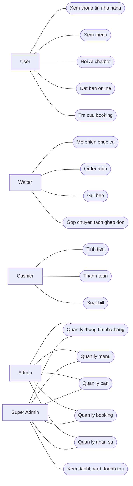
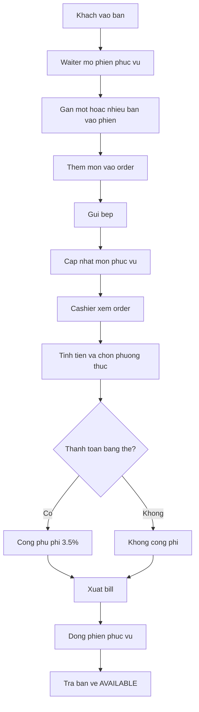
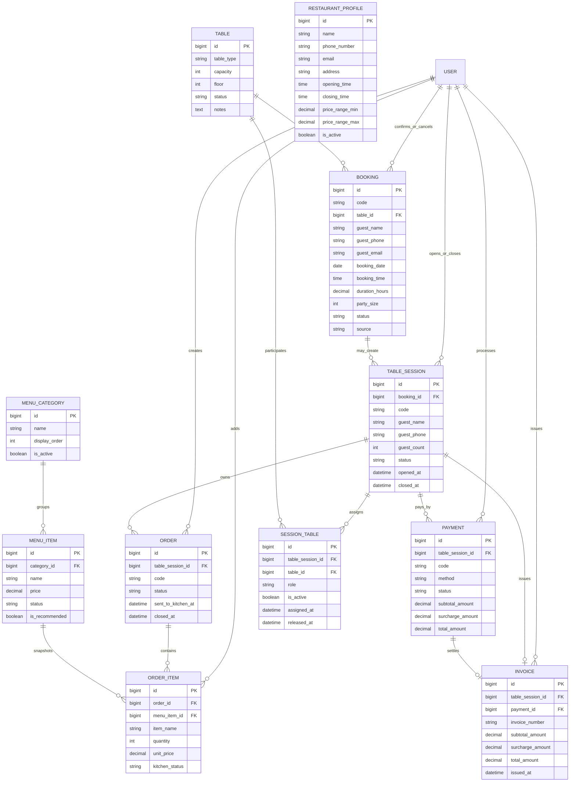

# PHUONG AN MO RONG HE THONG HO TRO VAN HANH NHA HANG

Tai lieu nay duoc viet de co the chen truc tiep vao bao cao M1 hoac dung lam phu luc mo rong cho de tai hien tai.

## 1. Dinh huong de tai sau khi mo rong

Neu phat trien theo huong da neu, de tai khong con dung o muc `chatbot AI ho tro dat ban`, ma tro thanh:

**Xay dung he thong website ho tro van hanh nha hang tich hop chatbot AI**

Pham vi moi gom 2 lop bai toan:

- Lop 1: tuong tac va tiep can khach hang.
- Lop 2: van hanh noi bo nha hang.

Trong do:

- khach hang xem thong tin nha hang, xem menu, hoi chatbot, dat ban online;
- nhan vien phuc vu xu ly order tai ban;
- thu ngan xu ly thanh toan va xuat bill;
- admin quan ly menu, ban, booking, nhan su;
- super admin xem toan bo he thong va dashboard doanh thu.

## 2. Muc tieu giai phap

He thong duoc mo rong nham dat 5 muc tieu:

1. So hoa thong tin co ban cua nha hang nhu ten, dia chi, gio mo cua, gio dong cua, menu, ban.
2. Ho tro khach hang bang AI chatbot cho cac cau hoi pho bien va goi y mon.
3. Quan ly dong thoi 2 luong nghiep vu: `booking online` va `phuc vu tai ban`.
4. Tach ro nghiep vu giua `waiter` va `cashier` de tranh chong cheo thao tac.
5. Tao nen tang de thong ke doanh thu, so don, mon ban chay cho super admin.

## 3. Cac vai tro trong he thong

| Vai tro | Mo ta | Chuc nang chinh |
| --- | --- | --- |
| User | Khach hang su dung website | Xem thong tin nha hang, xem menu, hoi AI, dat ban |
| Waiter | Nhan vien phuc vu | Mo ban, order mon, gui bep, gop ban, chuyen ban, tach don, ghep don |
| Cashier | Thu ngan | Xem order, tinh tien, thanh toan, xuat bill |
| Admin | Quan ly nha hang | Quan ly thong tin nha hang, menu, ban, booking, nhan su |
| Super Admin | Chu nha hang | Toan quyen he thong, dashboard doanh thu, bao cao |

## 4. Pham vi chuc nang de xuat

### 4.1. Nhom chuc nang cong khai

- Xem thong tin nha hang.
- Xem menu va khoang gia.
- Xem gio mo cua, gio dong cua, dia chi.
- Dat ban online.
- Tra cuu booking.
- Chat voi AI de hoi menu, gia, thong tin nha hang, goi y mon.

### 4.2. Nhom chuc nang van hanh noi bo

- Quan ly ban va trang thai ban.
- Quan ly phien phuc vu tai ban.
- Quan ly order va mon trong order.
- Gui mon cho bep.
- Gop ban, chuyen ban, tach don, ghep don.
- Thanh toan va xuat bill.
- Quan ly menu.
- Quan ly nhan su noi bo.
- Xem dashboard doanh thu va thong ke.

## 5. Nguyen tac nghiep vu can chot

De he thong ro rang, can chot cac nguyen tac sau:

1. `Booking` la nghiep vu dat cho truoc, khong dung de dai dien cho qua trinh phuc vu tai quan.
2. `TableSession` la mot phien phuc vu thuc te tai nha hang.
3. `Order` thuoc `TableSession`, khong thuoc truc tiep `Booking`.
4. `Waiter` duoc phep tao va cap nhat order, nhung khong la doi tuong chot thanh toan cuoi cung.
5. `Cashier` duoc phep xem order va tao giao dich thanh toan, xuat hoa don.
6. Sau khi thanh toan thanh cong va dong phien phuc vu, ban moi tro ve trang thai `AVAILABLE`.

## 6. Use Case tong quan

### 6.1. Use case theo nhom tac nhan

#### User

- Xem thong tin nha hang.
- Xem menu.
- Hoi AI ve menu, gia, gio mo cua, dia chi.
- Dat ban online.
- Tra cuu booking.

#### Waiter

- Mo phien phuc vu tai ban.
- Chon ban va gan ban vao phien phuc vu.
- Them mon vao order.
- Sua so luong mon.
- Xoa mon.
- Gui order cho bep.
- Xem chi tiet don.
- Gop ban.
- Chuyen ban.
- Tach don.
- Ghep don.

#### Cashier

- Xem don dang phuc vu.
- Tinh tong tien.
- Chon phuong thuc thanh toan.
- Ap dung phu phi the 3.5%.
- Xac nhan thanh toan.
- Xuat bill.
- Dong phien phuc vu.

#### Admin

- CRUD thong tin nha hang.
- CRUD menu.
- CRUD ban.
- Xem va xu ly booking.
- Tao va khoa tai khoan noi bo.

#### Super Admin

- Quan ly toan bo he thong.
- Xem doanh thu ngay.
- Xem doanh thu thang.
- Xem so don.
- Xem mon ban chay.

### 6.2. So do use case tong quan

## 7. Kien truc nghiep vu de xuat

### 7.1. Cach chia module

He thong nen chia thanh 6 module chinh:

1. `Restaurant Profile Module`
   Luu ten nha hang, dia chi, gio mo cua, gio dong cua, so dien thoai, email, website.

2. `Booking Module`
   Xu ly dat ban online, tra cuu booking, xac nhan/huy booking.

3. `Menu Module`
   Quan ly danh muc mon, mon an, gia, tinh trang con ban/hang.

4. `Floor Operation Module`
   Xu ly phien phuc vu tai ban, order, chuyen ban, gop ban, tach don, ghep don.

5. `Payment & Invoice Module`
   Xu ly thanh toan, phu phi the, xuat bill, dong phien phuc vu.

6. `AI Assistant Module`
   Tra loi cau hoi ve menu, khoang gia, gio mo cua, thong tin nha hang, goi y mon theo ngan sach/khau vi.

### 7.2. Luong xu ly noi bo

## 8. ERD de xuat

## 9. Y nghia cua cac thuc the moi

### 9.1. RestaurantProfile

Dung de dua thong tin nha hang ra khoi prompt hardcode va khoi code hardcode. AI chatbot, giao dien cong khai va admin deu doc cung mot nguon du lieu.

### 9.2. MenuCategory va MenuItem

Dung de quan ly menu co cau truc, phuc vu ca website cong khai, AI chatbot va order tai ban.

### 9.3. TableSession

La thuc the quan trong nhat cua nghiep vu noi bo. No dai dien cho mot luot phuc vu tai nha hang, tach biet hoan toan voi booking online.

### 9.4. SessionTable

Dung de bieu dien mot phien phuc vu co the gan voi 1 hoac nhieu ban, tu do ho tro gop ban, chuyen ban va theo doi lich su gan ban.

### 9.5. Order va OrderItem

Dung de quan ly mon an trong phien phuc vu, cho phep waiter them, sua, xoa, gui bep va tach/ghep don.

### 9.6. Payment va Invoice

Dung de xu ly thu ngan, tinh tong tien, cong phu phi the, luu giao dich va xuat bill.

## 10. Cach tich hop AI trong pham vi mo rong

AI khong nen chi dung prompt hardcode, ma nen lay du lieu that tu he thong.

### 10.1. Nguon du lieu AI can doc

- `RestaurantProfile`: ten nha hang, dia chi, gio mo cua, gio dong cua, thong tin lien he.
- `MenuItem`: ten mon, gia, mo ta, trang thai con ban/hang.
- `Booking`: de tra loi cac cau hoi lien quan den booking neu duoc phep.

### 10.2. Cac nhom cau hoi AI xu ly

- Hoi menu.
- Hoi khoang gia.
- Hoi gio mo cua.
- Hoi thong tin nha hang.
- Goi y mon theo ngan sach.
- Goi y mon theo khau vi.

### 10.3. Nguyen tac AI

- Khong hardcode du lieu nha hang trong prompt neu du lieu da co trong DB.
- Phai co tool/query de doc du lieu that.
- Khi mon het hang, AI phai dua tren `MenuItem.status`.

## 11. Anh xa voi codebase hien tai

Neu ap dung vao repo hien tai, cac cum thay doi chinh gom:

### 11.1. Auth va role/permission

- Mo rong `User.role` thanh `USER`, `WAITER`, `CASHIER`, `ADMIN`, `SUPER_ADMIN`.
- Mo rong `admin_permissions` thanh tap quyen noi bo tong quat.
- Cho phep super admin quan ly nhan su noi bo theo role.

### 11.2. Data model

- Giu `Booking` cho dat ban online.
- Bo sung `RestaurantProfile`, `MenuCategory`, `MenuItem`.
- Bo sung `TableSession`, `SessionTable`, `Order`, `OrderItem`, `Payment`, `Invoice`.

### 11.3. Frontend portal

- Tiep tuc dung mot internal portal, nhung tach man hinh theo role.
- Waiter co man hinh order va thao tac ban.
- Cashier co man hinh thanh toan va xuat bill.
- Admin co man hinh quan ly menu, booking, ban, nhan su.

### 11.4. AI chatbot

- Bo sung tool lay thong tin nha hang.
- Bo sung tool tra cuu menu.
- Bo sung tool goi y mon theo dieu kien.

## 12. Lo trinh trien khai de xuat

### Giai doan 1. Refactor nen tang

- Mo rong role/permission.
- Them schema cho restaurant, menu, order, payment, invoice.
- Cap nhat admin portal phan nhan su.

### Giai doan 2. Module thong tin nha hang va menu

- CRUD restaurant profile.
- CRUD menu category va menu item.
- Dua du lieu menu len giao dien cong khai.

### Giai doan 3. Module waiter

- Mo phien phuc vu.
- Gan ban va gop/chuyen ban.
- Tao order, them mon, gui bep.
- Tach/ghep don.

### Giai doan 4. Module cashier

- Tinh tien.
- Xu ly phuong thuc thanh toan.
- Cong phi the 3.5%.
- Xuat bill va dong ban.

### Giai doan 5. Module AI

- AI doc restaurant profile.
- AI doc menu va gia.
- AI goi y mon theo ngan sach/khau vi.

### Giai doan 6. Dashboard va bao cao

- Doanh thu ngay.
- Doanh thu thang.
- So order.
- Mon ban chay.

## 13. Ket luan

Huong phat trien nay hop ly neu muc tieu cua do an la xay dung mot he thong website phuc vu ca khach hang va van hanh nha hang. Diem quan trong nhat la phai tach ro:

- `booking online` khac voi `phuc vu tai ban`;
- `waiter` khac voi `cashier`;
- `AI chatbot` phai doc du lieu that thay vi tra loi bang prompt co dinh.

Neu trinh bay tot, huong mo rong nay se co gia tri thuc tien cao hon, dong thoi cho thay kha nang phan tich nghiep vu, thiet ke he thong va mo hinh hoa du lieu tot hon mot bai toan booking don le.
