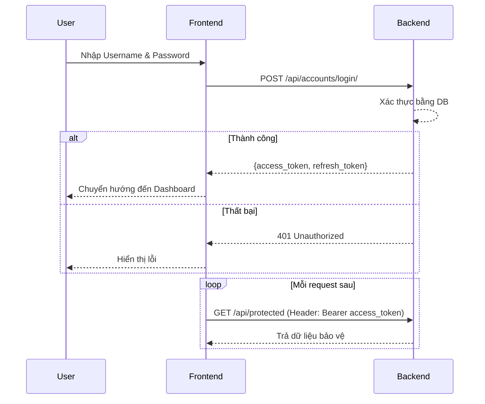
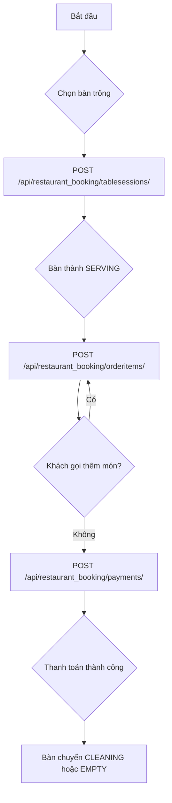
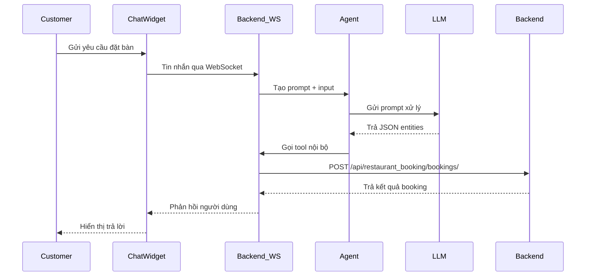
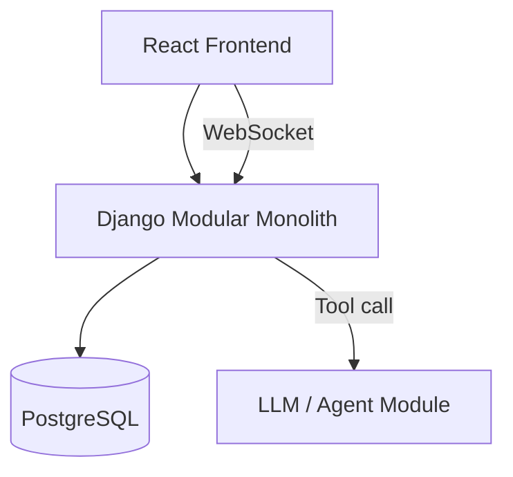

# BÁO CÁO KỸ THUẬT: HỆ THỐNG ĐẶT BÀN NHÀ HÀNG TÍCH HỢP TRỢ LÝ AI (DATN - RESTAURANT BOOKING AGENT) - CỘT MỐC M2

## PHẦN 2.1 – GIẢI PHÁP & KỸ THUẬT (60%)

### 1. Bài toán và vấn đề thực tế
Ngành F&B đang chịu áp lực lớn từ nhu cầu đặt bàn trực tuyến kết hợp tư vấn nhanh. Các giải pháp truyền thống thiếu khả năng:
- Nhận biết yêu cầu tự nhiên của khách (số người, giờ, yêu cầu riêng).
- Đồng bộ tình trạng bàn với luồng đặt bàn trong thời gian thực.
- Phòng tránh double booking khi nhiều yêu cầu cùng lúc.
- Đưa ra phản hồi tự động khi đặt bàn qua chatbot.

### 2. Giải pháp tổng thể (Bổ sung kỹ thuật chuyên sâu)
Giải pháp tập trung vào thiết kế **Modular Monolith (định hướng microservices)**, giúp hệ thống dễ dàng khởi tạo, maintain ở giai đoạn đầu nhưng vẫn đảm bảo khả năng tách service khi scale:
- **Xử lý AI Prompt Flow:** Sử dụng mô hình Router Agent. Flow: User Query -> Intent Classification Prompt -> Data Retrieval (nếu cần RAG cho menu/policy) -> Form Filling Prompt -> Validation -> Action.
- **Concurrency & Double-booking:** Khi user confirm đặt bàn, hệ thống sử dụng Database Transaction kết hợp Cờ Lock (SELECT ... FOR UPDATE trong PostgreSQL/Prisma) dựa trên table_id và time_slot. Thêm vào đó, áp dụng Redis caching để handle rate-limiting, giảm tải DB khi check availability.
- **CI/CD & Deployment:** Docker hóa toàn bộ ứng dụng (FE, BE, AI Service, DB) qua Docker Compose. Sử dụng GitHub Actions để chạy automated tests (Jest) và linter trước khi merge PR.

Hệ thống "Restaurant Booking Agent" kết hợp:
- Hệ thống quản lý đặt bàn chuẩn: sơ đồ bàn, booking, TableSession, order item, thanh toán.
- AI Chatbot/Agent: tiếp nhận ngôn ngữ tự nhiên, trích xuất yêu cầu, chuyển đổi thành API call nội bộ và tạo phản hồi bằng ngôn ngữ tự nhiên.

Giải pháp tập trung vào:
- **Frontend:** giao diện booking, sơ đồ bàn, dashboard, chat realtime.
- **Backend:** Django REST API + WebSocket ASGI.
- **Database:** PostgreSQL với transaction và khoá hàng.
- **Agent:** prompt-driven pipeline xử lý intent, thực thể, gọi công cụ nội bộ, đảm bảo kết quả booking chính xác.

### 3. Kiến trúc hệ thống
- **Frontend (React Web App):** React + Vite + TailwindCSS. Quản lý trạng thái bằng hooks và context để điều phối auth, booking, và websocket event.
- **Backend (Django Modular Monolith):** Django + Django REST Framework. Định hướng module hoá để dễ tách thành service sau này, nhưng hiện vẫn chạy trên cùng một codebase monolith.
- **Database:** PostgreSQL. Thiết kế schema bao gồm User, UserRole, Table, Booking, TableSession, OrderItem, Payment.
- **AI/Agent Module:** tích hợp trong backend qua api_chat_bot và restaurant_booking/agents, nhận input từ WebSocket, kết hợp prompt template và tool mapping.

### 4. Kỹ thuật áp dụng
- **Frontend:** React, Vite, TailwindCSS, WebSocket client.
- **Backend:** Django, Django REST Framework, Django Channels/ASGI cho WebSocket.
- **DB:** PostgreSQL, migration, row-level lock.
- **Bảo mật:** JWT cho authentication/authorization, refresh token.
- **Agent:** prompt engineering, entity extraction, API mapping, tool wrapper.

#### 4.1. Xử lý hội thoại & Agent pipeline
Agent chạy theo luồng sau:
1. Nhận thông điệp từ WebSocket chat widget.
2. Gửi vào prompt template với hệ thống role, ví dụ:
- You are a restaurant booking assistant.
- Extract intent, date/time, num_people, budget, seating preference, special requests.
3. Parser của agent sinh ra JSON thực thể và định danh intent.
4. Nếu intent là book_table, agent gọi tool nội bộ check_table_availability hoặc create_booking.
5. Tool nội bộ mapping sang API:
- GET /api/restaurant_booking/tables/availability/?datetime=...&guests=...
- POST /api/restaurant_booking/bookings/
6. Backend trả về kết quả, agent xây dựng câu phản hồi tự nhiên và gửi lại qua WebSocket.

#### 4.2. Mapping prompt sang API
- Prompt khai thác:
- Số khách → guest_count
- Giờ / Ngày → booking_time
- Ngân sách → budget
- Loại bàn → table_type
- Sau khi trích xuất, agent chỉ định tool:
- check_availability_tool cho kiểm tra bàn trống.
- create_booking_tool cho đặt bàn chính thức.

#### 4.3. Tránh double booking và concurrency
- Đặt bàn thực hiện trong transaction.atomic().
- Dùng select_for_update() khoá row Table hoặc BookingSlot khi kiểm tra và tạo booking.
- Kiểm tra Booking theo khoảng thời gian và số chỗ:
- SELECT ... FROM Booking WHERE table_id = X AND start_time < new_end AND end_time > new_start FOR UPDATE
- Nếu trùng, trả về unavailable và đề xuất bàn/giờ khác.
- Quy tắc ưu tiên:
- giữ chỗ tạm thời (soft hold) trong vài phút khi accept yêu cầu qua chat.
- xử lý concurrent bằng lock database, không rely vào cache đơn thuần.

### 5. Đóng góp của từng thành viên
- **Member 1 (Frontend / UX / State Management):**
- Thiết kế state management cho auth, booking, chart data và websocket event.
- Xây dựng UI sơ đồ bàn, booking form, chat widget realtime.
- Xử lý token refresh, role-based route guard, hiển thị quyền WAITER/ADMIN khác nhau.
- Tối ưu trải nghiệm chat: hiển thị trạng thái gửi, phản hồi agent, thông báo lỗi.
- Triển khai các component tái sử dụng cho booking list, order item, payment modal.
- **Member 2 (Backend / AI / Concurrency):**
- Thiết kế schema core: User/Role, Table, Booking, TableSession, OrderItem, Payment.
- Xây dựng REST API cho booking, table session, order item, payment.
- Thiết kế agent pipeline: prompt, entity extraction, tool invocation, API mapping.
- Cài đặt cơ chế tránh double booking bằng transaction và row-level locking.
- Tích hợp JWT, refresh token, Docker và cấu hình backend deployment.

---

## PHẦN 2.2 – TIẾN ĐỘ VÀ KẾT QUẢ ĐẠT ĐƯỢC (M2)
Báo cáo này mô tả chi tiết các hạng mục đã được xây dựng và đánh giá tiến độ Milestone 2.

### 1. Tổng quan mức độ hoàn thiện
- **Ước tính chung:** Dự án đã hoàn thành khoảng **65% - 70%** khối lượng công việc.
- **Trạng thái:** Core foundation đã hoạt động: Frontend kết nối API, backend xử lý booking và api chatbot, DB lưu trữ dữ liệu.
- **Kiến trúc:** Modular Monolith với Django app tách module rõ ràng, định hướng có thể tách riêng service sau này.

| Hạng mục | Trạng thái | Mô tả chi tiết |
| :--- | :--- | :--- |
| **ĐÃ HOÀN THÀNH** | ✅ | **Authentication + Authorization:** Login, JWT access/refresh, phân quyền SUPER_ADMIN/ADMIN/WAITER. |
| | ✅ | **Booking core:** CRUD bàn, tạo booking, cập nhật trạng thái bàn, TableSession và order item. |
| | ✅ | **Order & payment cơ bản:** Waiter thêm món, lưu order item, ghi nhận thanh toán đơn giản. |
| | ✅ | **AI Chatbot realtime:** Chat widget kết nối WebSocket, agent parse intent và gọi tool nội bộ. |
| | ✅ | **Hạ tầng Docker:** Frontend & backend đóng gói Docker, chạy local bằng docker-compose. |
| **CHƯA HOÀN THÀNH** | ❌ | **Vai trò CASHIER & USER:** Chưa đầy đủ quyền và màn hình chuyên biệt. |
| | ❌ | **Nâng cao nghiệp vụ:** Gộp/tách bàn, phí thẻ 3.5%, gợi ý món theo ngân sách chưa hoàn thiện. |
| | ❌ | **Dashboard quản trị:** Báo cáo doanh thu và thống kê Super Admin chưa hoàn thiện. |

### 2. Chức năng đã hoàn thành & Flow hoạt động

#### 2.1. Luồng xác thực và phân quyền (Authentication Flow)
Hệ thống sử dụng JWT cho auth.
- **Flow:**
1. User gửi username và password đến endpoint login.
2. Backend xác thực và trả access_token + refresh_token.
3. Frontend lưu token và dùng access_token cho request bảo vệ.
4. Nếu hết hạn, Frontend gọi endpoint refresh để nhận token mới.
- **Kỹ thuật:**
- Sử dụng middleware/permission class để phân biệt quyền SUPER_ADMIN, ADMIN, WAITER.
- Auth state được quản lý trong React context và route guard.



#### 2.2. Luồng phục vụ tại bàn (Waiter Order Flow)
Đây là luồng nghiệp vụ chính cho WAITER.
- **Flow:**
1. Waiter chọn bàn trống từ sơ đồ bàn.
2. Backend tạo TableSession, cập nhật trạng thái bàn sang SERVING.
3. Waiter thêm món vào OrderItem cho session.
4. Khi khách thanh toán, tạo Payment và chuyển trạng thái bàn về CLEANING/EMPTY.
- **Kỹ thuật:**
- Dữ liệu order được lưu trong TableSession và OrderItem.
- Trạng thái bàn cập nhật tự động khi thanh toán.



#### 2.3. Luồng Chatbot đặt bàn (AI Booking Flow)
Khách hàng có thể đặt bàn qua chat widget.
- **Flow:**
1. Khách chat trong widget.
2. Tin nhắn gửi qua WebSocket đến backend.
3. Agent phân tích intent, trích xuất entities, gọi tool nội bộ.
4. Nếu có bàn trống, tạo booking và trả phản hồi.
- **Kỹ thuật:**
- WebSocket nhận message, agent sử dụng prompt template để parse.
- Agent gọi tool check_availability và create_booking.
- Kết quả trả về dạng text, khách có thể nhận ngay.



### 3. Kiến trúc hệ thống và Cấu trúc thư mục

#### 3.1. Sơ đồ kiến trúc tổng thể
Hệ thống hiện tại là **Modular Monolith** với các Django app tách chức năng rõ ràng.



#### 3.2. Cấu trúc thư mục chính
```text
DATN-restaurant-booking-agent/
├── backend/                  # Mã nguồn API & AI (Django)
│   ├── accounts/             # Quản lý User, Auth, Role
│   ├── restaurant_booking/   # Booking, Table, Order, Payment, Agent tools
│   ├── api_chat_bot/         # WebSocket, agent integration, prompt engine
│   ├── common/               # Utility, permissions, services, tools chung
│   ├── docker-compose.yml    # Docker service definitions
│   └── manage.py             # Django CLI
├── frontend/                 # Mã nguồn giao diện React
│   ├── src/
│   │   ├── pages/            # Pages và route chính
│   │   ├── components/       # UI reusable components
│   │   └── api/              # HTTP client, auth helper, websocket client
│   └── docker-compose.yml    # Docker compose cho Frontend
└── postgres_init.sql         # Script khởi tạo dữ liệu mẫu
```

### 4. Hướng dẫn chạy và Triển khai

**Cách 1: Chạy bằng Docker (Khuyến khích)**
1. **Backend + DB:**
```bash
    cd backend
    docker-compose up --build -d
```
2. **Frontend:**
```bash
    cd frontend
    docker-compose up --build -d
```
3. **Truy cập:** 
- Giao diện: http://localhost:5173 
- Backend API: http://localhost:8000 

**Cách 2: Chạy thủ công (Môi trường phát triển)**
1. **Backend:**
```bash
    cd backend
    pip install -r requirements.txt
    python manage.py migrate
    python manage.py runserver
```
2. **Frontend:**
```bash
    cd frontend
    npm install
    npm run dev
```

---

## PHẦN 2.3 – LỘ TRÌNH PHÁT TRIỂN (M3) VÀ ĐỀ XUẤT CẢI TIẾN (20%)

### 1. Các tính năng cần hoàn thiện
1. **Hoàn thiện hệ thống phân quyền (RBAC):**
- Backend bổ sung vai trò CASHIER và USER trong UserRole.
- Xây dựng permission class riêng cho Cashier (chỉ thanh toán) và User (xem booking, chat).
- Frontend thêm route bảo vệ theo role và giao diện riêng.
2. **Nâng cấp nghiệp vụ nâng cao:**
- **Gộp/Tách bàn:** Backend xử lý merge/split TableSession, frontend cập nhật sơ đồ bàn.
- **Phí thẻ 3.5%:** Tính toán tự động khi chọn phương thức thanh toán bằng thẻ.
- **Tự động cập nhật trạng thái bàn:** Sau thanh toán, đổi SERVING → CLEANING hoặc EMPTY.
3. **Nâng cấp AI Chatbot:**
- Thêm tool suggest_menu_by_budget(budget, num_people).
- Tối ưu prompt để AI có thể gọi tool và trả lời bằng ngôn ngữ tự nhiên.
4. **Dashboard Super Admin:**
- Backend tạo endpoints thống kê doanh thu theo ngày/tuần/tháng, top món bán chạy.
- Frontend dùng Chart.js/Recharts để hiển thị biểu đồ.

### 2. Timeline dự kiến (4-6 tuần)

| Tuần | Sprint | Nội dung chính | Mục tiêu |
| :--- | :--- | :--- | :--- |
| Tuần 1-2 | Sprint 1 | Hoàn thiện RBAC, role CASHIER/USER, setup payment flow, gộp/tách bàn. | Đóng các lỗ hổng nghiệp vụ cốt lõi. |
| Tuần 3-4 | Sprint 2 | Nâng cấp AI agent, tool budget/menu, xây dựng Report Dashboard. | Hoàn thành giá trị khách hàng và quản trị. |
| Tuần 5 | Sprint 3 | Tối ưu hiệu năng, fix N+1 query, review bảo mật, chuẩn hóa frontend. | Đảm bảo vận hành ổn định. |
| Tuần 6 | Sprint 4 | Kiểm thử toàn diện, sửa lỗi, chuẩn bị tài liệu hướng dẫn. | Chuẩn bị cho nghiệm thu và demo. |

### 3. Đề xuất cải tiến
- **Tối ưu hiệu năng:**
- Backend dùng select_related, prefetch_related cho booking và menu.
- Cache menu, table layout bằng Redis.
- Frontend lazy load các trang lớn và tối ưu ảnh.
- **Cải thiện UI/UX:**
- Thiết kế POS dễ thao tác trên tablet.
- Chat widget rõ trạng thái, đề xuất nhanh khi đủ thông tin.
- **Tăng cường bảo mật:**
- Rate limiting cho API và WebSocket.
- Không hardcode secret, dùng biến môi trường.
- **AI nâng cao:**
- Cá nhân hóa đề xuất dựa trên lịch sử đặt món.
- Phân tích cảm xúc từ chat để cảnh báo phản hồi tiêu cực.

### 4. Kế hoạch Triển khai và CI/CD
- **Deployment:**
- Dùng VPS hoặc cloud server.
- Chạy backend + PostgreSQL trong Docker container.
- **CI/CD:**
- Dùng GitHub Actions để lint, test, build image.
- Nếu build thành công, đẩy image lên registry và triển khai tự động.

### 5. Đánh giá rủi ro và hướng xử lý

| Rủi ro | Ảnh hưởng | Khả năng | Giảm thiểu |
| :--- | :--- | :--- | :--- |
| LLM không ổn định | Cao | Trung bình | Fallback trả lời cơ bản, timeout/retry, dùng prompt kiểm tra response format. |
| Booking concurrency | Cao | Cao | Dùng transaction + select_for_update, kiểm tra availability, lock row. |
| Hiệu năng giảm khi dữ liệu lớn | Cao | Trung bình | Cache, tối ưu query, giới hạn page size. |
| Lỗ hổng bảo mật | Rất cao | Thấp | Kiểm tra input, rate limit, bảo mật token, audit logging. |
| Chi phí triển khai | Trung bình | Trung bình | Chọn VPS phù hợp, theo dõi chi phí, tối ưu tài nguyên. |

---

## BỔ SUNG YÊU CẦU: VÍ DỤ THỰC TẾ & THIẾT KẾ CƠ SỞ

### 1. Ví dụ thực tế hệ thống (Thực thi luồng đặt bàn AI)

**Ví dụ hội thoại Chatbot:**
> **Khách (User):** "Cho mình đặt 1 bàn 2 người tối nay lúc 19h nhé."
> **Bot (AI Agent):** "Dạ vâng, để đặt bàn cho 2 người lúc 19:00 hôm nay, anh/chị vui lòng cho em xin thêm Số điện thoại và Tên để nhà hàng giữ chỗ ạ."
> **Khách (User):** "Mình tên Tiến, SĐT 0987654321."
> **Bot (AI Agent):** "Cám ơn anh Tiến. Hệ thống ghi nhận: Bàn 2 người, 19:00 hôm nay. Tên: Tiến, SĐT: 0987654321. Anh kiểm tra lại thông tin và xác nhận giúp em nhé! [Nút Xác Nhận]"

**Ví dụ JSON Response (API /api/bookings):**
```json
{
  "status": "success",
  "data": {
    "booking_id": "BK-102938",
    "customer": {
      "name": "Tiến",
      "phone": "0987654321"
    },
    "reservation_time": "2023-11-20T19:00:00Z",
    "party_size": 2,
    "status": "PENDING_DEPOSIT",
    "payment_url": "https://pay.payos.vn/..."
  }
}
```

### 2. Thiết kế Database (ERD đơn giản)
Dưới đây là mô hình thực thể liên kết (ERD) dạng text đơn giản hóa các thực thể cốt lõi:
* **User:** id (PK), name, phone, role (CUSTOMER, ADMIN).
* **Table:** id (PK), capacity, status, location (Tầng 1, Tầng 2, VIP).
* **Booking:** id (PK), user_id (FK), table_id (FK), booking_time, party_size, status (PENDING, CONFIRMED, CANCELLED), deposit_amount.
* **Menu_Item:** id (PK), name, price, category, description (Dùng cho RAG).
* **Chat_Session:** id (PK), user_id (FK), context_data (JSON lưu state hội thoại).

**Mối quan hệ:**
* Một User có nhiều Booking.
* Một Table có nhiều Booking (nhưng khác khung giờ).
* Một User có một hoặc nhiều Chat_Session.

### 3. Use Case / Luồng tổng (Tổng quan)
**Các Use Case chính:**
1. **Khách hàng (Customer):**
* Tương tác với AI Chatbot (Hỏi menu, chính sách, yêu cầu đặt bàn).
* Xác nhận thông tin đặt bàn (Approve form do AI ген ra).
* Thanh toán tiền cọc.
* Xem lịch sử đặt bàn.
2. **Quản trị viên (Admin):**
* Quản lý danh sách bàn (Thêm/Sửa trạng thái).
* Quản lý danh sách Booking (Duyệt thủ công, Hủy, Refund).
* Cấu hình thông tin nhà hàng (Menu, Giờ mở cửa) để AI Agent học (Update Knowledge Base).
* Xem thống kê doanh thu/lượt khách.

**Luồng Tổng (Main Flow):**
Truy cập Web -> Mở cửa sổ Chat -> Chatbot trích xuất Intent (Đặt bàn) -> Thu thập đủ (Thời gian, Số người, Tên, SĐT) -> Gọi API Check Availability -> Trả ra Form Confirm -> User bấm Confirm -> Tạo Booking (Status PENDING) -> Render link thanh toán -> User thanh toán -> Webhook báo thành công -> Đổi status Booking sang CONFIRMED -> Gửi Email/SMS thông báo -> Kết thúc.


# BÁO CÁO KỸ THUẬT: HỆ THỐNG ĐẶT BÀN NHÀ HÀNG TÍCH HỢP TRỢ LÝ AI (DATN - RESTAURANT BOOKING AGENT) - CỘT MỐC M2

## PHẦN 1: TỔNG QUAN, KIẾN TRÚC VÀ CÁC VAI TRÒ TRONG HỆ THỐNG

### 1.1 Khái quát về hệ thống
Hệ thống "Restaurant Booking Agent" (Hệ thống đặt bàn nhà hàng tích hợp trợ lý AI) được thiết kế theo kiến trúc **Modular Monolith (định hướng microservices)**. Kiến trúc này giúp hệ thống dễ dàng khởi tạo, bảo trì ở giai đoạn đầu, đồng thời vẫn đảm bảo khả năng tách các domain logic thành các service độc lập khi cần scale (mở rộng) trong tương lai.

**Các module chính của hệ thống bao gồm:**
- **AI Chatbot:** (Giao tiếp với khách hàng, tư vấn menu, giá, đặt bàn).
- **Booking System:** (Hệ thống đặt bàn, phòng tránh double-booking, quản lý trạng thái chỗ ngồi).
- **Restaurant Management:** (Hệ thống quản lý cốt lõi của nhà hàng).
- *Menu Management:* Quản lý món ăn, phân loại, giá cả.
- *Table Management:* Quản lý sơ đồ bàn, gộp/tách bàn.
- *Order Management:* Cập nhật món ăn, theo dõi tình trạng đơn (dành cho Waiter).
- *Payment System:* Xử lý hóa đơn, tính phí thẻ 3.5%, xuất bill (dành cho Cashier).
- *User Management:* Quản lý tài khoản và phân quyền.
- *Revenue Dashboard:* Báo cáo thống kê dành cho Super Admin.

**Kiến trúc hệ thống (Sơ đồ luồng cơ bản):**
```text
Customer
   │
   ▼
AI Chatbot
   │
   ▼
Booking System
   │
   ▼
Restaurant System
      │
      ├ Menu Management
      ├ Table Management
      ├ Order Management
      ├ Payment System
      ├ User Management
      └ Revenue Dashboard
```

### 1.2 Các vai trò (Roles) trong hệ thống
Hệ thống phân quyền chi tiết với 5 vai trò riêng biệt để đảm bảo an toàn dữ liệu và tối ưu hóa luồng làm việc thực tế tại nhà hàng:

| Role | Mô tả chi tiết |
| :--- | :--- |
| **User** | Khách hàng sử dụng website/chatbot để xem thông tin nhà hàng, hỏi menu, hỏi giá, nhận gợi ý món ăn theo ngân sách và thực hiện đặt bàn. |
| **Waiter** | Nhân viên phục vụ. Chịu trách nhiệm nhận order, chọn bàn, chuyển/tách/gộp bàn (ví dụ: Table 5 + Table 6), thêm/sửa/xóa món trong đơn hàng. |
| **Cashier** | Thu ngân. Không trực tiếp order mà chỉ xem đơn hàng, tính tổng tiền, bổ sung phụ phí (ví dụ 3.5% thẻ), thanh toán và xuất hóa đơn để giải phóng bàn (về Available). |
| **Admin** | Quản lý nhà hàng. Có quyền CRUD (Tạo/Đọc/Sửa/Xóa) menu, bàn, tải khoản nhân viên (Waiter, Cashier) và quản lý chi tiết các luồng Booking. |
| **Super Admin** | Chủ nhà hàng. Có quyền cao nhất, xem toàn bộ hệ thống và Dashboard thống kê doanh thu (theo ngày/tháng, số đơn, món bán chạy). |

---

## PHẦN 2: CHI TIẾT CÁC MODULE VÀ NGHIỆP VỤ

### 2.1 Thông tin nhà hàng
Hệ thống duy trì một bộ thông tin cơ sở về nhà hàng, làm Context/Knowledge Base cho AI Agent và hiển thị trên giao diện:
- **Tên nhà hàng:** Restaurant ABC
- **Địa chỉ:** 123 Nguyễn Văn Linh
- **Giờ hoạt động:** Mở cửa: 09:00 - Đóng cửa: 22:00
- **Danh sách bàn & Menu món ăn** (Được cập nhật bởi Admin).

### 2.2 AI Chatbot (Trợ lý thông minh)
AI Chatbot sử dụng kiến trúc Agent sinh tự động theo **Router Agent Pattern**.
- **Tính năng:** Hỏi menu, hỏi khoảng giá, hỏi giờ mở cửa, thông tin nhà hàng và đặc biệt là *Gợi ý món ăn theo ngân sách*.
- **Ví dụ thực tế:**
- *Khách hỏi:* "Tôi có 300k cho 3 người"
- *AI gợi ý:* "Dạ với ngân sách 300k cho 3 người, em xin gợi ý: 1 Pizza hải sản, 1 Pasta bò bằm, 3 Coca. Tổng khoảng 280k ạ."

### 2.3 Hệ thống Đặt bàn (Booking)
Quản lý luồng đặt chỗ trước của khách hàng.
- **Dữ liệu bắt buộc:** Tên khách, Số điện thoại, Số khách, Thời gian đặt, Ghi chú.
- **Kỹ thuật xử lý Double Booking:** Sử dụng Database Transaction và Row-level Lock (SELECT ... FOR UPDATE).
- **Ví dụ JSON Response cho tạo Booking:**
```json
{
  "status": "success",
  "data": {
    "booking_id": "BK-102938",
    "customer": {
      "name": "Nguyễn Tuấn",
      "phone": "0987654321"
    },
    "reservation_time": "2023-11-20T19:00:00Z",
    "party_size": 5,
    "note": "sinh nhật",
    "status": "PENDING"
  }
}
```

### 2.4 Quản lý bàn (Table Management)
Mỗi bàn có các trạng thái (State Machine):
- **Available:** Bàn trống, sẵn sàng phục vụ.
- **Reserved:** Đã được đặt trước.
- **Occupied:** Đang có khách ngồi (đã tạo TableSession).
- **Cleaning:** Đang dọn dẹp (chờ chuyển về Available).
*Ví dụ:* Table 1: Available, Table 2: Reserved, Table 3: Occupied.

### 2.5 Nghiệp vụ Phục vụ (Waiter)
Nhân viên phục vụ tác động trực tiếp lên Database OrderItem và TableSession.
- **Chức năng:** Chọn bàn, chọn món, cập nhật giỏ hàng (thêm, sửa số lượng, xóa món), và quản lý trạng thái bàn khi order.
- **Nghiệp vụ nâng cao:** Gộp bàn (Table 5 + Table 6), chuyển bàn, tách/ghép đơn.
- *Ví dụ Order #105 (Table 5):* Pizza hải sản x1, Pasta bò bằm x1, Coca x3.

### 2.6 Nghiệp vụ Thu ngân (Cashier) & Payment
Chỉ quản lý thanh toán, đảm bảo minh bạch tài chính.
- **Chức năng:** Check đơn hàng, tính tổng, xuất bill, giải phóng bàn.
- **Phương thức thanh toán & Logic tính phí:**
- Tiền mặt / Chuyển khoản: Không phí.
- Thẻ: **Thu thêm phí 3.5%**.
- *Ví dụ:* Tổng món 1,000,000đ. Trả bằng Thẻ -> Phí 3.5% (35,000đ) -> Khách trả: 1,035,000đ. Hệ thống xuất bill và set Table = Available.

### 2.7 Nghiệp vụ Quản trị (Admin & Super Admin)
- **Admin:** CRUD Tài khoản Waiter/Cashier (Tạo, sửa, khóa, xóa). CRUD Menu (Pizza hải sản - 180,000đ). CRUD Sơ đồ bàn. Xác nhận/Hủy Booking.
- **Super Admin:** Truy cập Dashboard. Theo dõi doanh thu hôm nay (VD: 12,500,000đ), số đơn (58 đơn), món bán chạy.

---

## PHẦN 3: KẾT QUẢ ĐẠT ĐƯỢC (DONE) VÀ KẾ HOẠCH (PENDING)

### 3.1 Thiết kế Cơ sở dữ liệu (ERD Đơn giản)
* **User:** id, name, phone, role_id.
* **Role:** id, code (USER, WAITER, CASHIER, ADMIN, SUPER_ADMIN).
* **Table:** id, status (Available, Reserved, Occupied, Cleaning).
* **Booking:** id, user_id, table_id, datetime, guests, status.
* **Menu/Item:** id, name, price.
* **Order/TableSession:** id, table_id, status.
* **Payment:** id, order_id, method (CASH, TRANSFER, CARD), fee_percentage, total.

### 3.2 Bảng theo dõi tiến độ chức năng theo Role

| Module / Chức năng chi tiết | Trạng thái | Ghi chú |
| :--- | :---: | :--- |
| **Hạ tầng & Kiến trúc** | ✅ **DONE** | Docker Compose, Cấu trúc Modular Monolith Django + React đã hoàn thiện. |
| **Authentication & Phân quyền cơ bản** | ✅ **DONE** | Đã có đăng nhập JWT, phân quyền cơ bản. |
| **AI Chatbot (User)** | ✅ **DONE** | LLM trích xuất intent, hỏi đáp thông tin cơ bản, đặt bàn trực tiếp qua chat. |
| **Gợi ý món theo ngân sách (User)** | ❌ **PENDING** | Luồng Agent cần nâng cấp để tự tính toán và gợi ý dựa trên budget. |
| **Đặt chỗ & Xử lý Double Booking (User)** | ✅ **DONE** | Đã tạo được Booking. Có cơ chế Lock trong DB. |
| **Order món cơ bản (Waiter)** | ✅ **DONE** | Mở bàn, gọi món lưu vào Database. |
| **Nghiệp vụ gộp/tách/chuyển bàn (Waiter)**| ❌ **PENDING** | Cần bổ sung logic gộp TableSession. |
| **Thanh toán cơ bản (Cashier)** | ✅ **DONE** | Đã tạo được Payment record để đóng phiên bàn. |
| **Thu phụ phí thẻ 3.5% (Cashier)** | ❌ **PENDING** | Thuật toán tính cộng dồn mức phí tùy theo Hình thức thanh toán chưa áp dụng dứt điểm. |
| **Phân tách quyền riêng cho Cashier/User**| ❌ **PENDING** | Hệ thống Role hiện tại mới cover Admin/Waiter, cần mở rộng codebase chi tiết cho Cashier và User. |
| **Quản lý nhà hàng CRUD (Admin)** | ✅ **DONE** | Quản lý Tables, Menu Items, Bookings. |
| **Quản lý nhân sự CRUD (Admin)** | ❌ **PENDING** | Chưa tách biệt flow Admin cấp tài khoản cụ thể cho Waiter/Cashier trên UI. |
| **Dashboard Doanh thu (Super Admin)** | ❌ **PENDING** | API thống kê và cấu hình Chart (Tương tác biểu đồ) chưa xong. |
